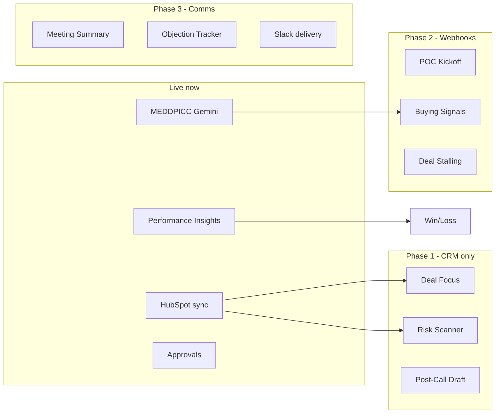

# Custom automations (Opine-style) on AI CRM data

Once HubSpot (or demo) data is in AI CRM — **deals, companies, notes, tasks, MEDDPICC, blockers, agent runs, webhooks** — these automations map 1:1 to the Opine agent templates in your reference screenshots.

## Data foundation required

| Data in AI CRM | Source today | Used by |
|----------------|--------------|---------|
| Deals + stages + amount | HubSpot sync / demo seed | All agents |
| Companies | HubSpot sync | Deal context, win/loss |
| Notes | HubSpot sync + manual | Post-call, signals, MEDDPICC |
| Tasks | HubSpot sync + manual | Deal focus, follow-ups |
| Blockers | App UI | Risk scanner |
| MEDDPICC | Gemini refresh | Risk, buying signals |
| Webhooks | HubSpot events | Real-time triggers |
| Activity analytics | Derived + Insights | Reporting agents |
| Call transcripts | **Future** (Gong/Zoom) | Objection tracker, meeting summary |

---

## Process agents

### My Deal Focus
**Opine:** Daily Slack DM — prioritized active deals by urgency, risk, recent signals.

| | |
|--|--|
| **Trigger** | Cron 8am user timezone |
| **Reads** | Open deals, `lastActivityAt`, `blockerCount`, `isHot`, `winProbability`, sentiment, MEDDPICC gaps |
| **AI (Gemini)** | Rank top 5–10 deals with 1-line “why now” per deal |
| **Output** | In-app Home focus list + optional Slack (when integrated) |
| **Status** | Template `deal-focus` — run simulated; ranking logic next |

### POC Kickoff
**Opine:** When deal hits pilot stage → Slack kickoff plan (stakeholders, success criteria, timeline).

| | |
|--|--|
| **Trigger** | Deal stage → Proposal/Negotiation OR webhook `deal.propertyChange` (dealstage) |
| **Reads** | Deal, company, notes, tasks, MEDDPICC champion/economic buyer |
| **AI** | Generate kickoff doc: stakeholders, success criteria, 30-day timeline |
| **Output** | Approval → note on deal + optional task list |
| **Status** | Template `poc-kickoff` — planned |

### Post-Call Follow-up Draft
**Opine:** After call → draft follow-up email (recap, action items, next steps).

| | |
|--|--|
| **Trigger** | Manual run on deal OR future call-ingest webhook |
| **Reads** | Latest notes, deal stage, open tasks |
| **AI** | Email draft with recap + bullet action items |
| **Output** | Approval queue (`contentType: email_draft`) |
| **Status** | Template `post-call` — partial (approval flow exists) |

### Meeting Summary & Next Steps
**Opine:** Concise meeting summary from transcript.

| | |
|--|--|
| **Trigger** | Call recording ingested (Gong/Zoom) |
| **Reads** | Transcript text, deal, contacts |
| **AI** | Summary + structured next steps → CRM note + tasks |
| **Output** | Note + tasks via approval |
| **Status** | Template `meeting-summary` — needs call integration |

---

## Risk agents

### Risk Scanner
**Opine:** Daily scan — stalled deals, missing stakeholders, slipping timelines → Slack alerts.

| | |
|--|--|
| **Trigger** | Cron daily |
| **Reads** | Deals where `lastActivityAt` > 14d, `blockerCount` > 0, red sentiment, low MEDDPICC completeness |
| **AI** | Classify risk type + recommended action |
| **Output** | Alerts on Home + Approvals for stage/task updates |
| **Status** | Template `risk-scanner` — rules ready; Gemini classification next |

### Deal Stalling Detection
**Opine:** Track stalled deals, missing stakeholders, slipping close dates.

| | |
|--|--|
| **Trigger** | Daily + webhook on deal update |
| **Reads** | `expectedCloseDate` passed, stage unchanged 21d+, no notes 14d+ |
| **AI** | Stalling reason hypothesis |
| **Output** | Badge on deal card + notification |
| **Status** | Template `deal-stalling` — planned |

---

## Signals agents

### Negotiation & Objection Tracker
**Opine:** Scan transcripts/Slack for pricing objections, competitors, negotiation language → tag deals.

| | |
|--|--|
| **Trigger** | New note or transcript |
| **Reads** | Note body, MEDDPICC competition letter |
| **AI** | Extract: objection type, competitor, pricing concern → tags |
| **Output** | Update deal tags/sentiment + MEDDPICC C2 patch (approval) |
| **Status** | Template `objection-tracker` — planned |

### Buying Signals
**Opine:** Detect exec involvement, budget approval, timeline urgency → Slack alert.

| | |
|--|--|
| **Trigger** | Note/webhook |
| **Reads** | Notes, tasks, MEDDPICC (E, C1, M), deal `isHot` |
| **AI** | Score buying signal strength 0–100 |
| **Output** | Set `isHot`, bump `winProbability`, alert rep |
| **Status** | Template `buying-signals` — planned |

### Product Feedback Capture
**Opine:** Feature gaps / missing integrations from calls → product request.

| | |
|--|--|
| **Trigger** | Note or transcript |
| **Reads** | Note text, deal company industry |
| **AI** | Extract feature request themes |
| **Output** | Linked “product request” record (future module) |
| **Status** | Template `product-feedback` — planned |

### MEDDPICC Synthesizer
**Opine:** (AI CRM native) Build qualification from deal artifacts.

| | |
|--|--|
| **Trigger** | Manual refresh or post-sync |
| **Reads** | Deal, company, notes |
| **AI** | Gemini → 8 MEDDPICC letters |
| **Output** | `DealMeddpicc` document |
| **Status** | **Live** — `meddpicc-synth` + stream API |

---

## Reporting agents

### Weekly Reporting Digest
**Opine:** Monday email — deal activity summary for past week.

| | |
|--|--|
| **Trigger** | Cron Monday 9am |
| **Reads** | Deals created/updated, stage moves, won/lost, pipeline delta |
| **AI** | Narrative summary + 3 highlights + 3 risks |
| **Output** | Email digest (or in-app report) |
| **Status** | Template `weekly-digest` — planned |

### Cross-Deal Win/Loss Analysis
**Opine:** Quarterly win/loss patterns, competitive themes, recommendations.

| | |
|--|--|
| **Trigger** | On-demand run |
| **Reads** | Closed won/lost deals, notes, MEDDPICC, amounts |
| **AI** | Pattern analysis + chart data + recommended actions |
| **Output** | Insights report PDF / dashboard section |
| **Status** | Template `win-loss-analysis` — planned; feeds **Insights** page |

---

## Implementation phases

| Phase | Automations | Depends on |
|-------|-------------|------------|
| **Now** | MEDDPICC, Insights, HubSpot sync, webhooks scaffold | `HUBSPOT_ACCESS_TOKEN` |
| **Phase 1** | Deal Focus, Risk Scanner, Post-Call Draft | Gemini + deals/notes/tasks |
| **Phase 2** | POC Kickoff, Buying Signals, Stalling | HubSpot webhooks + approvals |
| **Phase 3** | Meeting Summary, Objection Tracker, Slack | Gong/Zoom + Slack OAuth |

---

## Agent template catalog (UI)

All templates appear under **Agents → Start from template** (categories: Process, Risk, Signals, Reporting). Creating from template instantiates an `Agent`; **Run** creates an `AgentRun` and can route to **Approvals** when human-in-the-loop is required.

See `backend/src/modules/agents/handlers.ts` → `TEMPLATES` for the canonical list.
