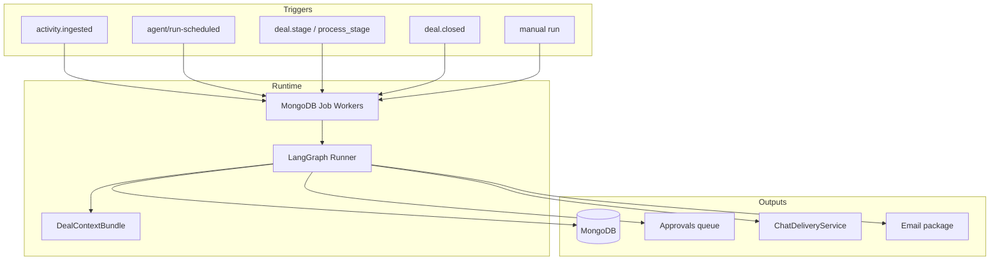

# Agent Platform — 10 Sub-Agents Specification

**Version:** 1.0  
**Runtime:** LangGraph + MongoDB job workers (`apps/api`) — see `architecture.md` §3.5  
**Delivery:** `ChatDeliveryService` — never call Slack/Teams APIs from agents (`chat-channels.md`)  
**Design UI:** `design-system.md` §5 (agent patterns)  
**Principles:** Structured context first · citations on every claim · approval for external writes

---

## 1. Platform overview



### Shared LangGraph skeleton

```
START → load_context → [plan] → tool_loop → format_output → [approval_gate?] → deliver? → END
```

| Guardrail | Value |
|-----------|-------|
| `maxSteps` | 25 |
| `maxCreditsPerRun` | 2.5 (default) |
| Per-deal monthly cap | ≤ $2 (NFR-011) |
| Citation rule | Non–"Not reported" claims require `artifactId` |

### Notification types (`ChatDeliveryService`)

| Type | Agents | User pref column |
|------|--------|------------------|
| `deal_focus` | #3 | `notify_deal_focus` |
| `approval` | #2, #5, #7 | `notify_approvals` |
| `risk_alert` | #4 | `notify_risk_alerts` |
| `buying_signal` | #6 | `notify_buying_signals` *(add)* |
| `negotiation_alert` | #8 | `notify_negotiation_alerts` *(add)* |
| `digest` | #10 | `notify_weekly_digest` |

---

## 2. Agent catalog

| # | Agent | Phase | Trigger | Approval? | Chat delivery |
|---|-------|-------|---------|-----------|---------------|
| 1 | Deal Context Synthesizer | **P1** | `activity.ingested`, manual refresh | No | No (read `/deal` in chat) |
| 2 | CRM Hygiene | P2 suggest / P3 write | post-call, nightly | **Yes** (CRM patch) | Approval buttons |
| 3 | Deal Focus | **P1** | Daily 7am user TZ | No | DM / channel |
| 4 | Risk Scanner | **P1** | Every 6h + daily | No | High severity only |
| 5 | Post-Call Follow-up | **P1** | `activity.ingested` (Gong) | **Yes** (email) | Approval buttons |
| 6 | Buying Signals | P2 | `activity.ingested` | No | Hot-deal alert |
| 7 | POC Orchestrator | P2–3 | Process → Technical Validation | Optional (Jira/kickoff) | Deal channel |
| 8 | Negotiation Tracker | P2–3 | `activity.ingested` | No | Objection alert |
| 9 | Win/Loss Analyst | P3 | `deal.closed`, quarterly | Optional (Jira) | Leadership digest |
| 10 | Weekly Leadership Digest | P2–3 | Mon 8am workspace TZ | No | Email + chat |

**MVP ship set (staff-cut):** #1, #3, #4, #5 + MEDDPICC UI.

---

## 3. Agent #1 — Deal Context Synthesizer

**Purpose:** MEDDPICC + sentiment + technical fit from unified deal context.

| Aspect | Spec |
|--------|------|
| **Graph** | `check_cache` → assemble → RAG → 8× parallel letter extract → merge locks → synthesize → score → persist |
| **SSE** | 8 loading steps → `section.completed` per letter → `summary.completed` |
| **Output** | `deal_meddpicc`, `meddpicc_citations`, `deals.sentiment`, `technical_fit_score` |
| **Tools** | `crm_get_deal_status`, `search_artifacts`, `get_artifact_excerpt` |
| **Cost** | ~0.8–1.2 credits/run; skip via `input_hash` |
| **UI** | `MeddpiccSummary`, `LoadingStepsList`, `CitationPopover` |

**Dedup:** MongoDB job dedupe 2 min/deal; `input_hash` over artifact content hashes.

---

## 4. Agent #2 — CRM Hygiene

**Purpose:** Draft CRM field updates from evidence → approval → write-back (P3).

| Aspect | Spec |
|--------|------|
| **Graph** | load → fetch CRM snapshot → deterministic gaps → LLM suggestions → `propose_field_update` → approval_gate → notify |
| **Output** | `approvals.content_type = crm_field_update` with `CanonicalDealPatch` + etag |
| **Write-back** | `CrmSyncOrchestrator.applyWriteBack` — Phase 3 only |
| **Chat** | Block Kit diff preview + Approve/Reject |
| **Cost** | ~0.01 credits/run (mostly rules) |

---

## 5. Agent #3 — Deal Focus

**Purpose:** Daily top-5 prioritized deals per rep.

| Aspect | Spec |
|--------|------|
| **Graph** | load deals → **deterministic rank** → LLM reasons (top 5) → cache → deliver |
| **Schedule** | 7:00 **per user timezone** (`users.timezone` — add column) |
| **Ranking** | Weighted: risk 25%, blockers 20%, stall 20%, urgency 15%, sentiment 10%, plan gap 5%, value 5% + hard boosts |
| **Cache** | MongoDB `focus_snapshots` or in-process cache until local midnight |
| **Commands** | `/focus` reads cache — no duplicate LLM |
| **UI** | `FocusFeedCard` on `/home` |
| **Cost** | ~0.2–0.3 credits/run |

---

## 6. Agent #4 — Risk Scanner

**Purpose:** Rules-first risk score 0–100 → kanban badges → chat for high severity.

| Aspect | Spec |
|--------|------|
| **Graph** | load → rule signals → score → conditional LLM narrate → persist → alert if ≥61 |
| **Severity** | 0–30 low · 31–60 medium · 61–80 high · 81–100 critical |
| **Signals** | Stalled activity, MEDDPICC gaps, sentiment drift, blockers, SLA breach |
| **Event** | `risk.elevated` when crossing into high or delta ≥15 |
| **UI** | `SentimentBadge`, `BlockerBadge` on `DealCard` |
| **Cost** | ~0.15–0.45 credits/workspace/run (LLM on elevated only) |

Full rubric: see analysis in repo — 16 additive signals capped at 100.

---

## 7. Agent #5 — Post-Call Follow-up

**Purpose:** Transcript → summary, tasks, email draft within **15 min** (NFR-003).

| Aspect | Spec |
|--------|------|
| **Trigger** | Gong `call.completed` → ingest → `activity.ingested` |
| **Graph** | load → plan → RAG tool_loop → format → **approval_gate** → deliver |
| **Output** | `approvals.content_type = post_call_bundle` |
| **On approve** | Send email, insert `tasks`, optional `deal_notes` |
| **Model** | GPT-4o (quality for action items) |
| **Chat** | Approval notification + `/approve {id}` |
| **UI** | `ApprovalPreview` with email HTML + task list |
| **Cost** | ~0.8–1.5 credits/run |

---

## 8. Agent #6 — Buying Signals (Phase 2)

**Purpose:** Detect purchase-intent signals → `deals.is_hot` + tags.

| Signal | Tag slug |
|--------|----------|
| Urgency | `urgency-timeline` |
| Budget | `budget-confirmed` |
| Competitor | `competitive-displacement` |
| Champion action | `champion-advocacy` |

**Hot rule:** ≥1 high-confidence signal (0.75+) OR ≥2 medium in 7 days.  
**UI:** `Flame` hot badge + signal chips on kanban.  
**Cost:** ~0.2 credits/run; high volume — rules pre-filter.

---

## 9. Agent #7 — POC Orchestrator (Phase 2–3)

**Purpose:** Technical Validation entry → POC plan + milestones + Jira.

| Aspect | Spec |
|--------|------|
| **Trigger** | `deals.opine_process_stage_id` → Technical Validation |
| **Tools** | `create_milestone`, `jira_create_issue` |
| **UI** | Plan tab, `ProcessStepper`, plan confidence KPI |
| **Chat** | POC kickoff to `#deal-*` channel |
| **Deps** | Jira adapter (5.22), sales process schema |

---

## 10. Agent #8 — Negotiation Tracker (Phase 2–3)

**Purpose:** Objection extraction → tags + cited talk tracks.

| Objection taxonomy | Slug |
|--------------------|------|
| Pricing, ROI, Competition, Timing, Authority, Legal, Security, Technical, Implementation, Incumbent |

**UI:** `NegotiationTalkTracks` sidebar + objection chips on deal header.  
**No approval** — internal coaching only.

---

## 11. Agent #9 — Win/Loss Analyst (Phase 3)

**Purpose:** Closed-deal post-mortems + quarterly themes + `product_requests`.

| Trigger | Scope |
|---------|-------|
| `deal.closed` | Single deal report |
| Quarterly cron | Aggregate win rate, loss themes, ARR impact |

**UI:** `/insights/loss`, product request cards on `/requests`.  
**Deps:** Activity rollups (6.1), Agent #1 snapshots.

---

## 12. Agent #10 — Weekly Leadership Digest (Phase 2–3)

**Purpose:** Monday leadership rollup — email primary, chat condensed.

| Aspect | Spec |
|--------|------|
| **Schedule** | Mon 8:00 `workspaces.timezone` |
| **Recipients** | `manager`/`admin` with `notify_weekly_digest = true` (opt-in) |
| **Graph** | aggregate (SQL) → summarize (1× LLM) → format email + chat → deliver |
| **Inputs** | Pipeline totals, Agent #4 risk deals, activity rollups |
| **Email subject** | `Weekly Pipeline Digest — {{date}} \| {{open_pipeline}}` |
| **Cost** | ~0.5–1.5 credits/run (~4/month/workspace) |

---

## 13. Agent templates (seed)

| slug | name | category | default_trigger |
|------|------|----------|-----------------|
| `deal-context-synthesizer` | Deal Context Synthesizer | process | event: `activity.ingested` |
| `crm-hygiene` | CRM Hygiene | process | cron nightly + event |
| `deal-focus` | Deal Focus | process | cron daily 7am |
| `risk-scanner` | Risk Scanner | risk | cron `0 */6 * * *` |
| `post-call-followup` | Post-Call Follow-up | process | event: `activity.ingested` |
| `buying-signals` | Buying Signals | signals | event: `activity.ingested` |
| `poc-orchestrator` | POC Orchestrator | process | event: `deal.process_stage_changed` |
| `negotiation-tracker` | Negotiation Tracker | signals | event: `activity.ingested` |
| `win-loss-analyst` | Win/Loss Analyst | reporting | event: `deal.closed` |
| `weekly-leadership-digest` | Weekly Leadership Digest | reporting | cron Mon 8am |

---

## 14. Domain events (extend `architecture.md` §4)

```typescript
type DomainEvent =
  | { type: 'activity.ingested'; dealId?: string; artifactId: string; source: string }
  | { type: 'deal.context_updated'; dealId: string; fields: string[] }
  | { type: 'deal.stage_changed'; dealId: string; stageId: string }
  | { type: 'deal.process_stage_changed'; dealId: string; processStageId: string }
  | { type: 'deal.closed'; dealId: string; outcome: 'won' | 'lost' }
  | { type: 'risk.elevated'; dealId: string; score: number }
  | { type: 'deal.tagged'; dealId: string; tagSlug: string }
  | { type: 'approval.decided'; approvalId: string; status: string };
```

---

## 15. Schema gaps (from 10-agent analysis)

| Gap | Resolution |
|-----|------------|
| `users.timezone` | Add for Deal Focus 7am scheduling |
| `notify_buying_signals` | Add to `user_chat_preferences` |
| `notify_negotiation_alerts` | Add to `user_chat_preferences` |
| `deal_objections` or talk-track JSONB | Phase 2 — on `deal_tags` or new table |
| `GET /api/deals/board` | Add `isHot`, `riskScore`, `tags[]` |
| `GET /api/focus` | Document in `api-routes.md` |
| Plan tab wireframe | Add to `design-system.md` |
| Phase alignment PRD vs WBS | Agents #6–10 = late P2 / P3 per WBS |

---

## 16. Implementation order (WBS-aligned)

```
P1 (W5–W7):
  4.14 Agent engine → 3.x MEDDPICC (#1) → 5.10 ChatConnector
  → 4.19 Deal Focus (#3) → 4.20 Risk Scanner (#4) → 4.21 Post-Call (#5)

P2 (W8–W10):
  4.22 CRM Hygiene (#2) → 4.23 Buying Signals (#6)
  → 4.24 Weekly Digest (#10) → 5.17–5.18 Teams/Google Chat

P3 (W11+):
  4.25 POC (#7) → 4.26 Negotiation (#8) → 4.27 Win/Loss (#9)
  → 5.8 CRM write-back
```

---

## 17. Related docs

| Doc | Purpose |
|-----|---------|
| [`design-system.md`](design-system.md) | Tokens, components, chat card mapping |
| [`chat-channels.md`](chat-channels.md) | ChatConnector, delivery, commands |
| [`architecture.md`](architecture.md) | LangGraph, MongoDB job queue, event bus |
| [`stack.md`](stack.md) | Next.js + shadcn + Node API + MongoDB |
| [`prd.md`](prd.md) | FR-003, FR-004, FR-009 |
| [`wbs.md`](wbs.md) | 4.14–4.27 task estimates |
