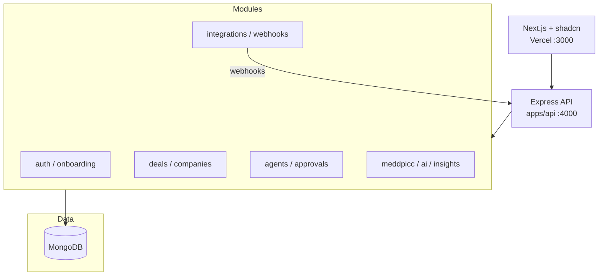

# System Architecture
# AI-Native Presales CRM

**Version:** 4.0  
**Date:** 2026-09-09  
**Stack:** Next.js + shadcn/ui · **modular monolith** (`apps/api`) · MongoDB  
**See also:** [`system-design.md`](system-design.md), [`README.md`](README.md), [`stack.md`](stack.md)

---

## 1. Architecture Overview

Monorepo SaaS with **Next.js frontend**, **Express modular monolith** (`apps/api`), **MongoDB** (data + background jobs), and **LangGraph** agents in-process. All domain modules live under `apps/api/src/modules/` — one deployable API.



---

## 2. Repository Structure

```
ai-crm/
├── apps/
│   ├── web/                      # Next.js — FRONTEND ONLY
│   │   ├── app/
│   │   │   ├── (marketing)/
│   │   │   ├── (auth)/
│   │   │   └── (dashboard)/
│   │   ├── components/
│   │   │   ├── ui/               # shadcn/ui primitives
│   │   │   ├── app/              # domain components
│   │   │   ├── marketing/
│   │   │   └── agents/
│   │   └── lib/
│   │       ├── api-client.ts     # fetch wrapper → API_URL
│   │       └── query-client.ts
│   └── api/                      # Node.js BACKEND
│       ├── src/
│       │   ├── server.ts
│       │   ├── routes/v1/
│       │   ├── middleware/auth.ts
│       │   ├── webhooks/
│       │   └── workers/          # MongoDB job processors (optional split)
│       └── package.json
├── packages/
│   ├── db/                       # Mongoose models + connect
│   ├── agents/                   # LangGraph graphs
│   ├── integrations/             # CRM, chat, Gong, Jira
│   ├── context/                  # RAG (Mongo vector search)
│   ├── shared/                   # Zod + types
│   └── email/
├── docs/
└── package.json
```

**Package manager:** pnpm · **Build:** Turborepo

---

## 3. Layer Responsibilities

### 3.1 Frontend (`apps/web`)

- **Next.js 15** App Router — pages, layouts, marketing site.
- **shadcn/ui** — all UI primitives in `components/ui/`; domain UI in `components/app/`.
- **TanStack Query** — cache + optimistic updates against Node API.
- **No Prisma, no Mongoose, no direct DB** in the web app.
- Clerk for sign-in UI; passes JWT to API via `Authorization` header.

```typescript
// lib/api-client.ts
const API = process.env.NEXT_PUBLIC_API_URL!;

export async function apiGet<T>(path: string, token: string): Promise<T> {
  const res = await fetch(`${API}/api/v1${path}`, {
    headers: { Authorization: `Bearer ${token}` },
  });
  if (!res.ok) throw new ApiError(res);
  return res.json();
}
```

### 3.2 Backend API (`apps/api`)

- **Express** TypeScript server (see ADR — Fastify not in scope).
- All routes under `/api/v1` — see `api-routes.md`.
- Middleware: Clerk JWT verify → `workspaceId`, `userId`, RBAC.
- **Every Mongoose query** includes `{ workspaceId }`.
- SSE endpoints for MEDDPICC streaming.
- Webhooks ingested here (CRM, Gong, chat).

### 3.3 Domain (`packages/context`, `packages/agents`)

- Deal scoring, MEDDPICC pipeline, LangGraph agents.
- RAG: MongoDB Atlas `$vectorSearch` + text search on `artifact_chunks`.

### 3.4 Integrations (`packages/integrations`)

- `CrmConnector`, `ChatConnector`, `IntegrationAdapter` — unchanged interface; persistence via Mongoose.

### 3.5 Workers (MongoDB job queue)

Background jobs stored in MongoDB `background_jobs` collection. Processors run in the API process by default; optional dedicated worker via `pnpm --filter @ai-crm/api dev:worker`.

| Queue | Trigger | Purpose |
|-------|---------|---------|
| `ingest-call` | Gong webhook | Transcript → artifacts |
| `agent-runs` | Event / cron / manual | Agent execution |

Additional queues (CRM sync, chat deliver, rollups) planned — same MongoDB queue pattern.

### 3.6 Agent Runtime (LangGraph)

Invoked from `apps/api` workers — same graph pattern as `agent-platform.md`.

---

## 4. Event Bus

Workers emit domain events via MongoDB job queue or internal EventEmitter:

```typescript
type DomainEvent =
  | { type: 'deal.created'; dealId: string }
  | { type: 'deal.stage_changed'; dealId: string; from: string; to: string }
  | { type: 'deal.closed'; dealId: string; outcome: 'won' | 'lost' }
  | { type: 'activity.ingested'; dealId?: string; artifactId: string; source: string }
  | { type: 'deal.context_updated'; dealId: string; fields: string[] }
  | { type: 'risk.elevated'; dealId: string; score: number }
  | { type: 'approval.decided'; approvalId: string; status: string };
```

---

## 5. Authentication

```
Browser → Clerk (web) → JWT → Node API middleware → workspaceId + role
```

| Role | Permissions |
|------|-------------|
| `admin` | Settings, integrations, all deals |
| `manager` | Team deals, approvals, insights |
| `member` | Own + assigned deals |

OAuth tokens stored encrypted in `integration_connections` (MongoDB).

---

## 6. AI / RAG

1. Chunk transcript → `artifact_chunks` with `embedding: number[]`
2. Atlas Vector Search + text index hybrid top-k=8 (pre-filter `workspaceId` + `dealId`)
3. Citations reference `artifacts._id`
4. Skip regeneration when `deal_meddpicc.inputHash` matches artifact hashes

**Data architecture (scalability, indexes, ER diagrams, retention):** [`database.md`](database.md) v3.0

---

## 7. Deployment

| Component | Platform |
|-----------|----------|
| **Web** (`apps/web`) | Vercel |
| **API** (`apps/api`) | Railway / Render / Fly.io / AWS ECS |
| **MongoDB** | MongoDB Atlas (M10+ for vector search) |
| **Object storage** | S3 / Cloudflare R2 |
| **Workers** | Same API process or separate worker process (MongoDB `background_jobs`) |

### Local dev

```bash
docker run -d -p 27017:27017 mongo:7
pnpm --filter api dev      # :4000
pnpm --filter web dev      # :3000
```

---

## 8. Security & integration reliability

- API: `helmet`, `cors` (web origin only), in-memory rate limiting.
- Clerk JWT validation on every protected route.
- Webhook HMAC verification on `POST /api/v1/webhooks/:provider/:connectionId`.
- Encrypted OAuth tokens at rest.

### Idempotency (webhooks + agents)

1. **Dedupe keys:** `(workspaceId, provider, externalEventId)` on webhook ingest; `(workspaceId, source, sourceId)` on artifacts.
2. **Fast ack:** Verify signature → enqueue MongoDB background job → return `202` within 3s — never run LangGraph in webhook handler.
3. **Write-back:** CRM patches only after approval; pass `externalEtag` from `external_records`.

### Stage model

Three layers — kanban `stageId`, CRM mirror via `crm_stage_mappings`, presales process stepper. See [`prd.md`](prd.md) §5.5 and [`system-design.md`](system-design.md) §15.

### Onboarding (first-class flow)

Sign up → pick CRM → OAuth → stage mapping → `crm-backfill` → `/deals`. See [`system-design.md`](system-design.md) §8.

---

## 9. Caching

| Data | Layer | TTL |
|------|-------|-----|
| Deal board | TanStack Query (web) | 30s |
| KPIs | TanStack Query + MongoDB | 60s |
| MEDDPICC | MongoDB (`inputHash` on `deal_meddpicc`) | Until `activity.ingested` |
| Focus feed | MongoDB / in-process cache | Until midnight user TZ |

---

## 10. ADRs (updated)

| ADR | Decision | Rationale |
|-----|----------|-----------|
| ADR-001 | Turborepo monorepo | Shared types web ↔ api |
| ADR-002 | **MongoDB + Atlas Vector Search** | Document model fits CRM + flexible AI JSON; team preference |
| ADR-003 | **Separate Node.js API** | Clear frontend/backend split; long-running SSE + workers |
| ADR-004 | **shadcn/ui on Next.js** | Accessible components, full UI control |
| ADR-005 | MongoDB job queue vs Inngest | Node-native async work; single database |
| ADR-006 | LangGraph | HITL interrupts for approvals |
| ADR-007 | Approval before CRM write | Trust + compliance |
