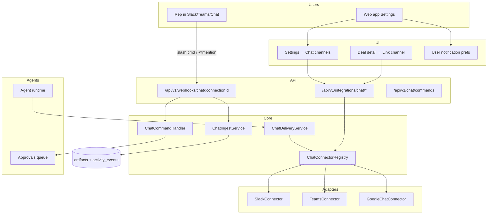

# Chat Channel Framework
# Multi-Provider Messaging (Slack, Microsoft Teams, Google Chat, …)

**Version:** 1.0  
**Status:** Required for agent delivery + user interaction surfaces  
**Pattern:** Same adapter model as [`crm-connectors.md`](crm-connectors.md) — one interface, many providers  
**Staff note:** Build `ChatConnector` core before provider-specific bots (parallel to CRM framework)

---

## 1. Goals

1. **User picks their chat tool** — Slack, Microsoft Teams, Google Chat (and more later); workspace can connect **multiple** chat platforms simultaneously (unlike one-primary-CRM rule).
2. **Configure where notifications go** — per user: DM vs deal channel vs team channel; per event type (Deal Focus, approvals, risk alerts).
3. **Interact from chat** — reps query deals, approve drafts, and trigger agents without opening the web app.
4. **One codebase** — new chat provider = new adapter implementing `ChatConnector`; agents call `ChatDeliveryService`, not Slack APIs directly.
5. **Deal context ingestion** — linked channel threads become `artifacts` (`slack_thread`, `teams_thread`, `google_chat_thread`) for MEDDPICC.

---

## 2. Supported Providers (Roadmap)

| Provider | Key | Auth | MVP Phase | Interaction model |
|----------|-----|------|-----------|-------------------|
| **Slack** | `slack` | OAuth 2.0 + Bot scopes | **P1 (W7)** | Slash commands, @app mentions, Block Kit actions |
| **Microsoft Teams** | `teams` | Azure AD app + Bot Framework | **P2 (W10)** | Adaptive Cards, message extensions, @bot |
| **Google Chat** | `google_chat` | Google Workspace app | **P2 (W11)** | Slash commands, @mention, Cards v2 |
| Webex | `webex` | OAuth | P3 | Bot + cards |
| Discord | `discord` | Bot token | P3 | Slash commands (optional) |

**MVP delivery:** Slack outbound only.  
**MVP interaction:** Slack slash commands `/focus`, `/deal`, `/approve` (read + approve).  
**Phase 2:** Teams + Google Chat connect + full interaction parity.

---

## 3. Architecture



---

## 4. `ChatConnector` Interface

```typescript
// packages/integrations/chat/core/types.ts

export type ChatProviderKey = 'slack' | 'teams' | 'google_chat' | 'webex' | 'discord';

export interface CanonicalChatMessage {
  text: string;                          // fallback plain text
  blocks?: unknown;                      // provider-specific (Block Kit, Adaptive Card, Google Card)
  threadExternalId?: string;             // reply in thread
  metadata?: Record<string, string>;     // dealId, approvalId, runId
}

export interface ChatChannel {
  externalId: string;
  name: string;
  isPrivate: boolean;
  providerKey: ChatProviderKey;
}

export interface ChatInboundEvent {
  providerEventId: string;               // idempotency key
  connectionId: string;
  type: 'message' | 'slash_command' | 'button_action' | 'app_mention';
  externalUserId: string;
  externalChannelId: string;
  text: string;
  threadExternalId?: string;
  actionId?: string;                     // approve/reject button
  raw: unknown;
}

export interface ChatConnector {
  readonly providerKey: ChatProviderKey;

  // Lifecycle
  getInstallUrl(workspaceId: string, redirectUri: string): Promise<{ url: string; connectionId: string }>;
  handleOAuthCallback(params: Record<string, string>): Promise<ChatConnectionResult>;
  refreshToken(connectionId: string): Promise<void>;
  healthCheck(connectionId: string): Promise<ChatHealthStatus>;

  // Outbound
  postMessage(connectionId: string, channelExternalId: string, msg: CanonicalChatMessage): Promise<string>;
  postDm(connectionId: string, externalUserId: string, msg: CanonicalChatMessage): Promise<string>;
  updateMessage(connectionId: string, channelExternalId: string, messageExternalId: string, msg: CanonicalChatMessage): Promise<void>;

  // Discovery
  listChannels(connectionId: string, cursor?: string): Promise<{ channels: ChatChannel[]; nextCursor?: string }>;
  resolveUser(connectionId: string, externalUserId: string): Promise<{ email?: string; displayName: string }>;

  // Inbound normalization
  verifyWebhookSignature(headers: Headers, body: string): boolean;
  parseInboundEvent(body: unknown): ChatInboundEvent | null;
}
```

**Registry:**

```typescript
// packages/integrations/chat/core/registry.ts
export class ChatConnectorRegistry {
  get(providerKey: ChatProviderKey): ChatConnector;
  listProviders(): ChatProviderMeta[];
}
```

---

## 5. `ChatDeliveryService` (agents use this)

Agents **never** import Slack SDK. They call:

```typescript
interface ChatDeliveryService {
  /** Resolve user's preferred channel for notification type */
  deliverToUser(params: {
    workspaceId: string;
    userId: string;
    notificationType: 'deal_focus' | 'approval' | 'risk_alert' | 'digest';
    message: CanonicalChatMessage;
  }): Promise<DeliveryResult>;

  /** Post to deal-linked channel */
  deliverToDealChannel(params: {
    dealId: string;
    message: CanonicalChatMessage;
    fallbackDmUserId?: string;
  }): Promise<DeliveryResult>;
}
```

**Fallback order:**
1. User preference for `notificationType` (DM or specific channel on preferred provider)
2. Deal-linked channel on **any** connected provider
3. Email (Phase 2)
4. In-app notification only (always)

---

## 6. User interaction from chat

### 6.1 Supported commands (MVP — Slack)

| Command | Action | Example |
|---------|--------|---------|
| `/focus` | Today's Deal Focus list | `/focus` |
| `/deal {name}` | Deal summary + MEDDPICC TL;DR | `/deal DocuSign` |
| `/approve {id}` | Approve pending draft | `/approve a1b2c3` |
| `/reject {id}` | Reject with optional reason | `/reject a1b2c3 wrong tone` |
| `/help` | List commands | `/help` |

**Phase 2:** Same commands on Teams (`@Bot focus`) and Google Chat (`/focus`).

### 6.2 Interactive messages (buttons)

Agent outputs include action buttons where supported:

| Button | Action |
|--------|--------|
| **Approve** | `POST` internal approve API via signed action payload |
| **Edit in app** | Deep link `https://app.example.com/agents/approvals/{id}` |
| **View deal** | Deep link `/deals/{dealId}` |

**Security:** Button payloads signed with `connection_id` secret; expire after 48h (match approval TTL).

### 6.3 Natural language (Phase 3)

`@Bot what's blocking the Starburst deal?` → routed to lightweight NL handler → Deal Context query → reply in thread with citations.

---

## 7. Configuration (admin + user)

### 7.1 Workspace admin — Settings → Integrations → Chat

| Setting | Description |
|---------|-------------|
| Connect Slack / Teams / Google Chat | OAuth install per provider |
| Default deal channel pattern | e.g. `#deal-{company-slug}` auto-create (Slack P2) |
| Allow chat commands | Toggle workspace-wide |
| Require app login for `/approve` | Extra security — map chat user to workspace user via email |

### 7.2 User — Settings → Notifications → Chat

```
┌─────────────────────────────────────────────────────────────┐
│ Where should we reach you?                                  │
├─────────────────────────────────────────────────────────────┤
│ Primary chat platform:  [Slack ▼]                           │
│ Delivery mode:          ○ DM  ● Channel  ○ Both             │
│ DM / channel:           [@lakshin] or [#sales-alerts]     │
├─────────────────────────────────────────────────────────────┤
│ Notify me on:                                               │
│   ☑ Daily Deal Focus (7am)                                  │
│   ☑ Approval requests                                       │
│   ☑ Risk alerts (high severity)                             │
│   ☐ Weekly digest                                           │
├─────────────────────────────────────────────────────────────┤
│ Allow me to approve deals from chat:  [ON]                  │
│ Linked chat account: lakshin@company.com ✓                  │
└─────────────────────────────────────────────────────────────┘
```

**Multi-provider:** User can link Slack **and** Teams; pick **primary** for delivery. Secondary used if primary unreachable.

### 7.3 Deal-level — Link channel

On deal detail → Integrations panel:

```
Deal channel:  #deal-docuSign  [Slack]  [Change] [Validate]
Also ingest:   ☑ Thread messages as deal context
```

Stored in `deal_integration_links` with `provider_key` = `slack` | `teams` | `google_chat`.

---

## 8. Onboarding (optional step)

After CRM wizard (step 5), **non-blocking** prompt:

```
Step 6 (optional): Connect your chat tool
  [Slack]  [Microsoft Teams]  [Google Chat]  [Skip for now]
```

Selecting a provider → OAuth → map chat user email to workspace user → set default DM delivery.

**Do not block** `/deals` if skipped (same as Gong).

---

## 9. Database

See [`database.md`](database.md) §9.5–9.7. Summary:

| Table | Purpose |
|-------|---------|
| `integration_connections` | OAuth tokens (`provider_key` = `slack`, `teams`, `google_chat`) |
| `user_chat_preferences` | Per-user delivery targets + notification toggles |
| `user_chat_identity_links` | Map `users.id` ↔ provider external user ID |
| `deal_integration_links` | Deal ↔ channel (existing) |
| `chat_command_audit` | Log inbound commands for security |

```sql
CREATE TABLE user_chat_preferences (
  id                    UUID PRIMARY KEY DEFAULT gen_random_uuid(),
  workspace_id          UUID NOT NULL REFERENCES workspaces(id),
  user_id               UUID NOT NULL REFERENCES users(id),
  provider_key          TEXT NOT NULL,
  is_primary            BOOLEAN DEFAULT false,
  delivery_mode         TEXT NOT NULL DEFAULT 'dm',  -- dm | channel | both
  external_user_id      TEXT,
  external_channel_id   TEXT,
  notify_deal_focus     BOOLEAN DEFAULT true,
  notify_approvals      BOOLEAN DEFAULT true,
  notify_risk_alerts    BOOLEAN DEFAULT true,
  notify_weekly_digest  BOOLEAN DEFAULT false,
  interact_enabled      BOOLEAN DEFAULT true,
  created_at            TIMESTAMPTZ DEFAULT now(),
  updated_at            TIMESTAMPTZ DEFAULT now(),
  UNIQUE (workspace_id, user_id, provider_key)
);

CREATE TABLE user_chat_identity_links (
  id                    UUID PRIMARY KEY DEFAULT gen_random_uuid(),
  workspace_id          UUID NOT NULL,
  user_id               UUID NOT NULL REFERENCES users(id),
  connection_id         UUID NOT NULL REFERENCES integration_connections(id),
  external_user_id      TEXT NOT NULL,
  external_email        TEXT,
  verified_at           TIMESTAMPTZ,
  UNIQUE (connection_id, external_user_id)
);

CREATE TABLE chat_command_audit (
  id                    UUID PRIMARY KEY DEFAULT gen_random_uuid(),
  workspace_id          UUID NOT NULL,
  user_id               UUID,
  provider_key          TEXT NOT NULL,
  command               TEXT NOT NULL,
  args                  TEXT,
  success               BOOLEAN,
  error_message         TEXT,
  created_at            TIMESTAMPTZ DEFAULT now()
);
```

---

## 10. API Routes

See [`api-routes.md`](api-routes.md) §6.4. Summary:

| Method | Path | Description |
|--------|------|-------------|
| `GET` | `/api/v1/integrations/chat/providers` | List chat providers + status |
| `POST` | `/api/v1/integrations/chat/:provider/connect` | Start OAuth install |
| `DELETE` | `/api/v1/integrations/chat/:provider` | Disconnect |
| `GET` | `/api/v1/integrations/chat/:provider/channels` | List linkable channels |
| `GET` | `/api/v1/settings/chat/preferences` | User notification prefs |
| `PUT` | `/api/v1/settings/chat/preferences` | Save prefs |
| `POST` | `/api/v1/settings/chat/link-identity` | Verify chat user ↔ app user |
| `POST` | `/api/v1/webhooks/chat/:connectionId` | Unified inbound webhook |

**OAuth callbacks:**
- `GET /api/v1/oauth/callback/chat/slack`
- `GET /api/v1/oauth/callback/chat/teams`
- `GET /api/v1/oauth/callback/chat/google_chat`

---

## 11. Ingestion → deal context

When a deal-linked channel receives messages:

1. Webhook → `ChatIngestService`
2. Idempotency: `(connection_id, provider_event_id)`
3. Create `artifact` type `slack_thread` | `teams_thread` | `google_chat_thread`
4. Emit `activity.ingested` → Context Synthesizer (debounced)

**Privacy:** Only ingest channels explicitly linked to deals. Never scan entire workspace without admin consent.

---

## 12. Agent tool: `send_chat_message`

```typescript
// Registered in agent tool registry
{
  name: 'send_chat_message',
  description: 'Post update to deal channel or user DM',
  parameters: {
    dealId?: string,
    userId?: string,
    text: string,
    requireApproval: boolean,  // default true for external-facing
  }
}
```

External-facing posts (buyer-visible channels) **always** require approval. Internal `#deal-*` channels can be auto-send if agent policy allows.

---

## 13. Implementation order

```
1. ChatConnector interface + registry (packages/integrations/chat/core/)
2. SlackConnector — OAuth, postMessage, postDm, webhook parse
3. ChatDeliveryService + user_chat_preferences
4. Agent #3 Deal Focus → deliverToUser
5. Approvals → deliver with Approve/Reject buttons
6. ChatCommandHandler — /focus, /deal, /approve
7. Deal channel linking UI
8. TeamsConnector (Phase 2)
9. GoogleChatConnector (Phase 2)
```

---

## 14. Related docs

| Doc | Link |
|-----|------|
| PRD FR-009 | [`prd.md`](prd.md) |
| API routes | [`api-routes.md`](api-routes.md) §6.4 |
| Database | [`database.md`](database.md) §9.5–9.7 |
| Settings UI | [`frontend-flow.md`](frontend-flow.md) §4.6 |
| WBS | [`wbs.md`](wbs.md) §5.13–5.20 |
| Architecture | [`architecture.md`](architecture.md) §3.4 |
