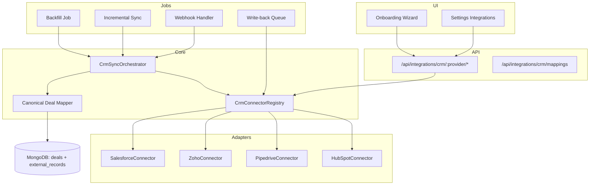

# CRM Connector Framework
# Multi-Provider Integration (HubSpot, Pipedrive, Zoho, Salesforce, …)

**Version:** 1.0  
**Status:** Required before implementation (Staff review CR-001, CR-005)  
**Related:** Chat providers use parallel framework — [`chat-channels.md`](chat-channels.md)

---

## 1. Goals

1. **One onboarding path** regardless of CRM — user picks provider, connects OAuth, maps stages, sees deals in <10 minutes.
2. **One codebase** — new CRM = new adapter implementing `CrmConnector`; no changes to deals UI, agents, or MEDDPICC.
3. **One primary CRM per workspace** (MVP) — simplifies sync and write-back; multi-CRM per workspace is Phase 3+.

---

## 2. Supported Providers (Roadmap)

| Provider | Key | Auth | MVP Phase | Notes |
|----------|-----|------|-----------|-------|
| **HubSpot** | `hubspot` | OAuth 2.0 | **P1 (W5)** | Deals API, webhooks, strong docs |
| **Pipedrive** | `pipedrive` | OAuth 2.0 | **P1 (W6)** | Multiple pipelines; popular SMB |
| **Zoho CRM** | `zoho` | OAuth 2.0 | **P2 (W10)** | EU/US datacenter selection required |
| **Salesforce** | `salesforce` | OAuth 2.0 | **P2 (W11)** | Opportunities; heaviest adapter |
| Close | `close` | API key | P3 | |
| Copper | `copper` | OAuth | P3 | |
| Microsoft Dynamics | `dynamics` | OAuth | P3 | |

---

## 3. Architecture



---

## 4. `CrmConnector` Interface

```typescript
// packages/integrations/crm/types.ts

export type CrmProvider =
  | 'hubspot'
  | 'pipedrive'
  | 'zoho'
  | 'salesforce';

export interface CrmConnector {
  readonly provider: CrmProvider;
  readonly displayName: string;

  // --- OAuth ---
  getOAuthConfig(): OAuthConfig;
  buildAuthorizationUrl(state: OAuthState): string;
  exchangeCodeForTokens(code: string): Promise<TokenSet>;
  refreshTokens(refreshToken: string): Promise<TokenSet>;

  // --- Discovery (onboarding) ---
  listPipelines(connection: Connection): Promise<CrmPipeline[]>;
  listStages(connection: Connection, pipelineId: string): Promise<CrmStage[]>;
  listOwners(connection: Connection): Promise<CrmOwner[]>;
  listDealFields(connection: Connection): Promise<CrmFieldSchema[]>;

  // --- Sync (read) ---
  fetchDealsPage(
    connection: Connection,
    cursor: SyncCursor
  ): Promise<PageResult<CanonicalCrmDeal>>;

  fetchDealById(
    connection: Connection,
    externalId: string
  ): Promise<CanonicalCrmDeal>;

  fetchActivities(
    connection: Connection,
    dealExternalId: string,
    since?: Date
  ): Promise<CanonicalCrmActivity[]>;

  // --- Webhooks ---
  verifyWebhookSignature(
    headers: Headers,
    body: string,
    secret: string
  ): boolean;

  parseWebhookEvent(
    body: unknown
  ): CrmWebhookEvent[];

  registerWebhooks?(
    connection: Connection,
    callbackUrl: string
  ): Promise<void>;

  // --- Write-back (via approval queue) ---
  updateDeal(
    connection: Connection,
    externalId: string,
    patch: CanonicalDealPatch,
    etag?: string
  ): Promise<WriteResult>;

  createNote?(
    connection: Connection,
    dealExternalId: string,
    note: string
  ): Promise<{ externalId: string }>;

  // --- Health ---
  healthCheck(connection: Connection): Promise<HealthCheckResult>;
}
```

---

## 5. Canonical Models

### 5.1 `CanonicalCrmDeal`

Provider-agnostic shape **all** adapters must emit:

```typescript
interface CanonicalCrmDeal {
  externalId: string;
  provider: CrmProvider;
  pipelineExternalId: string | null;
  stageExternalId: string;
  title: string;
  amount: number;
  currency: string;
  status: 'open' | 'won' | 'lost';
  ownerExternalId: string | null;
  companyExternalId: string | null;
  companyName: string | null;
  expectedCloseDate: string | null;  // ISO date
  probability: number | null;        // 0-100 if provider supplies
  updatedAt: string;                 // ISO datetime
  raw: Record<string, unknown>;      // never sent to LLM; debug only
}
```

### 5.2 Internal mapping (your DB)

| Internal field | Source |
|----------------|--------|
| `deals.id` | Your UUID |
| `deals.title` | `canonical.title` |
| `deals.amount` | `canonical.amount` |
| `deals.stage_id` | **Mapped via** `crm_stage_mappings` from `canonical.stageExternalId` |
| `deals.owner_id` | **Mapped via** `crm_user_mappings` from `canonical.ownerExternalId` |
| `external_records` | `(provider, external_id)` → `deal_id` |

**Never store** `hubspot_deal_id` on `deals` table — use `external_records`.

---

## 6. Provider-Specific Mapping Notes

### HubSpot
| Canonical | HubSpot API |
|-----------|-------------|
| `externalId` | `deal.id` |
| `stageExternalId` | `deal.properties.dealstage` |
| `pipelineExternalId` | `deal.properties.pipeline` |
| `amount` | `deal.properties.amount` |
| Webhooks | `deal.propertyChange`, `deal.creation` |

### Pipedrive
| Canonical | Pipedrive API |
|-----------|---------------|
| `externalId` | `deal.id` (number → string) |
| `pipelineExternalId` | `pipeline_id` |
| `stageExternalId` | `stage_id` |
| `status` | `status` (open/won/lost) |
| Webhooks | Pipedrive v2 webhooks (subscription per connection) |
| **Gotcha** | Multiple pipelines — user must pick default pipeline at onboarding |

### Zoho CRM
| Canonical | Zoho API |
|-----------|----------|
| `externalId` | `Deal.id` |
| `stageExternalId` | `Stage` |
| `amount` | `Amount` |
| **Gotcha** | `accounts.zoho.com` vs `accounts.zoho.eu` — store `api_domain` on connection |
| Webhooks | Notification APIs; polling fallback every 15 min |

### Salesforce
| Canonical | Salesforce API |
|-----------|----------------|
| `externalId` | `Opportunity.Id` |
| `stageExternalId` | `StageName` (text, not ID — map by name) |
| `amount` | `Amount` |
| `pipelineExternalId` | `RecordTypeId` optional |
| Webhooks | Outbound messages / Platform Events; CDC for scale |
| **Gotcha** | FLS — write-back must use user-delegated token |

---

## 7. Database Additions

```sql
-- Replace hubspot-specific columns with:

CREATE TABLE external_records (
  id              UUID PRIMARY KEY DEFAULT gen_random_uuid(),
  workspace_id    UUID NOT NULL,
  entity_type     TEXT NOT NULL,  -- deal | company | contact | user
  internal_id     UUID NOT NULL,
  provider        TEXT NOT NULL,
  external_id     TEXT NOT NULL,
  external_etag   TEXT,           -- for optimistic write-back
  last_synced_at  TIMESTAMPTZ,
  raw_snapshot    JSONB,
  UNIQUE (workspace_id, provider, entity_type, external_id)
);

CREATE TABLE crm_stage_mappings (
  id                    UUID PRIMARY KEY DEFAULT gen_random_uuid(),
  workspace_id          UUID NOT NULL,
  connection_id         UUID NOT NULL REFERENCES integration_connections(id),
  pipeline_external_id  TEXT,       -- null for single-pipeline CRMs
  stage_external_id     TEXT NOT NULL,
  stage_external_label  TEXT NOT NULL,
  internal_stage_id     UUID NOT NULL REFERENCES pipeline_stages(id),
  UNIQUE (connection_id, pipeline_external_id, stage_external_id)
);

CREATE TABLE crm_user_mappings (
  id                  UUID PRIMARY KEY DEFAULT gen_random_uuid(),
  workspace_id        UUID NOT NULL,
  connection_id       UUID NOT NULL,
  external_user_id    TEXT NOT NULL,
  external_email      TEXT,
  internal_user_id    UUID REFERENCES users(id),
  UNIQUE (connection_id, external_user_id)
);

CREATE TABLE crm_field_mappings (
  id                  UUID PRIMARY KEY DEFAULT gen_random_uuid(),
  workspace_id        UUID NOT NULL,
  connection_id       UUID NOT NULL,
  canonical_field     TEXT NOT NULL,  -- amount | close_date | ...
  external_field_id   TEXT NOT NULL,
  direction           TEXT NOT NULL DEFAULT 'bidirectional', -- read | write | bidirectional
  UNIQUE (connection_id, canonical_field)
);

-- Workspace: which CRM is primary
ALTER TABLE workspaces ADD COLUMN primary_crm_connection_id UUID
  REFERENCES integration_connections(id);
```

---

## 8. Onboarding Wizard (5 Steps)

**Route:** `/onboarding` (forced until `workspace.onboarding_completed_at` is set)

### Step 1 — Choose your CRM

```
Which CRM does your team use?
[HubSpot] [Pipedrive] [Zoho CRM] [Salesforce] [Other - request]
```

- Single select; stores `selected_provider`
- "Other" → waitlist form, not blocked from demo mode

### Step 2 — Connect (OAuth)

- Provider-branded card + "Connect" button
- Popup OAuth → poll connection status
- Error states: denied, wrong account, missing scopes

### Step 3 — Map pipeline stages

- Left: CRM stages (from `listStages`)
- Right: Internal default stages (drag to map or auto-suggest by name fuzzy match)
- Preview: "47 deals will import to Qualification"
- **Pipedrive:** pipeline picker if multiple

### Step 4 — Map team members (optional skip)

- Table: CRM user email → workspace user (auto-match by email)
- Unmapped owners → assign to connecting admin

### Step 5 — Import & go

- Progress bar: "Importing deals… 32/47"
- On complete: confetti + CTA "View your pipeline"
- Set `workspace.onboarding_completed_at`
- Trigger: Deal Focus agent intro (optional)

**Target time:** <10 minutes for admin with <500 open deals.

---

## 9. Sync Strategy

| Mode | When | Behavior |
|------|------|----------|
| **Initial backfill** | Onboarding step 5 | Paginate all open deals; bulk insert; 1 job per workspace |
| **Incremental poll** | Every 15 min | `updatedAt > cursor` |
| **Webhook** | Real-time | Parse → upsert single deal |
| **Manual** | User clicks "Sync now" | Force incremental |
| **Write-back** | After approval | `updateDeal` with etag; on conflict → approval retry UI |

### Rate limits (plan for)

| Provider | Limit | Strategy |
|----------|-------|----------|
| HubSpot | 100–190 req/10s | Token bucket per portal |
| Pipedrive | ~10k/day (varies by plan) | Queue + prioritize webhook |
| Zoho | 15k–25k/day | Batch + backoff |
| Salesforce | 15k–100k+ API/day | Bulk API for backfill |

---

## 10. API Routes (Connector)

| Method | Path | Description |
|--------|------|-------------|
| `GET` | `/api/integrations/crm/providers` | List available CRM providers + connection status |
| `POST` | `/api/integrations/crm/:provider/connect` | Start OAuth |
| `GET` | `/api/integrations/crm/:provider/status` | Poll connection |
| `DELETE` | `/api/integrations/crm/:provider` | Disconnect |
| `GET` | `/api/integrations/crm/:provider/pipelines` | Discovery for mapping UI |
| `GET` | `/api/integrations/crm/:provider/stages` | `?pipelineId=` |
| `GET` | `/api/integrations/crm/:provider/owners` | User mapping UI |
| `GET` | `/api/integrations/crm/mappings/stages` | Current mappings |
| `PUT` | `/api/integrations/crm/mappings/stages` | Save stage mappings |
| `PUT` | `/api/integrations/crm/mappings/users` | Save user mappings |
| `POST` | `/api/integrations/crm/sync` | Trigger manual sync |
| `GET` | `/api/integrations/crm/sync/status` | Backfill progress (SSE or poll) |
| `POST` | `/api/onboarding/complete` | Mark wizard done |

### Webhooks (signed)

```
POST /api/webhooks/crm/:connectionId
Header: X-CRM-Signature: sha256=...
```

---

## 11. Agent & MEDDPICC Integration

Agents **never** call HubSpot/Pipedrive SDKs directly.

```typescript
// Agent tool
async function crm_get_deal_status(dealId: string) {
  const record = await externalRecords.get(dealId);
  const connector = registry.get(record.provider);
  return connector.fetchDealById(connection, record.externalId);
}
```

MEDDPICC step "Checking CRM status" → `CanonicalCrmDeal` + last sync time.

CRM Hygiene write-back → `CanonicalDealPatch` → approval → `connector.updateDeal`.

---

## 12. Testing Strategy

| Test type | Scope |
|-----------|-------|
| **Contract tests** | Each adapter against recorded fixtures (VCR) |
| **Mapping tests** | Stage map → correct `internal_stage_id` |
| **Webhook tests** | Signature verification + idempotency |
| **E2E** | Onboarding wizard with Pipedrive sandbox account |

Fixture directory: `packages/integrations/crm/__fixtures__/{provider}/`

---

## 13. Implementation Order

1. `CrmConnector` interface + registry + canonical types
2. `external_records` + `crm_stage_mappings` migration
3. HubSpot adapter (reference implementation)
4. Onboarding wizard UI (steps 1–5)
5. Sync orchestrator (backfill + incremental)
6. Pipedrive adapter (proves framework)
7. Webhook router with `connectionId`
8. Zoho + Salesforce adapters
9. CRM Hygiene write-back through connector

---

## 14. Open Questions

| # | Question | Recommendation |
|---|----------|----------------|
| 1 | Nango for OAuth? | Yes for MVP — saves 2 weeks |
| 2 | Deal merge on CRM switch? | Archive old external_records; don't auto-merge |
| 3 | Custom fields in MEDDPICC? | Phase 2 via `crm_field_mappings` |
