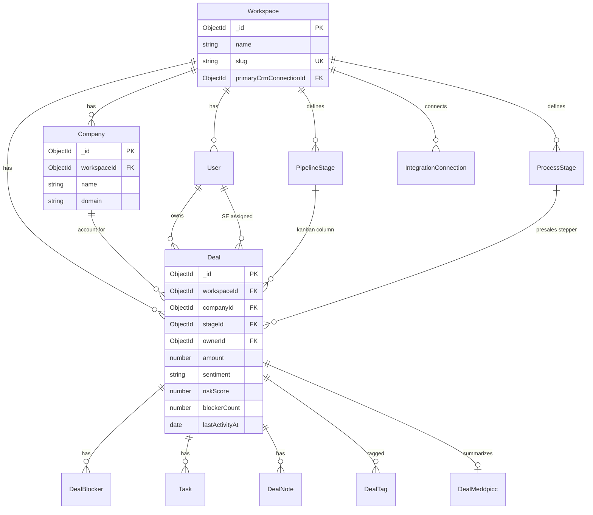
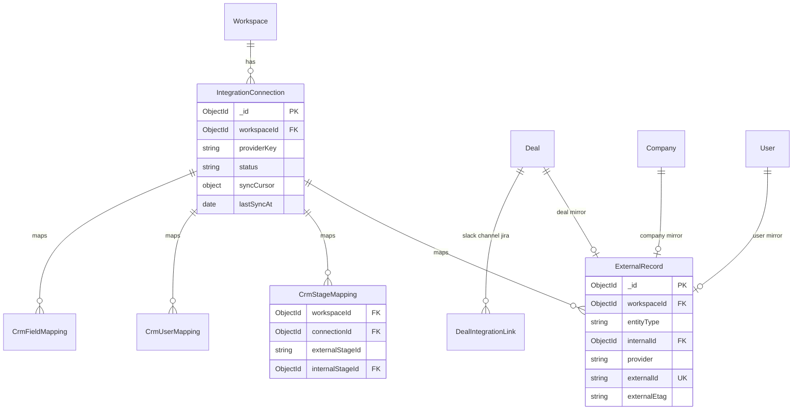
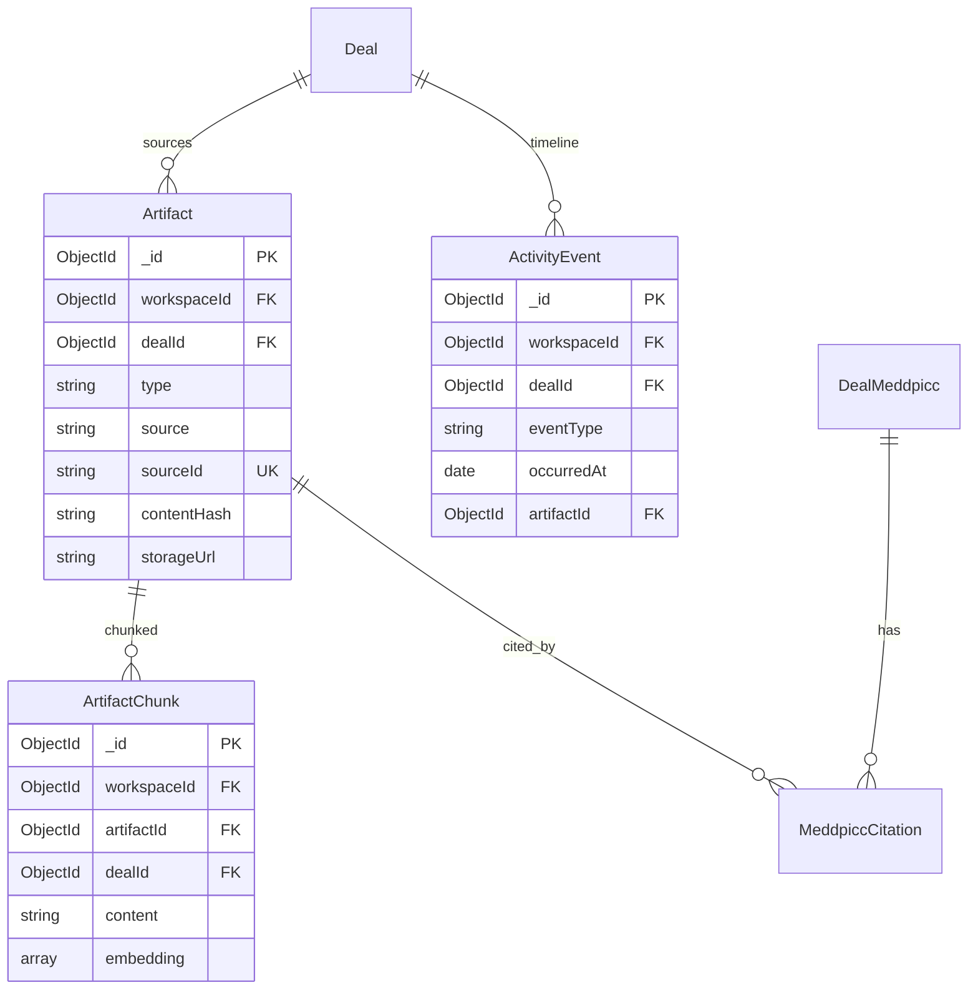
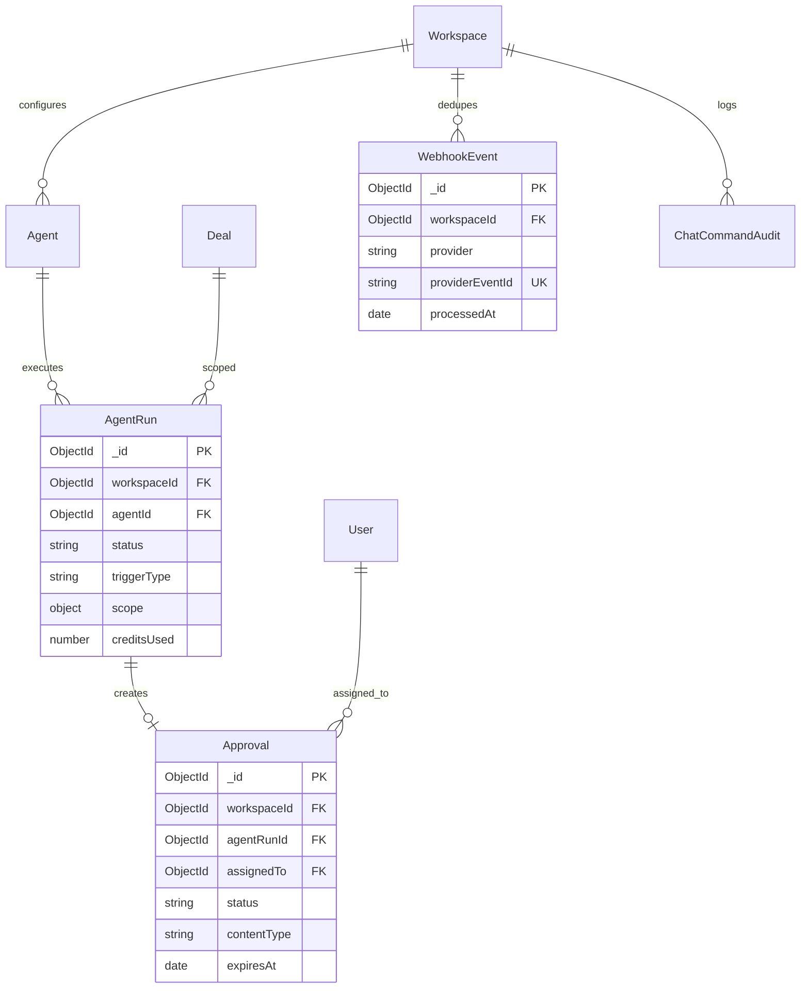
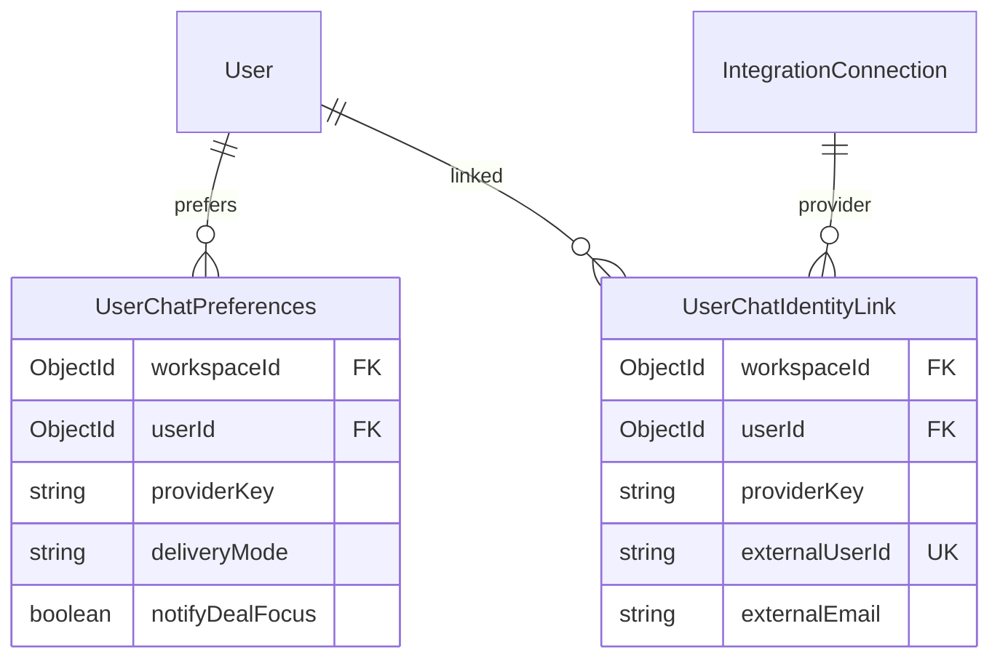

# Database Schema & Data Architecture
# AI-Native Presales CRM

**Version:** 4.0  
**Architecture:** modular monolith — see [`architecture.md`](architecture.md)  
**ODM:** Mongoose 8  
**Database:** MongoDB 7+ (MongoDB Atlas)  
**Vector search:** Atlas Vector Search on `artifact_chunks`  
**Overview:** [`system-design.md`](system-design.md) · **Index:** [`README.md`](README.md)  
**CRM pattern:** `external_records` + mapping collections — **never** provider IDs on `deals`. See [`crm-connectors.md`](crm-connectors.md).

---

## 1. Design principles

| Principle | Implementation |
|-----------|----------------|
| **Tenant isolation** | `workspaceId` on every tenant document; every query filters by it |
| **Provider-agnostic domain** | Deals, companies, users have no `hubspot_*` / `pipedrive_*` fields |
| **Denormalize for reads** | Kanban badges (`blockerCount`, `riskScore`, `sentiment`) live on `deals` |
| **Normalize for writes** | CRM mirror in `external_records`; AI output in dedicated collections |
| **Idempotent ingestion** | Unique compound keys on artifacts, external records, webhook events |
| **Separate hot from cold** | Full transcripts in object storage; chunks + embeddings in MongoDB |
| **Cache at the edge** | TanStack Query (web) + MongoDB `inputHash` on `deal_meddpicc` |

---

## 2. Scalability model

### 2.1 Tenancy & growth assumptions

| Tier | Workspaces | Deals/workspace | Artifacts/deal | Chunks/artifact |
|------|------------|-----------------|----------------|-----------------|
| Launch | 1–50 | 30–500 | 20–100 | 50–200 |
| Growth | 500 | 2,000 | 200 | 150 |
| Scale | 10,000+ | 10,000 | 500+ | 200+ |

**Shard key:** `workspaceId` — all tenant data co-locates logically. Atlas **zone sharding** on `workspaceId` when a single cluster exceeds ~2 TB or 50k ops/sec.

### 2.2 Module data ownership

Each collection has **one owning module** under `apps/api/src/modules/` — logical boundaries within a single MongoDB database.

| Module | Collections (write owner) |
|--------|---------------------------|
| **auth / onboarding** | `workspaces`, `users` |
| **deals / companies / pipeline** | `deals`, `companies`, `pipeline_stages`, `process_stages`, `tasks`, `deal_notes`, `deal_blockers`, `deal_participants`, `deal_projects`, `deal_files`, `deal_tags`, `tag_definitions` |
| **context / artifacts** | `artifacts`, `artifact_chunks`, `activity_events`, `artifacts_archive` |
| **meddpicc / ai** | `deal_meddpicc`, `meddpicc_citations`, `meddpicc_history` |
| **agents** | `agents`, `agent_runs`, `agent_templates`, `agent_credits_ledger` |
| **approvals** | `approvals` |
| **integrations-crm** | `external_records`, `crm_*_mappings`, `crm_sync_jobs`, CRM `integration_connections` |
| **integrations-chat** | `user_chat_preferences`, `user_chat_identity_links`, `chat_command_audit`, chat `integration_connections` |
| **integrations** | Gong/Jira/Calendar `integration_connections`, `jira_issue_links` |
| **insights** | `activity_daily_rollups`, `insights_snapshots` |
| **marketing** | `marketing_leads` |

### 2.2.1 Scaling path

```
Phase 0 (dev)     apps/api — all modules, single process
Phase 1 (launch)  Single Atlas M10 cluster; optional separate worker process
Phase 2 (growth)  Read replicas for analytics; optional MongoDB TTL cache collections
Phase 3 (scale)   Sharded cluster on workspaceId if needed
```

---

## 3. Performance architecture

### 3.1 Hot paths & target latency

| Path | Collections | Target p95 | Strategy |
|------|-------------|------------|----------|
| Kanban board | `deals`, `pipeline_stages` | &lt;150ms | Compound index + TanStack Query cache 30s |
| Deal overview header | `deals`, `deal_blockers`, `tasks` | &lt;100ms | Denormalized counts on `deals` |
| MEDDPICC read | `deal_meddpicc`, `meddpicc_citations` | &lt;80ms | 1:1 `deal_meddpicc`; cache by `inputHash` |
| MEDDPICC refresh | `artifacts`, `artifact_chunks`, agent | &lt;30s stream | SSE; skip if `inputHash` unchanged |
| Approvals queue | `approvals` | &lt;100ms | Partial index on `status: pending` |
| RAG retrieval | `artifact_chunks` | &lt;200ms | Vector index + `dealId` pre-filter |
| CRM webhook ack | `webhook_events` | &lt;50ms | Insert dedupe key → enqueue → 202 |

### 3.2 Denormalization on `deals`

These fields are **updated by workers** when source data changes — never computed at read time on the kanban:

| Field | Source | Update trigger |
|-------|--------|----------------|
| `blockerCount` | `deal_blockers` | Blocker create/resolve |
| `meddpiccCompleteness` | `deal_meddpicc` | Agent run complete |
| `riskScore`, `isHot` | Risk Scanner agent | `agent-run` complete |
| `sentiment`, `technicalFitScore` | Context Synthesizer | `activity.ingested` |
| `lastActivityAt` | `activity_events` | Any artifact ingest |

### 3.3 Cache strategy (MongoDB + client)

| Cache | Layer | TTL | Contents |
|-------|-------|-----|----------|
| Kanban board | TanStack Query (web) | 30s | Board payload |
| Deal KPIs | TanStack Query (web) | 60s | Overview header aggregates |
| MEDDPICC `inputHash` | `deal_meddpicc` document | Until `activity.ingested` | Last `inputHash` |
| Focus feed | MongoDB or in-process | Until midnight user TZ | Deal Focus list |
| Webhook dedupe | `webhook_events` unique index | 7d TTL | Idempotency guard |

### 3.4 Document size limits

| Collection | Max doc size strategy |
|------------|----------------------|
| `artifacts` | `rawText` ≤ 16 KB inline; larger → `storageUrl` (S3/R2) only |
| `artifact_chunks` | `content` ≤ 2 KB per chunk; ~150 chunks/call max |
| `deal_meddpicc.letters` | Nested subdocs; prune stale versions to `meddpicc_history` if &gt;100 KB |
| `agent_runs.outputRef` | Store pointer IDs only; full output in `approvals.contentFull` |

### 3.5 Read preference

| Workload | Preference |
|----------|------------|
| API user requests | `primary` (default) |
| Leadership digest / rollups | `secondaryPreferred` |
| Analytics export | `secondary` + batch cursor |

---

## 4. Entity-relationship diagrams

### 4.1 Core domain (CRM entities)



### 4.2 Integration & external mapping



### 4.3 Activity, artifacts & RAG



### 4.4 Agents, approvals & audit



### 4.5 Chat identity & delivery



---

## 5. Collection catalog

| Collection | Est. docs/workspace (growth) | Growth rate | Partition note |
|------------|------------------------------|-------------|----------------|
| `workspaces` | 1 | Low | Global |
| `users` | 50 | Low | By workspaceId |
| `deals` | 2,000 | Medium | Index-heavy |
| `companies` | 500 | Low | |
| `pipeline_stages` | 10 | Static | |
| `artifacts` | 200,000 | **High** | Archive &gt;2yr to cold storage |
| `artifact_chunks` | 2,000,000 | **Very high** | Largest collection; shard first |
| `activity_events` | 500,000 | High | TTL index optional 18mo |
| `agent_runs` | 100,000 | High | TTL archive 12mo |
| `approvals` | 20,000 | Medium | |
| `external_records` | 5,000 | Medium | |
| `webhook_events` | 1M+ | High | TTL 7 days |
| `marketing_leads` | N/A | Low | No workspaceId |

---

## 6. Conventions

| Rule | Implementation |
|------|----------------|
| Multi-tenancy | `workspaceId: ObjectId` required + indexed on every tenant document |
| Primary key | `_id: ObjectId` — API returns string `id` |
| Timestamps | `createdAt`, `updatedAt` via `{ timestamps: true }` |
| Soft delete | `deletedAt: Date \| null` on `deals`, `companies` |
| AI output | `Schema.Types.Mixed` with Zod validation at API boundary |
| Secrets | OAuth tokens AES-256-GCM encrypted before save |
| Relations | `ObjectId` refs; prefer `$lookup` in aggregations over N+1 `populate` |

### Connection (`packages/db/src/connection.ts`)

```typescript
import mongoose from 'mongoose';

export async function connectDb(uri = process.env.MONGODB_URI!) {
  if (mongoose.connection.readyState === 1) return mongoose.connection;
  await mongoose.connect(uri, {
    maxPoolSize: 50,
    minPoolSize: 5,
    serverSelectionTimeoutMS: 5000,
  });
  return mongoose.connection;
}
```

---

## 7. Core domain schemas

### 7.1 Workspace

```typescript
const WorkspaceSchema = new Schema({
  name: { type: String, required: true },
  slug: { type: String, required: true, unique: true },
  timezone: { type: String, default: 'America/New_York' },
  settings: {
    defaultCurrency: { type: String, default: 'USD' },
    aiCreditsMonthly: { type: Number, default: 10000 },
    aiCreditsUsed: { type: Number, default: 0 },
  },
  primaryCrmConnectionId: { type: Schema.Types.ObjectId, ref: 'IntegrationConnection' },
  onboardingCompletedAt: Date,
}, { timestamps: true });
```

### 7.2 User

```typescript
const UserSchema = new Schema({
  workspaceId: { type: Schema.Types.ObjectId, ref: 'Workspace', required: true, index: true },
  googleId: { type: String, required: true, unique: true },
  email: { type: String, required: true },
  displayName: { type: String, required: true },
  avatarUrl: String,
  role: { type: String, enum: ['admin', 'manager', 'member'], default: 'member' },
  timezone: { type: String, default: 'America/New_York' },
  isActive: { type: Boolean, default: true },
}, { timestamps: true });

UserSchema.index({ workspaceId: 1, email: 1 }, { unique: true });
UserSchema.index({ workspaceId: 1, role: 1, isActive: 1 });
```

### 7.3 Company

> **No `externalIds` on company** — all provider IDs go through `external_records`.

```typescript
const CompanySchema = new Schema({
  workspaceId: { type: Schema.Types.ObjectId, ref: 'Workspace', required: true, index: true },
  name: { type: String, required: true },
  domain: String,
  industry: String,
  logoUrl: String,
  employeeCount: Number,
  deletedAt: Date,
}, { timestamps: true });

CompanySchema.index({ workspaceId: 1, domain: 1 });
CompanySchema.index({ workspaceId: 1, name: 'text' });
```

### 7.4 PipelineStage

```typescript
const PipelineStageSchema = new Schema({
  workspaceId: { type: Schema.Types.ObjectId, ref: 'Workspace', required: true, index: true },
  name: { type: String, required: true },
  position: { type: Number, required: true },
  stageType: { type: String, enum: ['open', 'closed_won', 'closed_lost'], default: 'open' },
  slaDays: Number,
  color: String,
  isDefault: { type: Boolean, default: false },
}, { timestamps: true });

PipelineStageSchema.index({ workspaceId: 1, position: 1 }, { unique: true });
```

### 7.5 ProcessStage (presales stepper — orthogonal to CRM stage)

```typescript
const ProcessStageSchema = new Schema({
  workspaceId: { type: Schema.Types.ObjectId, ref: 'Workspace', required: true, index: true },
  name: { type: String, required: true },
  position: { type: Number, required: true },
  description: String,
}, { timestamps: true });
```

### 7.6 Deal

```typescript
const DealSchema = new Schema({
  workspaceId: { type: Schema.Types.ObjectId, ref: 'Workspace', required: true, index: true },
  companyId: { type: Schema.Types.ObjectId, ref: 'Company', required: true },
  title: { type: String, required: true },
  amount: { type: Number, default: 0 },
  currency: { type: String, default: 'USD' },
  stageId: { type: Schema.Types.ObjectId, ref: 'PipelineStage', required: true },
  position: { type: Number, default: 0 },
  ownerId: { type: Schema.Types.ObjectId, ref: 'User', required: true },
  solutionsEngineerId: { type: Schema.Types.ObjectId, ref: 'User' },
  status: { type: String, enum: ['open', 'won', 'lost'], default: 'open' },

  // Denormalized AI / health fields (updated by workers)
  sentiment: { type: String, enum: ['green', 'yellow', 'red'], default: 'yellow' },
  technicalFitScore: { type: Number, min: 1, max: 5 },
  technicalFitLabel: String,
  winProbability: { type: Number, default: 0 },
  planConfidence: { type: Number, default: 0 },
  riskScore: { type: Number, default: 0, index: true },
  blockerCount: { type: Number, default: 0 },
  isHot: { type: Boolean, default: false },
  meddpiccCompleteness: { type: Number, default: 0 },
  hasEconomicBuyer: { type: Boolean, default: false },
  hasChampion: { type: Boolean, default: false },

  expectedCloseDate: Date,
  lastActivityAt: Date,
  closedAt: Date,
  lostReason: String,
  competitorWon: String,
  competitorNames: [String],
  opineProcessStageId: { type: Schema.Types.ObjectId, ref: 'ProcessStage' },
  deletedAt: Date,
}, { timestamps: true });

// Kanban — primary hot path
DealSchema.index({ workspaceId: 1, stageId: 1, position: 1 });
DealSchema.index({ workspaceId: 1, ownerId: 1, status: 1, lastActivityAt: -1 });
DealSchema.index({ workspaceId: 1, status: 1, riskScore: -1 });
DealSchema.index({ workspaceId: 1, isHot: 1, expectedCloseDate: 1 });
DealSchema.index({ workspaceId: 1, title: 'text' });
// Partial index for open deals only (smaller, faster kanban)
DealSchema.index(
  { workspaceId: 1, stageId: 1, position: 1 },
  { partialFilterExpression: { status: 'open', deletedAt: null } },
);
```

### 7.7 DealBlocker

```typescript
const DealBlockerSchema = new Schema({
  workspaceId: { type: Schema.Types.ObjectId, ref: 'Workspace', required: true, index: true },
  dealId: { type: Schema.Types.ObjectId, ref: 'Deal', required: true, index: true },
  title: { type: String, required: true },
  description: String,
  severity: { type: String, enum: ['low', 'medium', 'high', 'critical'], default: 'medium' },
  status: { type: String, enum: ['open', 'resolved'], default: 'open' },
  ownerId: { type: Schema.Types.ObjectId, ref: 'User' },
  resolvedAt: Date,
  resolvedBy: { type: Schema.Types.ObjectId, ref: 'User' },
}, { timestamps: true });

DealBlockerSchema.index({ workspaceId: 1, dealId: 1, status: 1 });
```

### 7.8 Task

```typescript
const TaskSchema = new Schema({
  workspaceId: { type: Schema.Types.ObjectId, ref: 'Workspace', required: true, index: true },
  dealId: { type: Schema.Types.ObjectId, ref: 'Deal', required: true, index: true },
  title: { type: String, required: true },
  description: String,
  status: { type: String, enum: ['open', 'done', 'cancelled'], default: 'open' },
  priority: { type: String, enum: ['low', 'medium', 'high'], default: 'medium' },
  assigneeId: { type: Schema.Types.ObjectId, ref: 'User' },
  dueAt: Date,
  completedAt: Date,
  source: { type: String, enum: ['manual', 'agent', 'crm_sync'], default: 'manual' },
  sourceRunId: { type: Schema.Types.ObjectId, ref: 'AgentRun' },
}, { timestamps: true });

TaskSchema.index({ workspaceId: 1, dealId: 1, status: 1, dueAt: 1 });
TaskSchema.index({ workspaceId: 1, assigneeId: 1, status: 1, dueAt: 1 });
```

### 7.9 DealNote

```typescript
const DealNoteSchema = new Schema({
  workspaceId: { type: Schema.Types.ObjectId, ref: 'Workspace', required: true, index: true },
  dealId: { type: Schema.Types.ObjectId, ref: 'Deal', required: true, index: true },
  authorId: { type: Schema.Types.ObjectId, ref: 'User', required: true },
  body: { type: String, required: true },
  isPinned: { type: Boolean, default: false },
}, { timestamps: true });

DealNoteSchema.index({ workspaceId: 1, dealId: 1, createdAt: -1 });
```

### 7.10 DealTag & TagDefinition

```typescript
const TagDefinitionSchema = new Schema({
  workspaceId: { type: Schema.Types.ObjectId, ref: 'Workspace', required: true, index: true },
  slug: { type: String, required: true },
  label: { type: String, required: true },
  color: String,
  category: { type: String, enum: ['signal', 'risk', 'custom'], default: 'custom' },
}, { timestamps: true });

TagDefinitionSchema.index({ workspaceId: 1, slug: 1 }, { unique: true });

const DealTagSchema = new Schema({
  workspaceId: { type: Schema.Types.ObjectId, ref: 'Workspace', required: true },
  dealId: { type: Schema.Types.ObjectId, ref: 'Deal', required: true },
  tagDefinitionId: { type: Schema.Types.ObjectId, ref: 'TagDefinition', required: true },
  appliedBy: { type: String, enum: ['user', 'agent'], default: 'user' },
  agentRunId: { type: Schema.Types.ObjectId, ref: 'AgentRun' },
}, { timestamps: true });

DealTagSchema.index({ workspaceId: 1, dealId: 1, tagDefinitionId: 1 }, { unique: true });
```

---

## 8. AI / MEDDPICC

### 8.1 DealMeddpicc

```typescript
const DealMeddpiccSchema = new Schema({
  dealId: { type: Schema.Types.ObjectId, ref: 'Deal', required: true, unique: true },
  workspaceId: { type: Schema.Types.ObjectId, ref: 'Workspace', required: true, index: true },
  letters: { type: Schema.Types.Mixed, default: {} },   // M, E, D, D, P, I, C, C sections
  narrative: { type: Schema.Types.Mixed, default: {} },
  lockedFields: [String],
  humanEdits: { type: Schema.Types.Mixed, default: {} },
  status: { type: String, enum: ['idle', 'regenerating', 'stale'], default: 'idle' },
  overallConfidence: Number,
  inputHash: { type: String, index: true },  // SHA-256 of artifact IDs + content hashes — skip regen if match
  generatedAt: Date,
  generatedByRunId: { type: Schema.Types.ObjectId, ref: 'AgentRun' },
  version: { type: Number, default: 1 },
}, { timestamps: true });
```

**`inputHash` computation:**

```typescript
// packages/context/meddpicc-input-hash.ts
const inputHash = sha256(
  artifacts
    .sort((a, b) => a._id.toString().localeCompare(b._id.toString()))
    .map(a => `${a._id}:${a.contentHash}`)
    .join('|'),
);
```

### 8.2 MeddpiccCitation

```typescript
const MeddpiccCitationSchema = new Schema({
  dealId: { type: Schema.Types.ObjectId, ref: 'Deal', required: true, index: true },
  workspaceId: { type: Schema.Types.ObjectId, ref: 'Workspace', required: true },
  letter: { type: String, required: true },
  claimKey: { type: String, required: true },
  artifactId: { type: Schema.Types.ObjectId, ref: 'Artifact', required: true },
  chunkId: { type: Schema.Types.ObjectId, ref: 'ArtifactChunk' },
  excerpt: String,
  speaker: String,
  occurredAt: Date,
  confidence: Number,
}, { timestamps: true });

MeddpiccCitationSchema.index({ workspaceId: 1, dealId: 1, letter: 1 });
```

---

## 9. Artifacts & RAG

### 9.1 Artifact

```typescript
const ArtifactSchema = new Schema({
  workspaceId: { type: Schema.Types.ObjectId, ref: 'Workspace', required: true, index: true },
  dealId: { type: Schema.Types.ObjectId, ref: 'Deal', index: true },
  type: {
    type: String,
    enum: ['call', 'email', 'slack_thread', 'teams_thread', 'google_chat_thread', 'document', 'crm_note'],
    required: true,
  },
  source: { type: String, required: true },
  sourceId: { type: String, required: true },
  title: String,
  occurredAt: { type: Date, index: true },
  durationSeconds: Number,
  participants: [{ name: String, email: String, role: String }],
  contentHash: { type: String, required: true },
  storageUrl: String,
  rawText: String,
  chunkCount: { type: Number, default: 0 },
  embeddedAt: Date,
}, { timestamps: true });

ArtifactSchema.index({ workspaceId: 1, source: 1, sourceId: 1 }, { unique: true });
ArtifactSchema.index({ workspaceId: 1, dealId: 1, occurredAt: -1 });
ArtifactSchema.index({ workspaceId: 1, type: 1, occurredAt: -1 });
```

### 9.2 ArtifactChunk

```typescript
const ArtifactChunkSchema = new Schema({
  workspaceId: { type: Schema.Types.ObjectId, ref: 'Workspace', required: true, index: true },
  artifactId: { type: Schema.Types.ObjectId, ref: 'Artifact', required: true, index: true },
  dealId: { type: Schema.Types.ObjectId, ref: 'Deal', index: true },
  chunkIndex: { type: Number, required: true },
  content: { type: String, required: true },
  tokenCount: Number,
  speaker: String,
  tsStart: Number,
  tsEnd: Number,
  embedding: { type: [Number], required: true },  // 1536 dims — text-embedding-3-small
}, { timestamps: true });

ArtifactChunkSchema.index({ workspaceId: 1, artifactId: 1, chunkIndex: 1 }, { unique: true });
```

### 9.3 Atlas Vector Search index

```json
{
  "name": "artifact_chunks_vector",
  "type": "vectorSearch",
  "fields": [
    { "type": "vector", "path": "embedding", "numDimensions": 1536, "similarity": "cosine" },
    { "type": "filter", "path": "workspaceId" },
    { "type": "filter", "path": "dealId" }
  ]
}
```

### 9.4 Atlas Search index (hybrid text)

```json
{
  "name": "artifact_chunks_text",
  "mappings": {
    "dynamic": false,
    "fields": {
      "content": { "type": "string", "analyzer": "lucene.english" },
      "workspaceId": { "type": "objectId" },
      "dealId": { "type": "objectId" }
    }
  }
}
```

### 9.5 RAG query pattern (performance)

```typescript
// 1. Pre-filter by dealId in vector search filter (reduces candidates 100x)
// 2. numCandidates = limit * 10 (default 80 for limit=8)
// 3. Merge vector + text scores with RRF
const results = await ArtifactChunk.aggregate([
  {
    $vectorSearch: {
      index: 'artifact_chunks_vector',
      path: 'embedding',
      queryVector: embedding,
      numCandidates: 80,
      limit: 8,
      filter: { workspaceId, dealId },
    },
  },
  { $project: { content: 1, artifactId: 1, score: { $meta: 'vectorSearchScore' } } },
]);
```

---

## 10. Activity & insights

### 10.1 ActivityEvent (append-only timeline)

```typescript
const ActivityEventSchema = new Schema({
  workspaceId: { type: Schema.Types.ObjectId, ref: 'Workspace', required: true, index: true },
  dealId: { type: Schema.Types.ObjectId, ref: 'Deal', index: true },
  userId: { type: Schema.Types.ObjectId, ref: 'User' },
  eventType: {
    type: String,
    enum: [
      'deal.created', 'deal.stage_changed', 'deal.closed',
      'artifact.ingested', 'task.completed', 'note.added',
      'approval.decided', 'agent.completed', 'blocker.added',
    ],
    required: true,
  },
  summary: String,
  metadata: { type: Schema.Types.Mixed, default: {} },
  artifactId: { type: Schema.Types.ObjectId, ref: 'Artifact' },
  agentRunId: { type: Schema.Types.ObjectId, ref: 'AgentRun' },
  occurredAt: { type: Date, required: true, index: true },
}, { timestamps: true });

ActivityEventSchema.index({ workspaceId: 1, dealId: 1, occurredAt: -1 });
ActivityEventSchema.index({ workspaceId: 1, occurredAt: -1 });
// Optional TTL for cost control at scale:
// ActivityEventSchema.index({ occurredAt: 1 }, { expireAfterSeconds: 47304000 }); // 18 months
```

### 10.2 ActivityDailyRollup (pre-aggregated for insights)

```typescript
const ActivityDailyRollupSchema = new Schema({
  workspaceId: { type: Schema.Types.ObjectId, ref: 'Workspace', required: true },
  userId: { type: Schema.Types.ObjectId, ref: 'User' },
  date: { type: String, required: true },  // YYYY-MM-DD
  metrics: {
    dealsTouched: { type: Number, default: 0 },
    callsIngested: { type: Number, default: 0 },
    tasksCompleted: { type: Number, default: 0 },
    approvalsDecided: { type: Number, default: 0 },
    agentCreditsUsed: { type: Number, default: 0 },
  },
}, { timestamps: true });

ActivityDailyRollupSchema.index({ workspaceId: 1, userId: 1, date: 1 }, { unique: true });
```

---

## 11. Agents platform

### 11.1 Agent

```typescript
const AgentSchema = new Schema({
  workspaceId: { type: Schema.Types.ObjectId, ref: 'Workspace', required: true, index: true },
  templateSlug: String,
  name: { type: String, required: true },
  category: { type: String, enum: ['process', 'risk', 'signals', 'reporting'] },
  ownerId: { type: Schema.Types.ObjectId, ref: 'User' },
  isActive: { type: Boolean, default: true },
  triggerConfig: { type: Schema.Types.Mixed, default: {} },
  toolsConfig: { type: Schema.Types.Mixed, default: {} },
  runAsId: { type: Schema.Types.ObjectId, ref: 'User' },
}, { timestamps: true });
```

### 11.2 AgentRun

```typescript
const AgentRunSchema = new Schema({
  workspaceId: { type: Schema.Types.ObjectId, ref: 'Workspace', required: true, index: true },
  agentId: { type: Schema.Types.ObjectId, ref: 'Agent', required: true },
  dealId: { type: Schema.Types.ObjectId, ref: 'Deal', index: true },
  status: {
    type: String,
    enum: ['queued', 'running', 'awaiting_approval', 'completed', 'failed', 'skipped'],
    required: true,
  },
  triggerType: { type: String, enum: ['event', 'cron', 'manual', 'stage_change'] },
  scope: { type: Schema.Types.Mixed, default: {} },
  steps: [{ name: String, status: String, startedAt: Date, completedAt: Date }],
  outputRef: { type: Schema.Types.Mixed },
  idempotencyKey: String,
  creditsUsed: { type: Number, default: 0 },
  error: String,
  startedAt: Date,
  completedAt: Date,
}, { timestamps: true });

AgentRunSchema.index({ workspaceId: 1, createdAt: -1 });
AgentRunSchema.index({ workspaceId: 1, agentId: 1, status: 1 });
AgentRunSchema.index({ workspaceId: 1, idempotencyKey: 1 }, { unique: true, sparse: true });
```

### 11.3 Approval

```typescript
const ApprovalSchema = new Schema({
  workspaceId: { type: Schema.Types.ObjectId, ref: 'Workspace', required: true, index: true },
  agentRunId: { type: Schema.Types.ObjectId, ref: 'AgentRun', required: true },
  dealId: { type: Schema.Types.ObjectId, ref: 'Deal', index: true },
  assignedTo: { type: Schema.Types.ObjectId, ref: 'User', required: true },
  status: { type: String, enum: ['pending', 'approved', 'rejected', 'expired', 'conflict'], default: 'pending' },
  contentType: { type: String, enum: ['crm_update', 'email', 'slack_message', 'task_batch', 'jira_issue'], required: true },
  contentPreview: { type: Schema.Types.Mixed },
  contentFull: { type: Schema.Types.Mixed, required: true },
  expiresAt: { type: Date, required: true },
  decidedBy: { type: Schema.Types.ObjectId, ref: 'User' },
  decidedAt: Date,
  rejectionNote: String,
}, { timestamps: true });

ApprovalSchema.index({ workspaceId: 1, assignedTo: 1, status: 1 });
ApprovalSchema.index(
  { workspaceId: 1, status: 1, expiresAt: 1 },
  { partialFilterExpression: { status: 'pending' } },
);
```

---

## 12. Integrations & CRM

### 12.1 IntegrationConnection

```typescript
const IntegrationConnectionSchema = new Schema({
  workspaceId: { type: Schema.Types.ObjectId, ref: 'Workspace', required: true, index: true },
  providerKey: { type: String, required: true },
  status: { type: String, enum: ['pending', 'connected', 'disconnected', 'error'], default: 'pending' },
  healthStatus: String,
  healthMessage: String,
  externalAccountId: String,
  encryptedAccessToken: String,
  encryptedRefreshToken: String,
  tokenExpiresAt: Date,
  scopes: [String],
  connectedBy: { type: Schema.Types.ObjectId, ref: 'User' },
  syncCursor: { type: Schema.Types.Mixed, default: {} },
  config: { type: Schema.Types.Mixed, default: {} },
  lastSyncAt: Date,
  lastSyncError: String,
}, { timestamps: true });

IntegrationConnectionSchema.index({ workspaceId: 1, providerKey: 1 }, { unique: true });
```

### 12.2 ExternalRecord

```typescript
const ExternalRecordSchema = new Schema({
  workspaceId: { type: Schema.Types.ObjectId, ref: 'Workspace', required: true, index: true },
  connectionId: { type: Schema.Types.ObjectId, ref: 'IntegrationConnection', required: true },
  entityType: { type: String, enum: ['deal', 'company', 'contact', 'user'], required: true },
  internalId: { type: Schema.Types.ObjectId, required: true, index: true },
  provider: { type: String, required: true },
  externalId: { type: String, required: true },
  externalEtag: String,
  rawSnapshot: { type: Schema.Types.Mixed },  // debug / conflict resolution only
  lastSyncedAt: Date,
  lastSyncDirection: { type: String, enum: ['inbound', 'outbound'] },
}, { timestamps: true });

ExternalRecordSchema.index(
  { workspaceId: 1, provider: 1, entityType: 1, externalId: 1 },
  { unique: true },
);
ExternalRecordSchema.index({ workspaceId: 1, entityType: 1, internalId: 1 });
```

### 12.3 CrmStageMapping

```typescript
const CrmStageMappingSchema = new Schema({
  workspaceId: { type: Schema.Types.ObjectId, ref: 'Workspace', required: true, index: true },
  connectionId: { type: Schema.Types.ObjectId, ref: 'IntegrationConnection', required: true },
  externalStageId: { type: String, required: true },
  externalStageLabel: String,
  internalStageId: { type: Schema.Types.ObjectId, ref: 'PipelineStage', required: true },
  syncDirection: { type: String, enum: ['bidirectional', 'inbound_only', 'outbound_only'], default: 'bidirectional' },
}, { timestamps: true });

CrmStageMappingSchema.index({ workspaceId: 1, connectionId: 1, externalStageId: 1 }, { unique: true });
```

### 12.4 CrmUserMapping

```typescript
const CrmUserMappingSchema = new Schema({
  workspaceId: { type: Schema.Types.ObjectId, ref: 'Workspace', required: true, index: true },
  connectionId: { type: Schema.Types.ObjectId, ref: 'IntegrationConnection', required: true },
  externalUserId: { type: String, required: true },
  externalEmail: String,
  internalUserId: { type: Schema.Types.ObjectId, ref: 'User' },
}, { timestamps: true });

CrmUserMappingSchema.index({ workspaceId: 1, connectionId: 1, externalUserId: 1 }, { unique: true });
CrmUserMappingSchema.index({ workspaceId: 1, connectionId: 1, externalEmail: 1 });
```

### 12.5 CrmFieldMapping

```typescript
const CrmFieldMappingSchema = new Schema({
  workspaceId: { type: Schema.Types.ObjectId, ref: 'Workspace', required: true, index: true },
  connectionId: { type: Schema.Types.ObjectId, ref: 'IntegrationConnection', required: true },
  externalFieldId: { type: String, required: true },
  externalFieldLabel: String,
  internalFieldPath: { type: String, required: true },  // e.g. "deals.amount"
  transform: { type: String, enum: ['none', 'currency', 'date', 'enum_map'], default: 'none' },
  syncDirection: { type: String, enum: ['inbound', 'outbound', 'bidirectional'], default: 'inbound' },
}, { timestamps: true });

CrmFieldMappingSchema.index({ workspaceId: 1, connectionId: 1, externalFieldId: 1 }, { unique: true });
```

---

## 13. Chat

### 13.1 UserChatPreferences

```typescript
const UserChatPreferencesSchema = new Schema({
  workspaceId: { type: Schema.Types.ObjectId, ref: 'Workspace', required: true },
  userId: { type: Schema.Types.ObjectId, ref: 'User', required: true },
  providerKey: { type: String, required: true },
  isPrimary: { type: Boolean, default: false },
  deliveryMode: { type: String, enum: ['dm', 'channel', 'both'], default: 'dm' },
  externalChannelId: String,
  notifyDealFocus: { type: Boolean, default: true },
  notifyApprovals: { type: Boolean, default: true },
  notifyRiskAlerts: { type: Boolean, default: true },
  notifyBuyingSignals: { type: Boolean, default: true },
  notifyNegotiationAlerts: { type: Boolean, default: true },
  notifyWeeklyDigest: { type: Boolean, default: false },
  interactEnabled: { type: Boolean, default: true },
}, { timestamps: true });

UserChatPreferencesSchema.index({ workspaceId: 1, userId: 1, providerKey: 1 }, { unique: true });
```

### 13.2 UserChatIdentityLink

```typescript
const UserChatIdentityLinkSchema = new Schema({
  workspaceId: { type: Schema.Types.ObjectId, ref: 'Workspace', required: true, index: true },
  userId: { type: Schema.Types.ObjectId, ref: 'User', required: true },
  connectionId: { type: Schema.Types.ObjectId, ref: 'IntegrationConnection', required: true },
  providerKey: { type: String, required: true },
  externalUserId: { type: String, required: true },
  externalEmail: String,
  externalDisplayName: String,
  linkedAt: { type: Date, default: Date.now },
}, { timestamps: true });

UserChatIdentityLinkSchema.index({ workspaceId: 1, providerKey: 1, externalUserId: 1 }, { unique: true });
UserChatIdentityLinkSchema.index({ workspaceId: 1, userId: 1 });
```

### 13.3 DealIntegrationLink

```typescript
const DealIntegrationLinkSchema = new Schema({
  workspaceId: { type: Schema.Types.ObjectId, ref: 'Workspace', required: true, index: true },
  dealId: { type: Schema.Types.ObjectId, ref: 'Deal', required: true, index: true },
  providerKey: { type: String, required: true },
  externalId: String,
  linkConfig: { type: Schema.Types.Mixed, default: {} },
  validationStatus: { type: String, enum: ['unknown', 'valid', 'invalid'], default: 'unknown' },
  validationMessage: String,
}, { timestamps: true });

DealIntegrationLinkSchema.index({ workspaceId: 1, dealId: 1, providerKey: 1 }, { unique: true });
```

### 13.4 ChatCommandAudit

```typescript
const ChatCommandAuditSchema = new Schema({
  workspaceId: { type: Schema.Types.ObjectId, ref: 'Workspace', required: true, index: true },
  userId: { type: Schema.Types.ObjectId, ref: 'User' },
  connectionId: { type: Schema.Types.ObjectId, ref: 'IntegrationConnection' },
  providerKey: { type: String, required: true },
  command: { type: String, required: true },
  args: String,
  externalUserId: String,
  channelId: String,
  responseStatus: { type: String, enum: ['success', 'error', 'not_found'] },
  latencyMs: Number,
  dealId: { type: Schema.Types.ObjectId, ref: 'Deal' },
}, { timestamps: true });

ChatCommandAuditSchema.index({ workspaceId: 1, createdAt: -1 });
ChatCommandAuditSchema.index({ workspaceId: 1, userId: 1, createdAt: -1 });
```

---

## 14. Idempotency & webhooks

### 14.1 WebhookEvent

```typescript
const WebhookEventSchema = new Schema({
  workspaceId: { type: Schema.Types.ObjectId, ref: 'Workspace', required: true, index: true },
  connectionId: { type: Schema.Types.ObjectId, ref: 'IntegrationConnection', required: true },
  provider: { type: String, required: true },
  providerEventId: { type: String, required: true },
  eventType: String,
  payloadHash: String,
  status: { type: String, enum: ['received', 'processed', 'failed'], default: 'received' },
  processedAt: Date,
  error: String,
}, { timestamps: true });

WebhookEventSchema.index(
  { workspaceId: 1, provider: 1, providerEventId: 1 },
  { unique: true },
);
// TTL — auto-delete after 7 days
WebhookEventSchema.index({ createdAt: 1 }, { expireAfterSeconds: 604800 });
```

**Flow:** `POST webhook` → upsert `webhook_events` (duplicate = 200 no-op) → enqueue MongoDB background job → return 202.

---

## 15. Marketing (no tenancy)

```typescript
const MarketingLeadSchema = new Schema({
  email: { type: String, required: true },
  company: { type: String, required: true },
  teamSize: { type: String, required: true },
  crm: { type: String, required: true },
  primaryNeed: { type: String, required: true },
  source: { type: String, default: 'pricing-wizard' },
  ipHash: String,
  utmJson: { type: Schema.Types.Mixed },
}, { timestamps: true });

MarketingLeadSchema.index({ email: 1 });
MarketingLeadSchema.index({ createdAt: -1 });
```

---

## 16. Hot-path query patterns

### 16.1 Kanban board

```typescript
// Single aggregation — avoid N+1
const board = await Deal.aggregate([
  { $match: { workspaceId, status: 'open', deletedAt: null, ...filters } },
  { $sort: { stageId: 1, position: 1 } },
  {
    $group: {
      _id: '$stageId',
      deals: { $push: { id: '$_id', title: '$title', amount: '$amount', sentiment: '$sentiment', riskScore: '$riskScore', blockerCount: '$blockerCount', ownerId: '$ownerId', isHot: '$isHot' } },
      totalAmount: { $sum: '$amount' },
      count: { $sum: 1 },
    },
  },
]);
```

### 16.2 Deal activity timeline (cursor pagination)

```typescript
ActivityEvent.find({ workspaceId, dealId })
  .sort({ occurredAt: -1 })
  .limit(50)
  .select('eventType summary occurredAt metadata artifactId')
  .lean();
// Index: { workspaceId: 1, dealId: 1, occurredAt: -1 }
```

### 16.3 Pending approvals count (badge)

```typescript
Approval.countDocuments({ workspaceId, assignedTo: userId, status: 'pending' });
// Partial index on status: 'pending'
```

---

## 17. Index master checklist

### 17.1 Required (P0 — ship before MVP)

- [ ] `{ workspaceId: 1 }` on **every** tenant collection
- [ ] `{ workspaceId: 1, stageId: 1, position: 1 }` partial on `deals` (status: open)
- [ ] `{ workspaceId: 1, ownerId: 1, status: 1, lastActivityAt: -1 }` on `deals`
- [ ] `{ workspaceId: 1, source: 1, sourceId: 1 }` unique on `artifacts`
- [ ] `{ workspaceId: 1, dealId: 1, occurredAt: -1 }` on `artifacts`
- [ ] Vector search index on `artifact_chunks.embedding`
- [ ] `{ workspaceId: 1, provider: 1, providerEventId: 1 }` unique on `webhook_events`
- [ ] `{ workspaceId: 1, provider: 1, entityType: 1, externalId: 1 }` unique on `external_records`
- [ ] Partial `{ workspaceId: 1, status: 1 }` on `approvals` where status = pending

### 17.2 Growth (P1)

- [ ] Text search index on `artifact_chunks.content`
- [ ] `{ workspaceId: 1, dealId: 1, occurredAt: -1 }` on `activity_events`
- [ ] TTL on `webhook_events` (7d), optional TTL on `activity_events` (18mo)
- [ ] `{ workspaceId: 1, idempotencyKey: 1 }` sparse unique on `agent_runs`

### 17.3 Scale (P2)

- [ ] Shard key `workspaceId` on `artifact_chunks`, `activity_events`
- [ ] Archive job: move artifacts &gt;24mo to cold storage collection
- [ ] Compound index `{ workspaceId: 1, isHot: 1, riskScore: -1 }` for focus queries

---

## 18. Data lifecycle & retention

| Collection | Retention | Archive strategy |
|------------|-----------|------------------|
| `deals` | Forever (soft delete) | `deletedAt` filter |
| `artifacts` | 24 months hot | Move to `artifacts_archive`; keep metadata |
| `artifact_chunks` | Follow artifact | Delete with parent artifact |
| `agent_runs` | 12 months | Export to S3 parquet; TTL delete |
| `webhook_events` | 7 days | TTL index |
| `activity_events` | 18 months | Roll up to `activity_daily_rollups` then TTL |
| `chat_command_audit` | 12 months | TTL or export |

---

## 19. Atlas deployment tiers

| Phase | Tier | Storage est. | When to upgrade |
|-------|------|--------------|-----------------|
| MVP | M10 (2 vCPU, 10 GB) | &lt;50 GB | p95 &gt;200ms on board query |
| Growth | M20 + dedicated search nodes | 50–500 GB | `artifact_chunks` &gt;5M docs |
| Scale | Sharded M30+ | 500 GB+ | &gt;10k workspaces or 50k ops/sec |

**Vector search:** Requires Atlas M10+ with Search/Vector Search enabled on the same cluster or dedicated search nodes at M20+.

---

## 20. Seeds & migrations

```bash
# packages/db
pnpm db:seed          # demo workspace, stages, 30 deals, agent templates
pnpm db:indexes       # ensure all indexes + Atlas vector/search
```

**Seed order:** `tag_definitions` → `agent_templates` → `workspace` → `pipeline_stages` → `users` → `companies` → `deals`.

**Schema changes:** Use `migrate-mongo` for index additions; Mongoose schema versioning in code. No downtime index builds on Atlas.

---

## 21. Migration from SQL docs (v1.1)

| Postgres v1.1 | MongoDB v3.0 |
|---------------|--------------|
| `UUID` PK | `ObjectId` `_id` |
| `JSONB` | `Mixed` or nested subdocs |
| `pgvector` | Atlas Vector Search on `embedding[]` |
| Prisma migrations | Mongoose + `migrate-mongo` |
| Foreign keys | `ref` + app-level integrity + unique compounds |
| `companies.hubspot_id` | `external_records` only |

---

## Related docs

| Doc | Focus |
|-----|-------|
| [`system-design.md`](system-design.md) | Simple system overview |
| [`architecture.md`](architecture.md) | Workers, deployment, ADRs |
| [`crm-connectors.md`](crm-connectors.md) | Sync orchestration |
| [`chat-channels.md`](chat-channels.md) | Chat delivery |
| [`api-routes.md`](api-routes.md) | REST contract |
