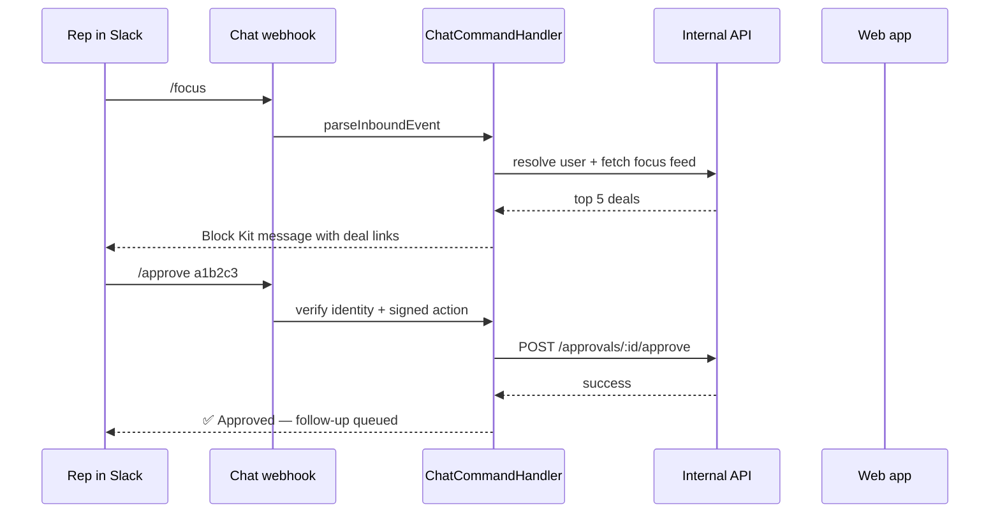
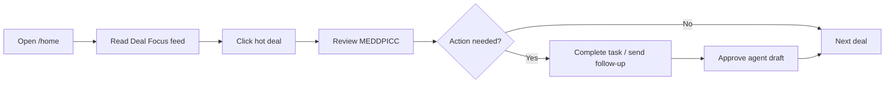
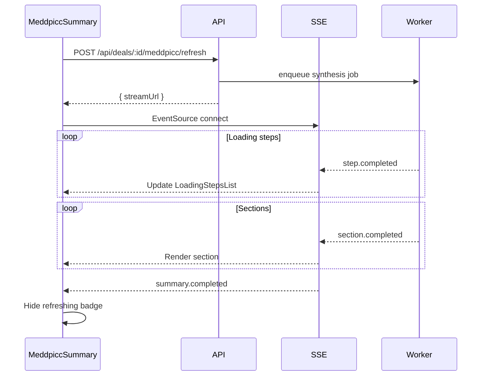
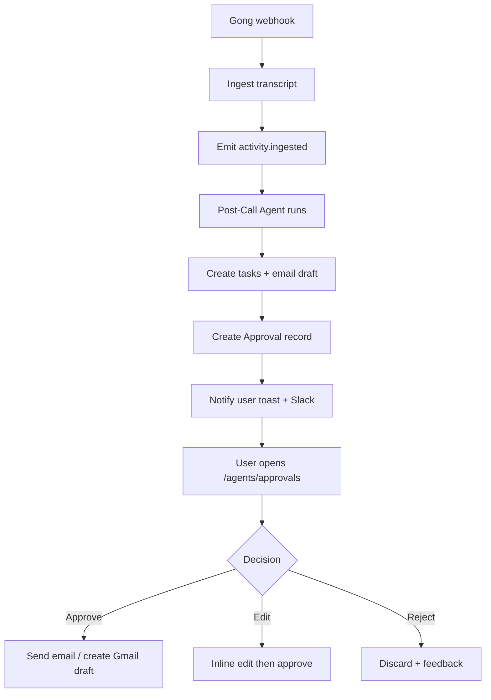
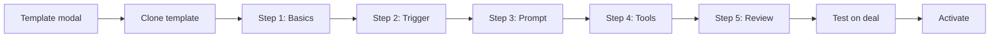
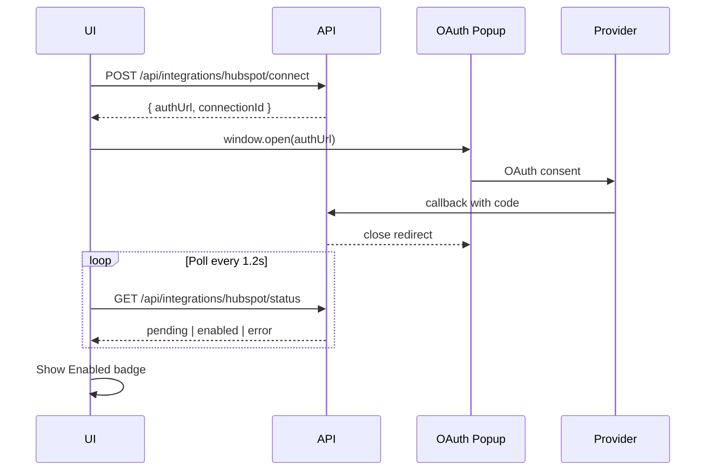

# Frontend Flows & Routing
# AI-Native Presales CRM

**Version:** 3.0  
**Framework:** Next.js 15 App Router + **shadcn/ui**  
**Backend:** `apps/api` modular monolith — [`api-routes.md`](api-routes.md) · [`architecture.md`](architecture.md)  
**Overview:** [`system-design.md`](system-design.md) · **Index:** [`README.md`](README.md)  
**Marketing spec:** [`landing-page.md`](landing-page.md)

### Full product app surface

**Nav:** Home · Deals · Accounts · Projects · Calls · Requests · Agents · Insights · Settings  
**Deal detail:** 12 tabs (lazy-loaded per tab) — see [`system-design.md`](system-design.md) §7  
**API:** All calls via `NEXT_PUBLIC_API_URL` → `apps/api` (`:4000`)

---

## 1. Route Map

### 1.1 Marketing (public — no auth)

```
/(marketing)/                        → Public site layout (header + footer)
  page.tsx                           → Homepage (hero, CRM strip, stats, features)
  pricing/page.tsx                   → Custom pricing + 4-step wizard (#quote)
  why/page.tsx                       → Why [Brand] — before/after deal card
  product/
    page.tsx                         → Product overview
    [slug]/page.tsx                  → deals, ai-summary, agents, insights, connectors
  integrations/page.tsx              → Gong, Slack, CRM connectors
  blog/
    page.tsx                         → Blog index (Phase 3)
    [slug]/page.tsx                  → Blog post
  about/page.tsx
  careers/page.tsx
  contact/page.tsx
  llms.txt                           → Static AI crawler summary (route or public file)

/                                    → Marketing homepage (NOT redirect to /deals)
/sign-in                             → Redirect to /(auth)/sign-in
```

**Auth routing rule:** Middleware sends authenticated users from `/` to `/home` only if they navigate to app URLs (`/deals`, `/home`, etc.). Marketing `/` stays public.

### 1.2 App (authenticated)

```
/(auth)/
  sign-in/[[...sign-in]]             → Clerk sign-in
  sign-up/[[...sign-up]]             → Clerk sign-up

/onboarding/                         → Forced until complete (admin)
  page.tsx                           → 5-step CRM wizard

/(dashboard)/                        → Auth required layout
  home/                              → Dashboard / focus feed
  deals/
    page.tsx                         → Pipeline kanban/list
    [dealId]/
      page.tsx                       → Deal detail (default tab: overview)
      loading.tsx
  accounts/
    page.tsx                         → Account list
    [accountId]/page.tsx             → Account detail
  projects/page.tsx
  calls/page.tsx
  requests/page.tsx
  agents/
    page.tsx                         → Agents dashboard
    new/page.tsx                     → Agent builder wizard
    [agentId]/
      page.tsx                       → Agent detail + runs
      edit/page.tsx                  → Edit agent
    runs/page.tsx                    → All runs log
    approvals/page.tsx               → Approval queue
  insights/
    page.tsx                         → Redirect to /insights/users
    users/page.tsx                   → Team performance table
    teams/page.tsx
    activity/page.tsx                → Activity analytics
    funnel/page.tsx
    loss/page.tsx
  settings/
    page.tsx                         → General settings
    integrations/page.tsx
    members/page.tsx
    sales-process/page.tsx
    integrations/
      page.tsx                     → Category grid (CRM, Chat, Calls, …)
      chat/page.tsx                → Connect Slack / Teams / Google Chat
    notifications/
      chat/page.tsx                → User delivery preferences
    agents/
      prompts/page.tsx
      skills/page.tsx
      credits/page.tsx

```

**No `/api` routes in Next.js** for CRM business logic — all data from Node API at `NEXT_PUBLIC_API_URL`.

### 1.3 shadcn/ui component map

| Screen | shadcn components |
|--------|-------------------|
| Kanban | `Card`, `Badge`, `ScrollArea`, `DropdownMenu` |
| Deal detail | `Tabs`, `Sheet`, `Progress`, `Separator` |
| MEDDPICC | `Card`, `Skeleton`, `Button`, `Tooltip` |
| Approvals | `Dialog`, `Textarea`, `Button` |
| Settings | `Switch`, `Select`, `Form` + `Input` |
| Onboarding | `RadioGroup`, `Card`, `Progress` |
| Toasts | `Sonner` / `Toast` |

Install path: `apps/web/components/ui/*` — see [`design-system.md`](design-system.md).

### 1.4 API client pattern

```tsx
// hooks/use-deals-board.ts
import { useQuery } from '@tanstack/react-query';
import { useAuth } from '@clerk/nextjs';
import { apiGet } from '@/lib/api-client';

export function useDealsBoard() {
  const { getToken } = useAuth();
  return useQuery({
    queryKey: ['deals', 'board'],
    queryFn: async () => {
      const token = await getToken();
      return apiGet<BoardPayload>('/deals/board', token!);
    },
  });
}
```

### 1.5 Marketing layout hierarchy

```tsx
// app/(marketing)/layout.tsx
<html>
  <body>
    <AnnouncementBar />
    <MarketingHeader />   {/* mega-menus, Sign in, Start free */}
    <main>{children}</main>
    <TrustBadges />       {/* optional per-page */}
    <MarketingFooter />
  </body>
</html>
```

**Pricing wizard flow** (`/pricing#quote`):

```
Step 1: Team size (4 radio cards)
  → Step 2: Which CRM? (HubSpot | Pipedrive | Zoho | Salesforce | Other)
    → Step 3: Primary need (AI summary | Agents | Pipeline | All)
      → Step 4: Work email + company → POST /api/v1/leads (or HubSpot form)
```

**Homepage scroll sections:** See [`landing-page.md`](landing-page.md) §3 (15 sections, P0–P2 priorities).

---

## 2. Layout Hierarchy

```tsx
// app/(dashboard)/layout.tsx
<ClerkProvider>
  <QueryClientProvider>
    <AppShell>                 {/* shadcn Sidebar + Header */}
      <SidebarNav />
      <div className="flex flex-col flex-1">
        <AppHeader />
        <main>{children}</main>
      </div>
    </AppShell>
    <Toaster />                  {/* shadcn Sonner */}
  </QueryClientProvider>
</ClerkProvider>
```

Workspace resolved from API `GET /api/v1/me` on first load (returns `workspaceId`, `role`).

---

## 3. State Management

| State type | Solution | Examples |
|------------|----------|----------|
| Server data | TanStack Query | Deals board, deal detail, agents |
| URL state | `nuqs` or searchParams | `?view=board`, `?tab=overview`, filters |
| Form state | React Hook Form + Zod | Create deal, agent wizard |
| Optimistic UI | Query mutations | Kanban DnD, task complete |
| SSE streams | `EventSource` hook | MEDDPICC refresh |
| Global UI | Zustand (minimal) | Sidebar collapsed, command palette open |

---

## 4. Core User Flows

### 4.0 CRM Onboarding Wizard (P0 — primary path)

**Route:** `/onboarding` — middleware redirects here if `!workspace.onboardingCompletedAt`

```mermaid
flowchart LR
    S1[1. Pick CRM] --> S2[2. OAuth Connect]
    S2 --> S3[3. Map Stages]
    S3 --> S4[4. Map Users]
    S4 --> S5[5. Import Deals]
    S5 --> DONE[/deals]
```

| Step | Component | API |
|------|-----------|-----|
| 1 | `CrmProviderPicker` | `GET /api/integrations/crm/providers` |
| 2 | `CrmOAuthConnect` | `POST /api/integrations/crm/:provider/connect` |
| 3 | `StageMappingTable` | `GET stages` + `PUT mappings/stages` |
| 4 | `UserMappingTable` | `GET owners` + `PUT mappings/users` |
| 5 | `ImportProgress` | `POST sync` + `GET sync/status` (poll/SSE) |

**UX rules:**
- Progress indicator at top (Step 2 of 5)
- Back button preserves state
- Step 3 auto-suggests mappings via fuzzy name match (`Qualification` ↔ `Qualification & Discovery`)
- Step 4 skippable — unmapped owners fall back to connecting admin
- Step 5 shows live count; on failure, retry + support link
- **Target:** <10 min for ≤500 deals

**Provider-specific UI:**
- **Pipedrive:** pipeline dropdown before stage mapping
- **Zoho:** region confirmation (US vs EU) before OAuth
- **Salesforce:** sandbox vs production toggle

### 4.1 Post-onboarding (optional integrations)

After `/deals` loads, show non-blocking banner:
- "Connect Gong for AI call summaries" → `/settings/integrations`
- "Connect Slack, Teams, or Google Chat for daily deal focus" → `/settings/integrations/chat`

Do **not** block pipeline on Gong or chat.

**Optional onboarding step 6:** Connect chat tool (skip allowed) — see `chat-channels.md` §8.

### 4.6 Chat channel configuration

**Admin — Settings → Integrations → Chat**

```
/settings/integrations/chat
  ├── Connected: [Slack ✓] [Teams —] [Google Chat —]
  ├── [+ Connect Slack]  [+ Connect Teams]  [+ Connect Google Chat]
  └── Workspace toggles: Allow chat commands · Require login for /approve
```

**User — Settings → Notifications → Chat**

```
/settings/notifications/chat
  ├── Primary platform: Slack ▼
  ├── Delivery: DM | Channel | Both
  ├── Channel picker (if channel/both)
  ├── Event toggles: Deal Focus · Approvals · Risk · Digest
  └── Interact from chat: ON · Link account [Verify]
```

**Deal detail — Link channel**

```
/deals/{id}?tab=overview → Integrations panel
  Provider: [Slack ▼]  Channel: [#deal-docuSign ▼]  [Link] [Validate]
  ☑ Ingest thread messages as deal context
```

### 4.7 Interact from chat (user journey)



**Deep links from chat buttons:** `https://app.{domain}/deals/{dealId}`, `/agents/approvals/{id}`

### 4.2 Daily rep workflow



**Home feed sections:**
1. **Today's focus** — top 5 deals from Deal Focus agent
2. **Pending approvals** — count badge → `/agents/approvals`
3. **Recent activity** — last 10 events on user's deals
4. **Pipeline snapshot** — mini kanban counts

### 4.3 Pipeline management

```mermaid
flowchart TD
    A[/deals] --> B{View mode}
    B -->|Board| C[KanbanBoard]
    B -->|List| D[DealsTable]
    C --> E[Drag card to column]
    E --> F[PATCH /api/deals/:id/stage]
    F --> G{Success?}
    G -->|Yes| H[Invalidate board query]
    G -->|No| I[Rollback + toast]
    C --> J[Click card]
    J --> K[/deals/:id]
```

**URL params:**
```
/deals?view=board&pipeline=default&sentiment=yellow&owner=me
```

### 4.4 Deal detail navigation

**Tab routing via query param:**
```
/deals/{dealId}?tab=overview
/deals/{dealId}?tab=tasks
/deals/{dealId}?tab=notes
```

**Tab lazy loading:** fetch tab data on first visit only.

| Tab | Query key | Hook |
|-----|-----------|------|
| overview | default | `useDealOverview(dealId)` |
| tasks | `tab=tasks` | `useDealTasks(dealId)` |
| notes | `tab=notes` | `useDealNotes(dealId)` |
| activity | `tab=activity` | `useDealActivity(dealId)` |

### 4.5 MEDDPICC refresh flow



**Client hook:**
```typescript
function useMeddpiccStream(dealId: string) {
  const [steps, setSteps] = useState<Step[]>([]);
  const [sections, setSections] = useState<MeddpiccSections>({});
  const [status, setStatus] = useState<'idle' | 'refreshing' | 'ready' | 'error'>('idle');

  const refresh = async () => {
    setStatus('refreshing');
    const { streamUrl } = await api.post(`/deals/${dealId}/meddpicc/refresh`);
    const es = new EventSource(streamUrl);
    es.addEventListener('step.completed', ...);
    es.addEventListener('section.completed', ...);
    es.addEventListener('summary.completed', () => { setStatus('ready'); es.close(); });
  };

  return { steps, sections, status, refresh };
}
```

### 4.6 Post-call agent flow



### 4.7 Approval workflow

**Page:** `/agents/approvals`

**List item:**
- Agent name, deal name, content type icon
- Preview snippet (first 2 lines)
- Time ago, expires in

**Detail sheet:**
- Full rendered preview (email HTML or Slack blocks)
- Edit mode for email body
- Approve | Reject with note

### 4.8 Agent creation wizard



**Wizard state:** stored in `useAgentWizardStore` (Zustand) until save.

**Validation per step:**
- Basics: name required, run-as selected
- Trigger: cron valid OR event type selected
- Prompt: min 50 chars
- Tools: at least one tool OR skill
- Review: integration prerequisites met (e.g. Slack connected)

### 4.9 Integration connect flow



---

## 5. Data Fetching Patterns

### 5.1 Server Components (initial load)

```tsx
// app/(dashboard)/deals/page.tsx
export default async function DealsPage() {
  const board = await apiGet('/deals/board', token); // Node API
  return <DealsPageClient initialBoard={board} />;
}
```

### 5.2 Client hooks

```typescript
// hooks/use-deals-board.ts
export function useDealsBoard(filters: DealFilters) {
  return useQuery({
    queryKey: ['deals', 'board', filters],
    queryFn: () => api.get('/api/deals/board', { params: filters }),
    staleTime: 30_000,
  });
}
```

### 5.3 Mutations

```typescript
export function useMoveDealStage() {
  const queryClient = useQueryClient();
  return useMutation({
    mutationFn: ({ dealId, stageId, position }) =>
      api.patch(`/api/deals/${dealId}/stage`, { stageId, position }),
    onMutate: async (vars) => {
      // optimistic update via queryClient.setQueryData
    },
    onError: (_err, _vars, context) => {
      // rollback from context
    },
    onSettled: () => {
      queryClient.invalidateQueries({ queryKey: ['deals', 'board'] });
    },
  });
}
```

---

## 6. Real-Time Updates

| Feature | Mechanism | MVP |
|---------|-----------|-----|
| MEDDPICC stream | SSE | Yes |
| Board multi-user | Polling 30s (TanStack Query `refetchInterval`) | Polling |
| Approval badge count | Poll on focus / 60s interval | Yes |
| Agent run status | Poll on runs page | Yes |

---

## 7. Command Palette

**Trigger:** `Cmd+K` / `Ctrl+K`

**Actions:**
- Go to deal (fuzzy search)
- Create deal
- Run agent (manual trigger)
- Refresh MEDDPICC on current deal
- Go to settings

**Implementation:** `cmdk` + shadcn Command dialog

---

## 8. Error Boundaries

| Route | Fallback |
|-------|----------|
| `/deals` | "Failed to load pipeline" + Retry |
| `/deals/[id]` | Deal not found vs generic error |
| `/agents` | Agent list error |
| Global | `error.tsx` with support link |

---

## 9. Feature Flags (optional)

```typescript
const flags = {
  insights_v2: false,
  agent_nl_builder: false,
  salesforce_sync: false,
};
```

Store in `workspace.settings.featureFlags`.

---

## 10. File Organization (apps/web)

```
apps/web/
├── app/
│   ├── (auth)/
│   ├── (dashboard)/
│   └── api/
├── components/
│   ├── deals/
│   ├── agents/
│   ├── ai/
│   ├── charts/
│   ├── layout/
│   ├── settings/
│   └── ui/              # shadcn
├── hooks/
├── lib/
│   ├── api-client.ts
│   ├── auth.ts
│   └── utils.ts
├── stores/
└── types/
```

---

## 11. Key Page Wireframes (ASCII)

### Home

```
┌─────────────────────────────────────────────────┐
│ Good morning, Lakshin                           │
├─────────────────────────────────────────────────┤
│ TODAY'S FOCUS (from Deal Focus agent)           │
│ ┌─────────────────────────────────────────────┐ │
│ │ 🔴 DocuSign — 4 blockers, close in 12d     │ │
│ │ 🟡 Starburst — no activity 14d              │ │
│ └─────────────────────────────────────────────┘ │
│ PENDING APPROVALS (2)                    [View] │
│ PIPELINE: 30 active · $7.19M open               │
└─────────────────────────────────────────────────┘
```

### Approvals

```
┌─────────────────────────────────────────────────┐
│ Approvals (2 pending)                           │
├─────────────────────────────────────────────────┤
│ 📧 Post-Call Follow-up · DocuSign    2h ago     │
│    "Follow-up: Technical validation recap..."   │
│                                    [Review]     │
│ 📧 POC Kickoff · Starburst           5h ago     │
│    Slack message to #deal-starburst             │
│                                    [Review]     │
└─────────────────────────────────────────────────┘
```
