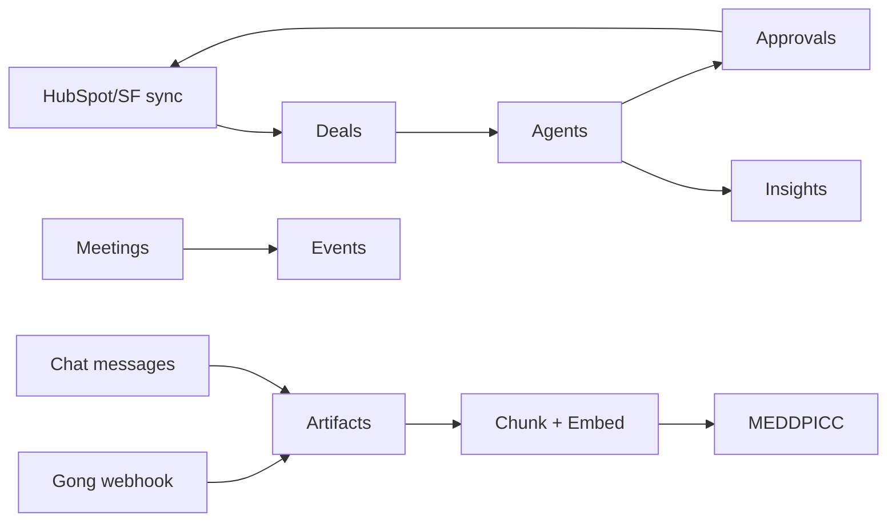

# AI Capabilities Roadmap — What Is Possible in AI CRM

**Version:** 1.0  
**Date:** 2026-09-09  
**Related:** [`../agent-platform.md`](../agent-platform.md) · [`../prd.md`](../prd.md) · [`AGENT_AUTOMATIONS.md`](../AGENT_AUTOMATIONS.md)

---

## 1. North star

AI CRM is not “ChatGPT inside a CRM.” It is a **citation-first context layer** where:

1. Every external signal (CRM, Gong, Slack, calendar, docs) lands in a **unified deal graph**
2. **Specialized agents** read that graph and produce **actionable outputs** (summaries, drafts, alerts)
3. **Humans approve** anything that writes externally (CRM, email, Jira)
4. Every non-trivial AI claim links to an **artifact** (call moment, note, CRM field)

---

## 2. Capability matrix

| Capability | User value | Data inputs | AI technique | Status | WBS |
|------------|------------|-------------|--------------|--------|-----|
| **MEDDPICC synthesis** | 8-letter qualification with sources | Notes, company, deal fields | Parallel LLM extract + merge | ✅ Live (SSE) | 3.10–3.13 |
| **Deal sentiment** | Green/yellow/red on kanban | Notes, blockers, stage age | Rules + optional Gemini | ✅ Live | 3.14 |
| **Technical fit score** | 0–100 fit for presales | Industry, product reqs, notes | Weighted rules + LLM | ✅ Live | 3.15 |
| **Blocker title suggest** | Faster blocker logging | Note text, deal context | LLM one-liner | ✅ Live | 2.x |
| **Post-call email draft** | <15 min follow-up | Latest notes, tasks, stage | LLM structured output | 🟡 Executor exists | 4.19 |
| **CRM hygiene suggestions** | Keep CRM accurate | CRM snapshot vs artifacts | Rules + LLM gap fill | 🟡 Approval flow | 4.20 |
| **Deal focus ranking** | “What to work today” | Open deals, activity, MEDDPICC | Rules + LLM “why now” | 🟡 Executor exists | 4.21 |
| **Risk scanner** | Stall / slip detection | `lastActivityAt`, blockers, sentiment | Rules → approval task | 🟡 Executor exists | 4.22 |
| **Buying signals** | Hot deal detection | Notes, MEDDPICC E/C1/M | LLM score 0–100 | 🟡 Executor exists | 4.23 |
| **Objection tracker** | Pricing / competitor tags | Notes, transcripts | NER + classification | 🟡 Executor exists | 4.24 |
| **POC kickoff doc** | Pilot-stage plan | Stage change, stakeholders | LLM doc template | 🟡 Executor exists | 4.25 |
| **Product feedback capture** | Feature gaps → requests | Call/note text | Theme extraction | 🟡 Executor exists | 4.26 |
| **Weekly digest** | Monday leadership email | Week of deal events | LLM narrative | 🟡 Executor exists | 4.27 |
| **Win/loss analysis** | Quarterly patterns | Closed deals, MEDDPICC | Aggregation + LLM | 🟡 Executor exists | 6.x |
| **RAG over Gong** | Cite exact call moments | Transcript chunks + embed | Chunk + vector search | 🔲 R6 WS-1 | 3.1, 5.9 |
| **NL agent builder** | “Build me a daily Slack digest” | User prompt | Structured output → wizard | 🔲 R6 WS-3 | 4.28 |
| **Chat Q&A on deal** | “What did champion say about budget?” | Artifacts + chunks | RAG + chat | 🔲 R7 | 3.4 |
| **Forecast AI** | Predict close date / amount | Historical wins, stage velocity | Time-series + LLM explain | 🔲 R7 | 6.17 |
| **Competitive battlecards** | Auto-update from losses | Loss reasons, call mentions | Cluster + summarize | 🔲 R7 | 6.18 |
| **Multi-deal compare** | “Why did we win Acme but lose Beta?” | Two deal graphs | Dual RAG + diff | 🔲 R8 | — |
| **Buyer portal AI** | External-facing FAQ | Approved deal artifacts | RAG with ACL | 🔲 R8 | 2.x |
| **Voice agent (phone)** | Post-demo recap call | Twilio audio → transcript | STT + same agents | 🔲 R9 | — |

**Legend:** ✅ Live · 🟡 Code exists, needs triggers/integrations polish · 🔲 Designed

---

## 3. AI surfaces (where users experience AI)

### 3.1 Deal detail — Overview tab

| Element | API | Refresh trigger |
|---------|-----|-----------------|
| MEDDPICC accordion (8 letters) | `GET /api/v1/deals/:id/meddpicc` + SSE stream | Manual refresh, post-sync |
| Sentiment badge | `POST /api/v1/ai/sentiment` | Manual or agent |
| Technical fit | `POST /api/v1/ai/fit-score` | Manual or agent |
| Citation popovers | `meddpicc_citations` collection | Tied to MEDDPICC run |

**Future:** Inline “Ask about this deal” chat drawer using `search_artifacts` tool.

### 3.2 Agents dashboard (`/agents`)

| Element | API |
|---------|-----|
| Template library (13) | `GET /api/v1/agents/templates` |
| Create from template | `POST /api/v1/agents/from-template/:slug` |
| Custom agent wizard | `POST /api/v1/agents` |
| Manual run | `POST /api/v1/agents/:id/run` |
| Runs log | `GET /api/v1/agent-runs` |

**Future:** NL panel on `/agents/new` → `POST /api/v1/agents/draft-from-nl`.

### 3.3 Approvals (`/approvals`)

| `content_type` | AI source | Human action |
|----------------|-----------|--------------|
| `email_draft` | Post-call, meeting summary | Approve → send (future) |
| `crm_field_update` | CRM hygiene | Approve → HubSpot patch |
| `task_create` | Risk scanner | Approve → create task |
| `note_create` | POC kickoff | Approve → deal note |

### 3.4 Insights (`/insights`)

AI-adjacent today: activity breakdown, funnel conversion, loss themes.  
**Future:** Win/loss agent output rendered as interactive dashboard; natural-language queries.

### 3.5 Chat (Slack / Teams / Google Chat)

| Command (planned) | Behavior |
|-------------------|----------|
| `/deal Acme` | Summary + MEDDPICC gaps |
| `/focus` | Today's deal focus list |
| `/approve <id>` | Approve from chat |
| `/risk` | Team risk digest |

Delivery via `ChatDeliveryService` — agents never call Slack APIs directly (`chat-channels.md`).

### 3.6 Home dashboard

| Element | Source |
|---------|--------|
| Focus feed | Deal Focus agent output (planned wiring) |
| Pipeline snapshot | Live CRM sync |
| Recent agent runs | `agent_runs` collection |

---

## 4. AI primitives (building blocks)

### 4.1 DealContextBundle

Assembled per run from:

```
Deal + Company + PipelineStage
  + Notes (last N)
  + Tasks (open)
  + Blockers (open)
  + Artifacts (calls, docs) — future RAG
  + MEDDPICC snapshot
  + external_records (CRM etag)
```

**Code:** `apps/api/src/lib/ai-scoring.ts` (`buildDealScoringContext`), agent executors.

### 4.2 Tools (agent toolbelt)

| Tool ID | Description | Used by |
|---------|-------------|---------|
| `crm_get_deal_status` | Read canonical deal + CRM mirror | MEDDPICC, hygiene |
| `search_artifacts` | Semantic search over chunks | MEDDPICC, post-call |
| `get_artifact_excerpt` | Pull cited text span | All RAG agents |
| `propose_field_update` | Draft CRM patch → approval | Hygiene, objection |

**Future tools:**

| Tool ID | Description |
|---------|-------------|
| `create_task` | Propose task → approval |
| `send_slack_message` | Via ChatDeliveryService |
| `query_insights` | Run analytics aggregation |
| `web_search` | Competitive intel (gated) |

### 4.3 Skills (prompt modules)

| Skill ID | Injects |
|----------|---------|
| `meddpicc` | 8-letter extraction prompts |
| `risk_scoring` | Stall rules + severity |
| `email_draft` | Tone, structure, action items |
| `slack_delivery` | Block Kit formatting |

Skills map to `toolsConfig.skills[]` on the Agent document.

### 4.4 Model routing

| Use case | Model | Env var |
|----------|-------|---------|
| MEDDPICC letters | Gemini 1.5 Pro / Flash | `GEMINI_API_KEY` |
| Quick classify (sentiment) | Rules first, Gemini fallback | `GEMINI_API_KEY` |
| Embeddings (RAG) | Gemini embedding or hash stub | `GEMINI_API_KEY` |

**Cost guardrails** (`agent-platform.md`):

- `maxCreditsPerRun`: 2.5 default
- Per-deal monthly cap: ≤ $2
- `input_hash` dedup on MEDDPICC (skip if artifacts unchanged)

---

## 5. Data flywheel



**More data → better AI:**

| New data source | Unlocks |
|-----------------|---------|
| Gong transcripts | Cited MEDDPICC, objection tracker, meeting summary |
| Slack threads | Buying signals, stakeholder map |
| Calendar attendees | Participant auto-fill, exec involvement |
| Jira links | POC progress, product feedback closure |
| Email (Gmail/Outlook) | Thread context, follow-up detection |

---

## 6. Phase roadmap

### Phase A — R6 (next 4–6 weeks)

- Gong transcript fetch + `artifact_chunks` + embed worker
- NL agent builder (`draft-from-nl`)
- CRM incremental sync → live stage updates
- Teams / GChat OAuth

### Phase B — R7 (weeks 7–14)

- Deal chat (RAG Q&A on `/deals/:id`)
- SQL insights explorer
- Scheduled agent cron worker (wire `triggerConfig.schedule`)
- Chat delivery for Deal Focus + Risk

### Phase C — R8 (weeks 15–24)

- Forecasting model + explainability
- Competitive battlecards from win/loss
- Buyer portal with scoped RAG
- Salesforce live adapter

### Phase D — R9+ (scale)

- Multi-workspace analytics
- Custom LangGraph import (power users)
- Voice / phone agent
- MCP server for external tool registry

---

## 7. Anti-patterns (do not build)

| Anti-pattern | Why |
|--------------|-----|
| Auto-write CRM without approval | Trust + compliance |
| Single mega-prompt per deal | Latency, no citations |
| Agents calling Slack directly | Use ChatDeliveryService |
| Storing raw LLM output without schema | Use Zod at API boundary |
| Per-seat AI with no credits cap | Cost overrun (NFR-011) |

---

## 8. Implementation pointers

| Feature | Start file |
|---------|------------|
| New agent executor | `apps/api/src/modules/agents/executors/` + register in `executor.ts` |
| New AI scoring endpoint | `apps/api/src/modules/ai/handlers.ts` |
| MEDDPICC changes | `executors/meddpicc-synth.ts`, `modules/meddpicc/` |
| RAG chunking | `lib/queues/embed-artifact.ts` (R6) |
| Frontend AI UI | `apps/web/components/deals/tabs/OverviewTab.tsx` |

---

## Changelog

| Date | Change |
|------|--------|
| 2026-09-09 | v1.0 — Initial capability matrix |
