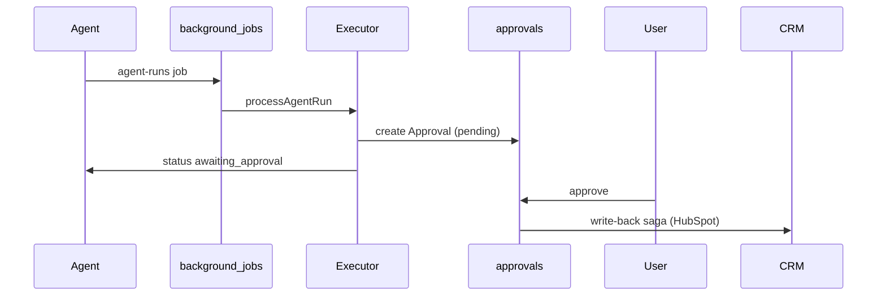

# Custom Automations Guide — Agents, Triggers & Workflows

**Version:** 1.0  
**Date:** 2026-09-09  
**Related:** [`../AGENT_AUTOMATIONS.md`](../AGENT_AUTOMATIONS.md) · [`trigger-event-catalog.md`](trigger-event-catalog.md) · [`../agent-platform.md`](../agent-platform.md)

---

## 1. What is a custom automation?

In AI CRM, an **automation** = an **Agent** document with:

1. A **template** (or custom prompt) defining behavior
2. A **trigger** (when it runs)
3. **Tools & skills** (what data it can read / write)
4. Optional **approval gate** before external writes

Users create automations via:

| Path | UI | API |
|------|-----|-----|
| Template | Agents → Start from template | `POST /api/v1/agents/from-template/:slug` |
| Wizard | `/agents/new` (5 steps) | `POST /api/v1/agents` |
| NL (R6) | “Ask AI to build” panel | `POST /api/v1/agents/draft-from-nl` |

---

## 2. User journeys

### 2.1 “Daily deal focus in Slack”

**Goal:** Every weekday 8am, DM the rep their top 5 deals with one-line “why now.”

| Step | Action |
|------|--------|
| 1 | Go to **Agents** → **Deal Focus** template → **Use template** |
| 2 | Name: `My morning focus` |
| 3 | Trigger: **Schedule** → `Daily at 8:00 AM` (`0 8 * * *`) |
| 4 | Tools: enable `crm_get_deal_status`, `search_artifacts` |
| 5 | Skills: enable `slack_delivery` |
| 6 | Review → **Create** → toggle **Active** |

**Backend today:** Executor `deal-focus` ranks deals; chat delivery needs Slack OAuth (R6/R7).

### 2.2 “After every Gong call, draft follow-up email”

| Step | Action |
|------|--------|
| 1 | Template: **Post-Call Follow-up Draft** |
| 2 | Trigger: **Event** → `activity.ingested` |
| 3 | Filter (future): `source = gong` |
| 4 | Skills: `email_draft` |
| 5 | Output routes to **Approvals** (`content_type: email_draft`) |

**Depends on:** Gong transcript in `artifacts.rawText` (R6 WS-1).

### 2.3 “When deal hits POC stage, generate kickoff plan”

| Step | Action |
|------|--------|
| 1 | Template: **POC Kickoff** |
| 2 | Trigger: **Event** → `deal.stage_changed` |
| 3 | Condition (future): `newStage.type = technical_validation` |
| 4 | Approval: note + tasks on deal |

### 2.4 “Weekly pipeline digest for manager”

| Step | Action |
|------|--------|
| 1 | Template: **Weekly Reporting Digest** |
| 2 | Trigger: **Schedule** → `Weekly Monday 8:00 AM` |
| 3 | Scope: workspace-wide (no `dealId`) |
| 4 | Delivery: email + optional Slack channel |

### 2.5 Fully custom agent (no template)

Use `/agents/new` wizard:

| Step | Field | Example |
|------|-------|---------|
| Basics | Name | `Enterprise risk watch` |
| Basics | Category | `risk` |
| Trigger | Type | `schedule` / `event` / `manual` / `webhook` |
| Trigger | Cron | `0 */6 * * *` (every 6h) |
| Prompt | System prompt | “Flag deals >$100k with red sentiment and no activity 7d…” |
| Tools | Toggles | `propose_field_update`, `search_artifacts` |
| Review | Test run | Manual run on one deal |

---

## 3. Agent document schema

```typescript
// packages/db — Agent collection
{
  workspaceId: ObjectId,
  name: string,
  templateSlug?: string,      // e.g. 'deal-focus'
  category: 'process' | 'risk' | 'signals' | 'reporting',
  isActive: boolean,
  ownerId?: ObjectId,
  triggerConfig: {
    type: 'schedule' | 'event' | 'manual' | 'webhook',
    schedule?: string,        // cron, e.g. '0 8 * * *'
    event?: string,           // e.g. 'activity.ingested'
    webhookSecret?: string,
  },
  toolsConfig: {
    systemPrompt?: string,
    tools?: string[],
    skills?: string[],
  },
}
```

**Zod:** `packages/shared/src/schemas/agent.ts`

---

## 4. Template catalog (13 templates)

Source of truth: `apps/api/src/modules/agents/handlers.ts` → `TEMPLATES`.

| Slug | Category | Executor | Approval? |
|------|----------|----------|-----------|
| `meddpicc-synth` | signals | ✅ | No |
| `crm-hygiene` | process | ✅ | Yes (CRM) |
| `deal-focus` | process | ✅ | No |
| `post-call` | process | ✅ | Yes (email) |
| `meeting-summary` | process | ✅ (same as post-call) | Yes |
| `poc-kickoff` | process | ✅ | Optional |
| `risk-scanner` | risk | ✅ | Yes (tasks) |
| `deal-stalling` | risk | ✅ (risk scanner) | Yes |
| `buying-signals` | signals | ✅ | No |
| `objection-tracker` | signals | ✅ | Optional |
| `product-feedback` | signals | ✅ | No |
| `weekly-digest` | reporting | ✅ | No |
| `win-loss-analysis` | reporting | ✅ | Optional |

---

## 5. Trigger types

### 5.1 Manual

- User clicks **Run** on agent detail or deal context menu
- API: `POST /api/v1/agents/:id/run` body `{ scope: { dealId? } }`
- Creates `AgentRun` → enqueues `agent-runs` job

### 5.2 Schedule (cron)

| Preset | Cron | Use case |
|--------|------|----------|
| Daily 8am | `0 8 * * *` | Deal focus |
| Monday 8am | `0 8 * * 1` | Weekly digest |
| Every 6h | `0 */6 * * *` | Risk scanner |

**Implementation status:** UI collects cron; **worker cron dispatcher not wired** — R7 task.

**To implement:**

```typescript
// apps/api/src/lib/queues/scheduled-agents.ts (new)
// Poll agents where triggerConfig.type === 'schedule'
// Match cron against workspace timezone
// enqueueAgentRun({ agentId, workspaceId, templateSlug, ... })
```

### 5.3 Event

| Event | Emitted when | Subscriber |
|-------|--------------|------------|
| `activity.ingested` | Gong webhook, note sync | Post-call, buying signals |
| `deal.stage_changed` | CRM webhook / manual stage move | POC kickoff |
| `deal.closed` | Close deal action | Win/loss analysis |

**Implementation status:** Event bus partial — wire in `packages/events` (WBS 11.1).

### 5.4 Webhook

- External system POSTs to `POST /api/v1/webhooks/agents/:agentId`
- HMAC validated with `triggerConfig.webhookSecret`
- Use for: custom Zapier flows, internal tools

**Status:** Schema exists; route not implemented — R7.

---

## 6. Tools & skills reference

### Tools (data access)

| ID | Reads | Writes |
|----|-------|--------|
| `crm_get_deal_status` | Deal, stage, CRM mirror | — |
| `search_artifacts` | Vector / text search on chunks | — |
| `get_artifact_excerpt` | Cited span | — |
| `propose_field_update` | — | Approval queue |

### Skills (prompt behavior)

| ID | Effect |
|----|--------|
| `meddpicc` | 8-letter extraction prompts |
| `risk_scoring` | Stall detection + severity |
| `email_draft` | Follow-up email structure |
| `slack_delivery` | Format for ChatDeliveryService |

**Custom prompt:** `toolsConfig.systemPrompt` appended to template base prompt.

---

## 7. Approval flow



**Approval types:** `apps/api/src/modules/approvals/handlers.ts`

---

## 8. Example: add a new automation template

### Step 1 — Register template

```typescript
// apps/api/src/modules/agents/handlers.ts
{
  slug: 'champion-tracker',
  name: 'Champion Engagement Tracker',
  category: 'signals',
  description: 'Alert when champion has not been contacted in 14 days.',
}
```

### Step 2 — Implement executor

```typescript
// apps/api/src/modules/agents/executors/champion-tracker.ts
export async function runChampionTracker(ctx: AgentRunContext): Promise<AgentRunResult> {
  // 1. Load deals with participants.role = 'champion'
  // 2. Check last activity involving champion
  // 3. If stale → create approval or notification
  return { status: 'completed', creditsUsed: 0.1, output: { alerts: [...] } };
}
```

### Step 3 — Register in executor switch

```typescript
// apps/api/src/modules/agents/executor.ts
case 'champion-tracker':
  return runChampionTracker(ctx);
```

### Step 4 — (Optional) Add wizard preset

Add to `EVENT_OPTIONS` or template picker on `/agents/new`.

### Step 5 — Document in `AGENT_AUTOMATIONS.md`

---

## 9. Automation recipes (copy-paste configs)

### Recipe A — Stalled deal nudge

```json
{
  "name": "Stalled deal nudge",
  "templateSlug": "deal-stalling",
  "category": "risk",
  "config": {
    "triggerConfig": { "type": "schedule", "schedule": "0 9 * * *" },
    "toolsConfig": {
      "skills": ["risk_scoring"],
      "tools": ["crm_get_deal_status", "propose_field_update"]
    }
  }
}
```

### Recipe B — MEDDPICC on demand

```json
{
  "name": "Refresh MEDDPICC",
  "templateSlug": "meddpicc-synth",
  "category": "signals",
  "config": {
    "triggerConfig": { "type": "manual" },
    "toolsConfig": {
      "skills": ["meddpicc"],
      "tools": ["search_artifacts", "get_artifact_excerpt"]
    }
  }
}
```

### Recipe C — Competitive mention alert

```json
{
  "name": "Competitor mentions",
  "templateSlug": "objection-tracker",
  "category": "signals",
  "config": {
    "triggerConfig": { "type": "event", "event": "activity.ingested" },
    "toolsConfig": {
      "systemPrompt": "Flag any mention of CompetitorX, CompetitorY. Tag deal and update MEDDPICC Competition letter.",
      "skills": ["meddpicc"],
      "tools": ["search_artifacts", "propose_field_update"]
    }
  }
}
```

---

## 10. Limits & governance

| Limit | Value | Config |
|-------|-------|--------|
| Max steps per run | 25 | `agent-platform.md` |
| Credits per run | 2.5 default | `AgentRun.creditsUsed` |
| Monthly workspace credits | 10,000 default | `workspace.settings.aiCreditsMonthly` |
| Runs per agent per day | TBD | Rate limit middleware |

**Admin controls (Settings → Agents):** enable/disable templates per workspace (future).

---

## Changelog

| Date | Change |
|------|--------|
| 2026-09-09 | v1.0 — Initial guide |
