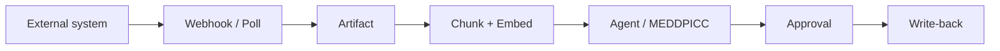
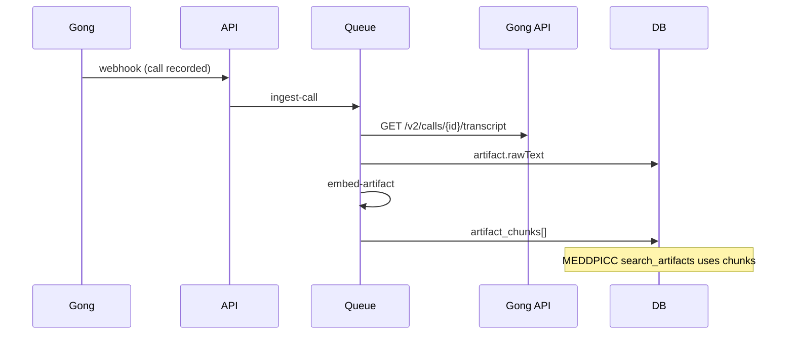

# Integration + AI Patterns — Gong, CRM, Chat, RAG

**Version:** 1.0  
**Date:** 2026-09-09  
**Related:** [`../crm-connectors.md`](../crm-connectors.md) · [`../chat-channels.md`](../chat-channels.md) · [`r6-roadmap.md`](../r6-roadmap.md) WS-1

---

## 1. Pattern: ingest → normalize → enrich → agent

Every integration follows the same pipeline:



| Stage | Collection | Key fields |
|-------|------------|------------|
| Raw event | `webhook_events` | payload, TTL 7d |
| Normalized | `artifacts` | `source`, `externalId`, `rawText`, `dealId` |
| Searchable | `artifact_chunks` | `embedding`, `text`, `dealId`, `artifactId` |
| AI output | `deal_meddpicc`, `approvals` | citations → `artifactId` |

---

## 2. HubSpot CRM integration

### 2.1 OAuth connect

| Step | Endpoint |
|------|----------|
| Start | `GET /api/v1/oauth/hubspot/start` |
| Callback | `GET /api/v1/oauth/hubspot/callback` |
| Status | `GET /api/v1/integrations/crm/status` |

**Tokens:** Encrypted in `integration_connections` (`TOKEN_ENCRYPTION_KEY`).

### 2.2 Sync modes

| Mode | Trigger | Job |
|------|---------|-----|
| Full import | Onboarding connect | `crm-full-sync` |
| Incremental | Webhook `deal.propertyChange` | `crm-incremental` (R6) |
| Manual refresh | Settings button | Re-queue full sync |

### 2.3 Canonical mapping

```
HubSpot deal → Deal (local)
HubSpot company → Company
HubSpot owner → User (match by email)
HubSpot stage → PipelineStage (mapped in onboarding)
```

**Mirror:** `external_records` stores `{ connectionId, objectType, externalId, etag, raw }`

### 2.4 AI use cases on CRM data

| Use case | Reads | Writes (approval) |
|----------|-------|-------------------|
| MEDDPICC | Notes + deal fields | — |
| CRM Hygiene | external_record vs artifacts | `propose_field_update` |
| Stage suggestion | Activity + MEDDPICC gaps | Stage change approval |
| Win probability | Historical similar deals | `deal.winProbability` |

### 2.5 Webhook registration

Document in `HUBSPOT_APP_SETUP.md`:

- `deal.creation`, `deal.propertyChange`, `deal.deletion`
- Target: `POST /api/v1/webhooks/crm/:connectionId`
- HMAC: `X-AI-CRM-Signature`

---

## 3. Gong integration

### 3.1 Current (R5)

| Piece | File |
|-------|------|
| Webhook receiver | `modules/webhooks/gong.ts` |
| HMAC verify | `lib/gong-signature.ts` |
| Ingest job | `lib/queues/ingest-call.ts` |
| Model | `packages/db/models/artifact.ts` |
| UI | `/calls` page |

**Webhook creates:** Artifact with metadata (title, date, external call ID).

### 3.2 R6: transcript + RAG



**New files:**

| File | Purpose |
|------|---------|
| `lib/integrations/gong-api.ts` | OAuth token refresh, transcript fetch |
| `lib/queues/embed-artifact.ts` | Chunk 512 tokens, overlap 64 |
| `models/artifact-chunk.ts` | Vector storage (or text index for MVP) |

### 3.3 Linking calls to deals

| Strategy | Priority |
|----------|----------|
| Gong `parties` email → deal participants | P0 |
| CRM opportunity ID in Gong custom field | P0 |
| LLM fuzzy match on company name | P1 |
| Manual link in `/calls` UI | P0 |

### 3.4 AI agents powered by Gong

| Agent | Uses transcript for |
|-------|---------------------|
| MEDDPICC | Economic buyer quotes, metrics |
| Post-call | Action items from dialogue |
| Objection tracker | Pricing/competitor mentions |
| Buying signals | Budget/timeline language |
| Meeting summary | Full recap |

---

## 4. Slack / Teams / Google Chat

### 4.1 Architecture rule

**Agents → ChatDeliveryService → ChatConnector**

Never import `@slack/web-api` in agent executors.

```
packages/integrations/chat/
  slack/
  teams/      (R6)
  google-chat/ (R6)
```

### 4.2 Delivery types

| `notificationType` | Content |
|------------------|---------|
| `deal_focus` | Ranked deal list + links |
| `approval` | Approve/Reject buttons |
| `risk_alert` | Stalled deal summary |
| `buying_signal` | Hot deal alert |
| `digest` | Weekly narrative |

### 4.3 Inbound (future)

| Command | Action |
|---------|--------|
| `/deal <name>` | RAG summary |
| `/focus` | Run deal-focus agent |
| `/approve <id>` | Resolve approval |

**OAuth:** `modules/oauth/handlers.ts` — mirror Slack pattern for Teams/GChat.

---

## 5. Google Calendar

| Event | Maps to |
|-------|---------|
| Meeting with prospect emails | `activity_events` type `customerMeeting` |
| Internal sync | `internalMeeting` |
| Attendee list | `participants` enrichment |

**AI use:** Champion engagement gap, meeting density analytics.

---

## 6. RAG implementation guide

### 6.1 Chunking

```typescript
const CHUNK_SIZE = 512;      // tokens
const CHUNK_OVERLAP = 64;

function chunkText(text: string): string[] {
  // Use tiktoken or char-based approximation: 4 chars ≈ 1 token
  // Split on sentence boundaries when possible
}
```

### 6.2 Embedding

```typescript
async function embed(text: string): Promise<number[]> {
  if (!process.env.GEMINI_API_KEY) {
    // Dev stub: deterministic hash vector for testing
    return hashEmbed(text, 384);
  }
  return geminiEmbed(text);
}
```

### 6.3 Search

**MVP (no vector DB):** MongoDB text index on `artifact_chunks.text`  
**Scale:** Atlas Vector Search or Pinecone

```typescript
async function searchArtifacts(workspaceId, dealId, query, limit = 8) {
  // 1. embed(query)
  // 2. vector search OR $text search
  // 3. return { chunkId, artifactId, excerpt, score }
}
```

### 6.4 Citation format

```typescript
{
  letter: 'E',  // MEDDPICC letter
  claim: 'Budget approved for Q4',
  artifactId: '...',
  chunkId: '...',
  startOffset: 1204,
  endOffset: 1289,
  sourceLabel: 'Gong call — Discovery with CFO',
}
```

---

## 7. Jira / Linear (future)

| Direction | Use case |
|-----------|----------|
| Outbound | POC Orchestrator creates epic |
| Inbound | Issue status → deal project tab |
| AI | Product feedback → auto-create issue draft |

**Approval:** Jira create always gated.

---

## 8. Error handling & retries

| Failure | Retry | User visibility |
|---------|-------|-----------------|
| Gong API 429 | Exponential backoff 3x | Integration badge warning |
| HubSpot token expired | Refresh OAuth | Re-connect prompt |
| Embed job fail | 2 retries | `artifact.embedStatus = failed` |
| Agent OOM | Mark run failed | Runs log error |

---

## 9. Environment variables

| Var | Integration |
|-----|-------------|
| `HUBSPOT_CLIENT_ID/SECRET` | CRM OAuth |
| `GONG_WEBHOOK_SECRET` | Webhook HMAC |
| `GONG_ACCESS_TOKEN` or OAuth in DB | Transcript API |
| `SLACK_CLIENT_ID/SECRET` | Chat |
| `TEAMS_CLIENT_ID/SECRET` | R6 |
| `GOOGLE_CLIENT_ID/SECRET` | GChat + Calendar |
| `GEMINI_API_KEY` | Embeddings + agents |

---

## 10. Vibe coding checklist (new integration)

1. Add `IntegrationConnection` provider key
2. OAuth handlers in `modules/oauth/`
3. Webhook route + HMAC in `modules/webhooks/`
4. Queue processor in `lib/queues/`
5. Artifact normalizer
6. Settings UI card in `settings/integrations`
7. Document in this file + `crm-connectors.md` or `chat-channels.md`
8. Smoke test in `apps/api` smoke script

---

## Changelog

| Date | Change |
|------|--------|
| 2026-09-09 | v1.0 — Initial patterns doc |
