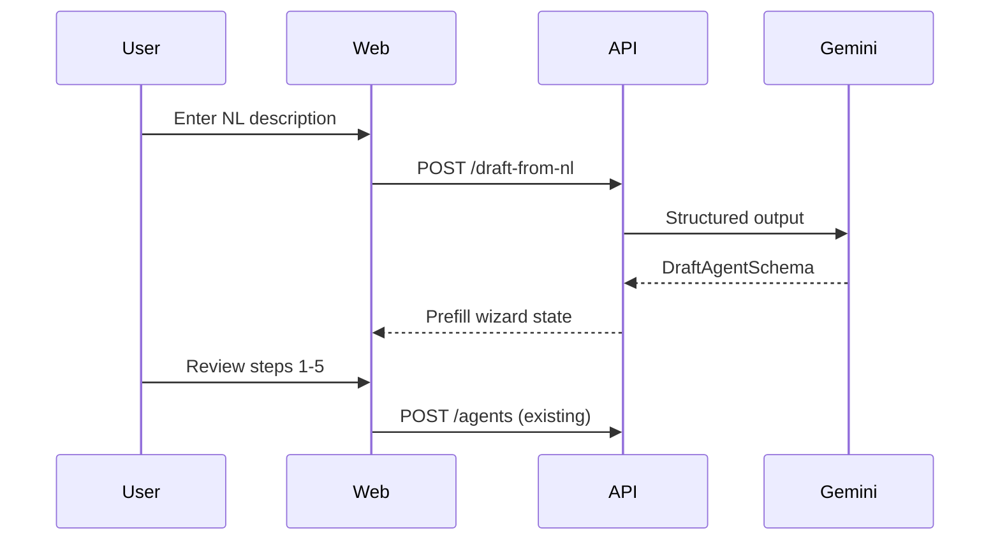

# NL Agent Builder — Natural Language → Agent Wizard

**Version:** 1.0  
**Date:** 2026-09-09  
**WBS:** 4.28 · **R6 workstream:** WS-3  
**UI:** `/agents/new` right panel (currently disabled)

---

## 1. Problem

Power users want to describe automations in plain English:

> “Every morning Slack me my top 5 at-risk deals over $50k with no activity in 10 days.”

Today they must manually configure template, trigger, tools, and prompt across 5 wizard steps.

---

## 2. Solution

`POST /api/v1/agents/draft-from-nl` accepts a description and returns a **wizard prefill** object. User reviews and edits before `POST /api/v1/agents`.



---

## 3. API contract

### Request

```http
POST /api/v1/agents/draft-from-nl
Authorization: Bearer <token>
Content-Type: application/json

{
  "description": "Daily Slack digest of at-risk deals over 50k with no activity in 10 days"
}
```

### Response 200

```json
{
  "draft": {
    "name": "At-risk deal digest",
    "templateSlug": "risk-scanner",
    "category": "risk",
    "triggerType": "schedule",
    "schedule": "0 8 * * *",
    "event": null,
    "systemPrompt": "Focus on open deals with amount > 50000 and lastActivityAt older than 10 days. Rank by risk severity.",
    "tools": ["crm_get_deal_status", "search_artifacts"],
    "skills": ["risk_scoring", "slack_delivery"],
    "confidence": 0.87,
    "reasoning": "Matches risk-scanner template with daily schedule and Slack delivery skill."
  }
}
```

### Errors

| Code | When |
|------|------|
| 400 | Empty description, > 2000 chars |
| 422 | NL too vague — `{"error":"NEEDS_CLARIFICATION","questions":["Which channel?"]}` |
| 429 | Rate limit (>10/hour/user) |
| 503 | Gemini unavailable — fallback to rule map |

---

## 4. Zod schemas

```typescript
// packages/shared/src/schemas/agent.ts (add)

export const DraftFromNlRequestSchema = z.object({
  description: z.string().min(10).max(2000),
});

export const DraftAgentSchema = z.object({
  name: z.string().min(1).max(200),
  templateSlug: z.string().max(100),
  category: AgentCategorySchema,
  triggerType: TriggerTypeSchema,
  schedule: z.string().max(200).nullable(),
  event: z.string().max(200).nullable(),
  systemPrompt: z.string().max(10000),
  tools: z.array(z.string().max(100)),
  skills: z.array(z.string().max(100)),
  confidence: z.number().min(0).max(1).optional(),
  reasoning: z.string().max(500).optional(),
});
```

---

## 5. LLM prompt (Gemini structured output)

### System prompt (abbreviated)

```
You are an agent configuration assistant for AI CRM.
Given a user description, output JSON matching DraftAgentSchema.

Rules:
- Pick the closest templateSlug from: [list TEMPLATES slugs]
- triggerType: schedule for "daily/weekly/every", event for "when call/stage", manual otherwise
- schedule: valid cron only if triggerType=schedule
- event: one of activity.ingested, deal.stage_changed, deal.closed
- tools/skills: only from allowed lists
- systemPrompt: concise, actionable, no markdown
```

### Allowed lists (inject from code)

```typescript
const ALLOWED_TOOLS = ['crm_get_deal_status', 'search_artifacts', 'get_artifact_excerpt', 'propose_field_update'];
const ALLOWED_SKILLS = ['meddpicc', 'risk_scoring', 'email_draft', 'slack_delivery'];
const TEMPLATE_SLUGS = TEMPLATES.map(t => t.slug);
```

---

## 6. Fallback without Gemini

Keyword → template map for dev/demo:

| Keywords | templateSlug | trigger |
|----------|--------------|---------|
| daily, morning, focus | deal-focus | schedule 8am |
| risk, stall, stuck | risk-scanner | schedule 6h |
| call, follow-up, email | post-call | event activity.ingested |
| meddpicc, qualify | meddpicc-synth | manual |
| weekly, digest, report | weekly-digest | schedule Monday |
| win, loss, analysis | win-loss-analysis | manual |
| poc, kickoff, pilot | poc-kickoff | event deal.stage_changed |
| buying, signal, hot | buying-signals | event activity.ingested |
| objection, competitor, pricing | objection-tracker | event activity.ingested |

```typescript
function draftFromKeywords(description: string): DraftAgent {
  const lower = description.toLowerCase();
  // ... match rules
  return { ..., confidence: 0.6, reasoning: 'Keyword fallback (no GEMINI_API_KEY)' };
}
```

---

## 7. Frontend integration

### `/agents/new/page.tsx`

1. Enable right panel textarea + **Generate** button
2. On success → `setWizardState` from `draft`
3. Jump to step 1 with fields prefilled
4. Show badge: “AI suggested — review before saving”
5. Disable Generate while loading; show confidence if < 0.7

```typescript
async function handleNlDraft(description: string) {
  const { draft } = await apiPost('/agents/draft-from-nl', { description }, token);
  setWizardState({
    name: draft.name,
    templateSlug: draft.templateSlug,
    category: draft.category,
    triggerType: draft.triggerType,
    schedule: draft.schedule ?? SCHEDULE_PRESETS[0].value,
    event: draft.event ?? EVENT_OPTIONS[0].value,
    systemPrompt: draft.systemPrompt,
    tools: draft.tools,
    skills: draft.skills,
  });
  setStep(0);
  toast.success('Agent draft ready — review each step');
}
```

---

## 8. Handler implementation

```typescript
// apps/api/src/modules/agents/handlers.ts

export async function postDraftFromNl(req: AuthedRequest, res: Response) {
  const parsed = DraftFromNlRequestSchema.safeParse(req.body);
  if (!parsed.success) return res.status(400).json(...);

  await checkRateLimit(req.tenant!.userId, 'draft-from-nl', 10, 3600);

  let draft: DraftAgent;
  if (process.env.GEMINI_API_KEY) {
    draft = await generateDraftWithGemini(parsed.data.description);
  } else {
    draft = draftFromKeywords(parsed.data.description);
  }

  const validated = DraftAgentSchema.safeParse(draft);
  if (!validated.success) return res.status(422).json(...);

  res.json({ draft: validated.data });
}
```

**Route:** Register in `agents/index.ts` → `router.post('/draft-from-nl', postDraftFromNl)`  
**Note:** Place before `/:id` routes to avoid param capture.

---

## 9. Example inputs & expected outputs

| Input | Expected template | Trigger |
|-------|-------------------|---------|
| “Summarize MEDDPICC after every HubSpot sync” | meddpicc-synth | event (future: deal.synced) |
| “Alert me on Slack when competitor mentioned” | objection-tracker | activity.ingested |
| “Monday email to leadership on pipeline” | weekly-digest | schedule Mon 8am |
| “Draft thank-you email after demo calls” | post-call | activity.ingested |
| “Flag deals stuck in negotiation 21+ days” | deal-stalling | schedule daily |

---

## 10. Security & limits

| Control | Implementation |
|---------|----------------|
| Auth required | JWT middleware |
| Workspace scoped | `req.tenant.workspaceId` |
| No auto-create agent | Draft only — user must POST /agents |
| Prompt injection | Sanitize description; system prompt isolated |
| Rate limit | 10/user/hour Mongo counter |
| Audit log | `agent_nl_drafts` collection (optional) |

---

## 11. Tests

| Kind | Case |
|------|------|
| Unit | `draftFromKeywords` each keyword path |
| API | POST with valid description → 200 + schema |
| API | POST empty → 400 |
| API | 11th request in hour → 429 |
| E2E | Type NL → wizard prefilled → create agent |

---

## 12. Acceptance criteria (R6 WS-3)

- [ ] API returns valid draft for 5 example prompts in `§9`
- [ ] Wizard prefills all 5 steps from draft
- [ ] Works without `GEMINI_API_KEY` (keyword fallback)
- [ ] Rate limit enforced
- [ ] No agent persisted until user clicks Create

---

## Changelog

| Date | Change |
|------|--------|
| 2026-09-09 | v1.0 — R6 WS-3 spec |
