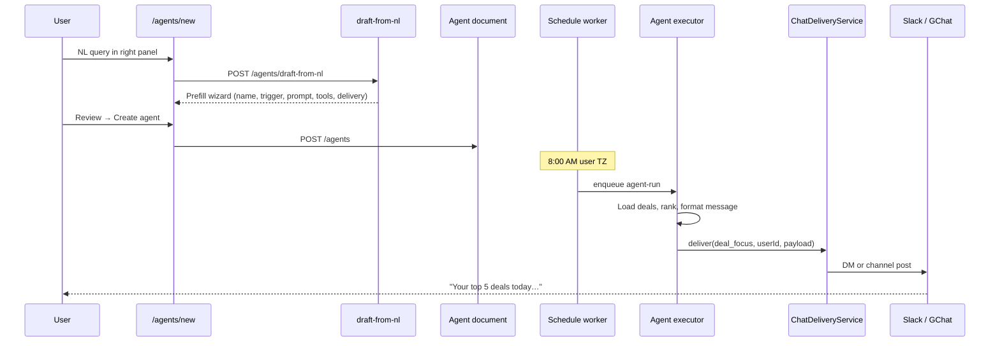

# NL Query → Automation → Chat Delivery Vision

**Version:** 1.0  
**Date:** 2026-09-10  
**Inspired by:** Opine-style agent builder (Basics → Trigger → Prompt → Tools → Review + “Ask to build” panel)  
**Related:** [`nl-agent-builder-spec.md`](nl-agent-builder-spec.md) · [`custom-automations-guide.md`](custom-automations-guide.md) · [`../chat-channels.md`](../chat-channels.md)

---

## 1. The core idea

Revenue teams live in **Slack, Google Chat, and Teams** — not in CRM tabs. AI CRM should let them:

1. **Describe** what they want in plain English (right panel on `/agents/new` or in chat)
2. **Review** a pre-filled agent (trigger, prompt, tools, delivery target)
3. **Activate** the automation with one click
4. **Receive results** where they already work — DM, team channel, or deal-linked thread

```
User types:  "Every weekday at 8am, Slack me my top 5 deals that haven't moved in 2 weeks"
     ↓
AI drafts:   deal-focus template · schedule cron · risk_scoring skill · slack_delivery
     ↓
User edits:  Wizard steps 1–5 (optional)
     ↓
Agent runs:  Daily → ranks deals → ChatDeliveryService → Slack DM
```

**Why this matters:** Zero YAML, zero Zapier wiring, zero “learn another admin UI.” The CRM becomes an **AI automation layer** on top of HubSpot + Gong, with **chat as the output surface**.

---

## 2. End-to-end flow (detailed)



### 2.1 Input surfaces

| Surface | Example query | When |
|---------|---------------|------|
| **Web — NL panel** | “Post POC kickoff to #deals when stage hits Technical Validation” | Primary (R6) |
| **Web — template picker** | Click “My Deal Focus” | Power users |
| **Slack slash** | `/aicrm create Daily risk scan to #revops` | R7 |
| **Google Chat** | `@AI CRM build weekly digest for my team` | R7 |
| **Approvals follow-up** | “Also send this to my manager’s DM” | R8 |

### 2.2 Output surfaces (delivery targets)

| Target | Use case | Config |
|--------|----------|--------|
| **User DM** | Personal deal focus, private alerts | `deliveryMode: dm` |
| **Workspace channel** | Team risk digest, leadership weekly | `channelId: #pipeline` |
| **Deal-linked channel** | POC kickoff, post-call recap for Acme | `dealId → slackChannelId` |
| **Thread reply** | Continue conversation on existing alert | `threadTs` |
| **Email fallback** | No chat connected | `email` (existing digest) |

Stored in `UserChatPreferences` + new `Agent.deliveryConfig`:

```typescript
deliveryConfig: {
  provider: 'slack' | 'google_chat' | 'teams',
  mode: 'dm' | 'channel' | 'deal_channel',
  channelId?: string,       // external channel ID
  mentionUser?: boolean,    // @user on high severity
  includeApproveButtons?: boolean,
}
```

---

## 3. What users can build (30+ automation ideas)

### 3.1 Daily / weekly rhythm (Schedule trigger)

| NL query example | What runs | Chat output |
|------------------|-----------|-------------|
| “Every morning Slack me deals I should focus on” | Deal Focus | DM: ranked list + “why now” |
| “Monday 9am post pipeline summary to #leadership” | Weekly Digest | Channel: narrative + KPIs |
| “Every 6 hours alert #revops on red-sentiment deals over $100k” | Risk Scanner | Channel: deal cards |
| “Friday 4pm DM me deals closing this month without champion” | Custom MEDDPICC gap | DM: list + letter gaps |
| “Weekdays at 8am: stalled deals with no notes in 14 days” | Deal Stalling | DM or #managers |

### 3.2 Event-driven (after calls / CRM changes)

| NL query example | Trigger | Chat output |
|------------------|---------|-------------|
| “After every Gong call, draft follow-up and post to deal channel” | `activity.ingested` | Channel: email draft + Approve |
| “When deal moves to POC, post kickoff plan to Slack” | `deal.stage_changed` | Channel: stakeholders + timeline |
| “When competitor mentioned in a note, alert me in DM” | `activity.ingested` | DM: excerpt + deal link |
| “When deal closes lost, post win/loss snippet to #product” | `deal.closed` | Channel: themes + MEDDPICC gaps |
| “HubSpot stage change → notify account team channel” | CRM webhook | Channel: stage diff |

### 3.3 On-demand (Manual / chat command)

| NL query example | Trigger | Chat output |
|------------------|---------|-------------|
| “Summarize this deal for my manager” | Manual / `/deal Acme` | DM or shared channel |
| “Refresh MEDDPICC and post gaps to thread” | Manual | Thread: 8 letters + citations |
| “Run risk scan on my top 10 deals now” | Manual | DM: immediate results |
| “What did the CFO say about budget on Acme?” | Chat Q&A (RAG) | Reply in thread with citation |

### 3.4 Manager & leadership

| NL query example | Audience | Value |
|------------------|----------|-------|
| “Weekly: which reps have lowest MEDDPICC completeness?” | #sales-managers | Coaching priorities |
| “Alert me when any deal slips close date twice” | Manager DM | Forecast trust |
| “Post funnel conversion drop in Eval stage to #cro” | Leadership channel | RevOps signal |
| “Digest of pending approvals older than 48h” | #revops | Unblock writes |

### 3.5 SE / presales specific

| NL query example | Output |
|------------------|--------|
| “When technical validation starts, create POC task list in Slack” | POC Orchestrator |
| “After demo call, post technical fit score + gaps to #se-team” | Fit score + notes |
| “Capture product feedback from calls into #product-requests” | Product Feedback agent |
| “Notify SA when legal review blocker added” | Event on blocker |

### 3.6 Cross-system (future)

| NL query example | Integrations |
|------------------|--------------|
| “When Jira epic blocked, post to deal channel” | Jira webhook |
| “Calendar meeting with 3+ prospects → prep brief in DM 1h before” | Google Calendar |
| “Slack thread on deal → ingest for MEDDPICC” | Chat ingest |

---

## 4. NL parsing — what the AI must extract

From a single user sentence, `draft-from-nl` should infer:

| Field | Example extraction |
|-------|-------------------|
| **Intent** | monitor / notify / draft / summarize / approve |
| **Template** | Closest of 13 templates |
| **Schedule** | “every morning” → `0 8 * * *` + user TZ |
| **Event** | “after call” → `activity.ingested` |
| **Scope** | “my deals” / “team” / “deal Acme” / “>$50k” |
| **Delivery** | “Slack me” → dm · “post to #channel” → channel |
| **Severity filter** | “at-risk”, “red sentiment”, “stalled” |
| **Approval** | “draft email” → approval required |

### Example parses

**Input:**  
`Every weekday at 8am Slack me my top 5 deals over $50k with no activity in 10 days`

**Output:**
```json
{
  "name": "High-value stalled deal focus",
  "templateSlug": "deal-focus",
  "category": "process",
  "triggerType": "schedule",
  "schedule": "0 8 * * 1-5",
  "systemPrompt": "Rank open deals where amount > 50000 and lastActivityAt older than 10 days. Return top 5 with one-line reason each.",
  "tools": ["crm_get_deal_status", "search_artifacts"],
  "skills": ["risk_scoring", "slack_delivery"],
  "deliveryConfig": { "provider": "slack", "mode": "dm" }
}
```

**Input:**  
`When a Gong call ends on an enterprise deal, post a recap to the deal's Slack channel and ask me to approve before sending follow-up email`

**Output:**
```json
{
  "templateSlug": "post-call",
  "triggerType": "event",
  "event": "activity.ingested",
  "skills": ["email_draft", "slack_delivery"],
  "deliveryConfig": { "mode": "deal_channel", "includeApproveButtons": true }
}
```

---

## 5. Chat message formats

### 5.1 Deal Focus (Slack Block Kit)

```
📋 Your deal focus — Wed Sep 10

1. *Acme Corp — $120k* — No activity 12d, red sentiment, MEDDPICC E gap
   <https://app/deals/abc|Open deal>

2. *Beta Inc — $85k* — Close date passed, champion silent
   ...

_Agent: High-value stalled deal focus · Run #1842_
```

### 5.2 Risk alert (Google Chat Card)

| Field | Value |
|-------|-------|
| Header | ⚠️ Risk: Acme Corp stalled |
| Body | Last activity 18 days ago. Blocker: Legal review. |
| Buttons | [Open deal] [Dismiss] [Create task] |

### 5.3 Approval in chat

```
📧 Post-call follow-up ready — Acme Corp

Hi Sarah, thanks for today's session…
[Approve & send] [Edit in app] [Reject]
```

Approve → `POST /api/v1/approvals/:id/approve` via chat action URL.

---

## 6. Two-way chat (create + control from Slack/GChat)

### Phase A — Receive only (R6–R7)

- Outbound: agent results → chat
- User opens web app to create/edit agents

### Phase B — Commands (R7)

| Command | Action |
|---------|--------|
| `/aicrm focus` | Run deal-focus now → DM |
| `/aicrm deal Acme` | RAG summary |
| `/aicrm approve <id>` | Resolve approval |
| `/aicrm agents` | List my active agents |

### Phase C — NL from chat (R8)

```
User in #revops: @AI CRM every Monday post funnel conversion by stage to this channel

Bot: I'll create an agent:
     • Template: Weekly Digest
     • Schedule: Mon 9am America/New_York
     • Delivery: #revops
     [Create agent] [Edit in app] [Cancel]
```

Uses same `draft-from-nl` API with `source: chat` and `channelId` context.

### Phase D — Conversational tuning (R9)

```
User: Make that only enterprise deals over $100k
Bot: Updated filter on agent "Monday funnel" ✓
```

---

## 7. UI parity with Opine (reference screenshot)

| Opine element | AI CRM target | Status |
|---------------|---------------|--------|
| Left wizard steps (Basics → Review) | `/agents/new` 5 steps | ✅ Live |
| Trigger: Schedule / Event / Manual / Webhook | Radio + presets | ✅ Live |
| Schedule presets (“Every weekday 8am”) | `SCHEDULE_PRESETS` | ✅ Live |
| Scope (“no deal scope”) | `RunAgentSchema.scope.dealId` | 🟡 Partial |
| Right panel “Want help getting started?” | NL textarea | 🔲 Disabled — R6 |
| Example templates in sidebar | Link to template library | 🔲 Enhance |
| “Ask Opine to build…” | `POST /draft-from-nl` | 🔲 R6 WS-3 |
| Run as / Sharing | `ownerId`, workspace visibility | 🔲 R7 |
| Slack delivery mention in copy | `deliveryConfig` + chat OAuth | 🔲 R6–R7 |

### Recommended UI enhancements (R6–R7)

1. **Step 2 — Delivery** (new sub-section under Trigger):
   - Provider: Slack | Google Chat | Teams
   - Destination: DM | Pick channel | Deal channel
2. **Right panel — live NL**:
   - Generate → animate wizard prefill
   - Show 3 example chips (Deal Focus, Risk, Post-call)
3. **Step 5 — Test delivery**:
   - “Send test message to my Slack” button

---

## 8. Technical architecture

```
packages/integrations/chat/
  ChatConnector.ts          # interface
  ChatDeliveryService.ts    # agents call this
  slack/SlackConnector.ts
  google-chat/GoogleChatConnector.ts
  teams/TeamsConnector.ts

apps/api/src/modules/agents/
  handlers.ts               # draft-from-nl
  executor.ts               # run → deliver
  executors/*.ts            # business logic

apps/api/src/modules/integrations-chat/
  handlers.ts               # OAuth, channel list, test message
```

**Rule:** Executors return structured `output`; a shared `deliverAgentOutput()` reads `agent.deliveryConfig` and calls `ChatDeliveryService`.

```typescript
// After executor completes:
if (agent.deliveryConfig && result.output.message) {
  await chatDelivery.deliver({
    workspaceId,
    userId: agent.ownerId,
    type: mapTemplateToNotificationType(agent.templateSlug),
    provider: agent.deliveryConfig.provider,
    destination: agent.deliveryConfig,
    payload: result.output,
  });
}
```

---

## 9. Data requirements for quality output

| Automation type | Minimum data | Without it |
|-----------------|--------------|------------|
| Deal focus | Deals + lastActivityAt + amounts | Generic list |
| Post-call | Gong transcript or meaty notes | Thin draft |
| Risk scanner | Activity dates, sentiment, blockers | Rules only |
| Buying signals | Notes + MEDDPICC | Low precision |
| Weekly digest | Stage history, wins/losses | Static counts |
| Objection tracker | Transcripts / long notes | Keyword only |

**R6 Gong RAG** unlocks the highest-value chat automations (cited recaps, objections, buying language).

---

## 10. Governance & trust

| Concern | Mitigation |
|---------|------------|
| Spam to channels | Rate limit deliveries per agent/channel |
| Wrong channel | Confirm channel name in review step |
| PII in chat | Redact emails/phones in delivery formatter |
| Unauthorized agent | `ownerId` + workspace admin can disable |
| Email send from chat | Always approval gate |
| CRM writes | Never from chat without approval |

---

## 11. Implementation roadmap

| Phase | Deliverable | User-visible outcome |
|-------|-------------|----------------------|
| **R6a** | `draft-from-nl` + wizard prefill | Type query → agent configured |
| **R6b** | `deliveryConfig` on Agent schema | Pick Slack DM in wizard |
| **R7a** | Slack OAuth + `ChatDeliveryService` | Deal focus lands in DM |
| **R7b** | Channel picker + deal-linked channels | Post to #deals-acme |
| **R7c** | Approval buttons in Slack | Approve from chat |
| **R8a** | Google Chat + Teams delivery | Same automations, user's chat tool |
| **R8b** | `/aicrm` slash commands | Run without web app |
| **R8c** | Create agent from chat | Full NL loop in Slack |
| **R9** | Conversational edit + analytics | “Show me runs of this agent last week” |

---

## 12. Success metrics

| Metric | Target |
|--------|--------|
| Time to first automation | < 3 minutes from NL query |
| % agents with chat delivery | > 60% of active agents |
| Chat open rate on deal focus | > 40% |
| Approval from chat (vs web) | > 30% |
| NL draft acceptance without edit | > 50% (high confidence) |

---

## 13. Vibe coding prompts

```
Implement deliveryConfig on Agent per nl-chat-automation-vision.md §2.2.
Add Zod schema, migration default null, wizard step 2 UI for Slack DM vs channel.
```

```
Wire deal-focus executor to ChatDeliveryService per §8.
Post ranked deals as Block Kit after successful run when deliveryConfig.mode=dm.
```

```
Enable NL panel on /agents/new per nl-agent-builder-spec.md + vision §7.
On Generate, call draft-from-nl and prefill form including deliveryConfig.
```

---

## 14. Related docs

| Doc | Topic |
|-----|-------|
| [`nl-agent-builder-spec.md`](nl-agent-builder-spec.md) | API contract for NL draft |
| [`custom-automations-guide.md`](custom-automations-guide.md) | Templates, triggers, recipes |
| [`chat-channels.md`](../chat-channels.md) | ChatConnector framework |
| [`integration-ai-patterns.md`](integration-ai-patterns.md) | Gong → RAG → agents |
| [`ai-demo-playbook.md`](ai-demo-playbook.md) | Demo the NL → Slack story |

---

## Changelog

| Date | Change |
|------|--------|
| 2026-09-10 | v1.0 — NL → automation → chat vision |
