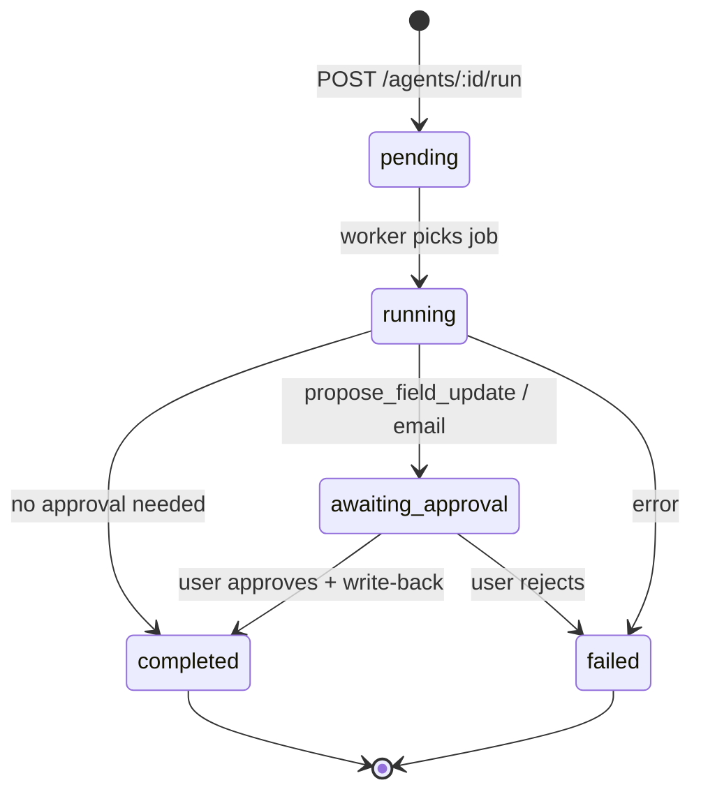

# Trigger & Event Catalog — Automations, Webhooks & Queues

**Version:** 1.0  
**Date:** 2026-09-09  
**Related:** [`custom-automations-guide.md`](custom-automations-guide.md) · [`../architecture.md`](../architecture.md)

---

## 1. Overview

AI CRM has four trigger mechanisms:

| Type | Config field | Dispatcher status |
|------|--------------|-------------------|
| **Manual** | `triggerConfig.type = 'manual'` | ✅ Live |
| **Schedule** | `triggerConfig.schedule` (cron) | 🔲 Worker needed (R7) |
| **Event** | `triggerConfig.event` | 🟡 Partial emitters |
| **Webhook** | Per-agent secret | 🔲 Route needed (R7) |

Background processing uses **MongoDB `background_jobs`** collection (no Redis).

---

## 2. Domain events (agent triggers)

### 2.1 Catalog

| Event name | Payload | Emitted from | Subscribers (agents) |
|------------|---------|--------------|----------------------|
| `activity.ingested` | `{ dealId?, artifactId, source }` | Gong webhook, note sync | post-call, buying-signals, objection-tracker |
| `deal.stage_changed` | `{ dealId, fromStageId, toStageId }` | CRM webhook, manual patch | poc-kickoff |
| `deal.closed` | `{ dealId, outcome: won\|lost }` | Close deal handler | win-loss-analysis |
| `deal.created` | `{ dealId }` | CRM sync, manual create | — |
| `approval.resolved` | `{ approvalId, status }` | Approvals handler | — |
| `meddpicc.completed` | `{ dealId, runId }` | MEDDPICC executor | — (future: risk re-score) |

### 2.2 Emitter implementation (target)

```typescript
// packages/events/src/bus.ts (WBS 11.1)
export async function emit(event: string, payload: Record<string, unknown>, workspaceId: string) {
  // 1. Persist to activity_events (audit)
  // 2. Find agents where triggerConfig.event === event && isActive
  // 3. enqueueAgentRun for each
}
```

### 2.3 Current emitters (grep targets)

| File | Should emit |
|------|-------------|
| `modules/webhooks/gong.ts` | `activity.ingested` after artifact upsert |
| `modules/webhooks/crm.ts` | `deal.stage_changed` on dealstage change |
| `modules/deals/handlers-close.ts` | `deal.closed` |
| `lib/queues/ingest-call.ts` | `activity.ingested` |

---

## 3. Inbound webhooks (external → AI CRM)

### 3.1 Live routes

| Route | Auth | Handler |
|-------|------|---------|
| `POST /api/v1/webhooks/gong` | HMAC (`gong-signature.ts`) | `webhooks/gong.ts` |
| `POST /api/v1/webhooks/crm/:connectionId` | HMAC (`webhook-hmac.ts`) | `webhooks/crm.ts` |
| `POST /api/v1/webhooks/hubspot` | HubSpot signature | `webhooks/hubspot.ts` |

### 3.2 HubSpot event types (CRM webhook)

From `webhooks/hubspot-events.ts`:

| Event | Maps to |
|-------|---------|
| `deal.propertyChange` (dealstage) | `deal.stage_changed` |
| `deal.creation` | `deal.created` |
| `deal.deletion` | Soft delete external_record |
| `company.*` | Company sync job |

### 3.3 Gong webhook payload

| Field | Use |
|-------|-----|
| `callId` | Artifact external ID |
| `metaData.title` | Call title |
| `metaData.scheduled` | Call date |
| `metaData.primaryUserId` | Owner mapping |

**R6:** After ingest → fetch transcript → `activity.ingested`.

### 3.4 Planned routes

| Route | Purpose |
|-------|---------|
| `POST /api/v1/webhooks/agents/:agentId` | Custom agent webhook trigger |
| `POST /api/v1/webhooks/slack/events` | Slash commands |
| `POST /api/v1/webhooks/teams` | Bot framework |

---

## 4. Background job queues

### 4.1 Job types

| Job type | Queue fn | Processor |
|----------|----------|-----------|
| `agent-run` | `addAgentRunJob` | `processAgentRun` |
| `ingest-call` | `addIngestCallJob` | `processIngestCall` |
| `crm-incremental` | (R6) | HubSpot deal patch |
| `embed-artifact` | (R6) | Chunk + embed |
| `crm-full-sync` | HubSpot connect | Initial import |

**Collection:** `background_jobs`  
**Worker:** Started with API or separate process (`architecture.md`)

### 4.2 Job document shape

```typescript
{
  type: 'agent-run' | 'ingest-call' | ...,
  status: 'pending' | 'processing' | 'completed' | 'failed',
  payload: { runId, workspaceId, templateSlug, dealId? },
  attempts: number,
  scheduledAt: Date,
  lockedAt?: Date,
  error?: string,
}
```

### 4.3 Idempotency keys

| Job | Dedup key |
|-----|-----------|
| MEDDPICC | `input_hash` on deal artifacts |
| Gong ingest | `workspaceId:gong:callId` |
| CRM incremental | `portalId:objectId:eventId` |
| Agent run (manual) | No dedup (user intent) |

---

## 5. Cron schedules (reference)

| Agent | Cron | TZ |
|-------|------|-----|
| Deal Focus | `0 8 * * *` | User or workspace |
| Risk Scanner | `0 */6 * * *` | Workspace |
| Weekly Digest | `0 8 * * 1` | Workspace |
| CRM Hygiene | `0 2 * * *` | Workspace |

**Cron parser:** Use `cron-parser` npm package with `workspace.timezone`.

---

## 6. Agent run lifecycle



**Collection:** `agent_runs`  
**Statuses:** `pending`, `running`, `completed`, `failed`, `awaiting_approval`

---

## 7. Event → agent matching algorithm

```typescript
async function dispatchEventAgents(event: string, workspaceId: string, payload: object) {
  const agents = await Agent.find({
    workspaceId,
    isActive: true,
    'triggerConfig.type': 'event',
    'triggerConfig.event': event,
  });

  for (const agent of agents) {
    if (!passesScopeFilter(agent, payload)) continue;
    await addAgentRunJob({
      agentId: agent.id,
      workspaceId,
      templateSlug: agent.templateSlug,
      dealId: payload.dealId,
      trigger: 'event',
      eventName: event,
    });
  }
}
```

**Future filters:** `triggerConfig.filter` JSON — e.g. `{ "source": "gong" }`.

---

## 8. Testing triggers locally

### Manual agent run

```bash
curl -X POST http://localhost:4000/api/v1/agents/AGENT_ID/run \
  -H "Authorization: Bearer $TOKEN" \
  -H "Content-Type: application/json" \
  -d '{"scope":{"dealId":"DEAL_ID"}}'
```

### Simulate Gong webhook

```bash
# See apps/api smoke tests or gong-signature.ts for HMAC
curl -X POST http://localhost:4000/api/v1/webhooks/gong \
  -H "Content-Type: application/json" \
  -d '{"callId":"test-123","metaData":{"title":"Demo call"}}'
```

### Check job queue

```javascript
// mongosh
db.background_jobs.find({ status: 'pending' }).sort({ createdAt: -1 }).limit(5)
db.agent_runs.find().sort({ createdAt: -1 }).limit(5)
```

---

## 9. Observability

| Signal | Where |
|--------|-------|
| Job failures | `background_jobs.error` |
| Agent run errors | `agent_runs.error` |
| Webhook receipt | `webhook_events` (TTL 7d) |
| Correlation ID | `req.correlationId` (R2 OTel) |

---

## Changelog

| Date | Change |
|------|--------|
| 2026-09-09 | v1.0 — Initial catalog |
