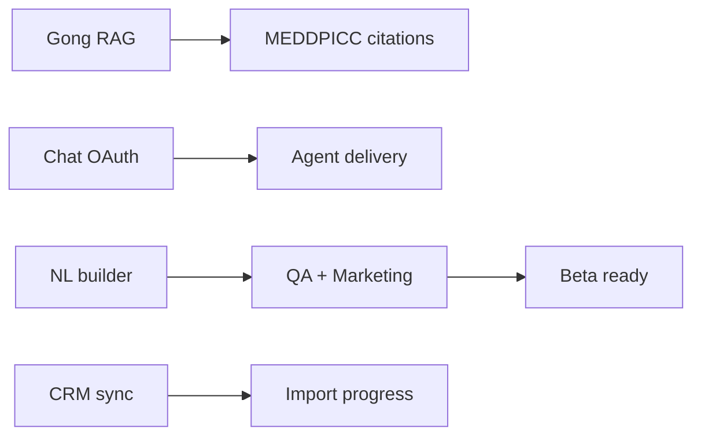

# R6 Roadmap — Next Development Batch

**Version:** 1.0  
**Date:** 2026-09-09  
**Status:** Approved for execution  
**Prerequisite:** R5 complete (`3401220` on `main`)  
**Parent:** [`wbs.md`](wbs.md) · [`prd.md`](prd.md) · [`.agent/progress.md`](../.agent/progress.md)

---

## 1. Executive summary

R1–R5 delivered a shippable **modular monolith** with core CRM, MEDDPICC AI, 10 agent executors, HubSpot/Gong scaffolding, marketing site, JWT auth, Playwright E2E, and GitHub Actions CI.

**R6** closes the highest-value gaps before a beta launch: **real Gong transcript ingest + RAG**, **multi-chat OAuth (Teams / Google Chat / Calendar)**, **NL agent builder**, **CRM incremental sync queue**, and **production hardening** (E2E in CI, call detail UI, marketing Phase 3).

Execute R6 as **5 parallel subagent forks** (one workstream each), then integrate and run `pnpm typecheck`, `pnpm build`, `pnpm test:e2e`.

---

## 2. Completion snapshot (R1–R5)

| Release | Highlights |
|---------|--------------|
| **R1–R3** | Monorepo, deals kanban, 12 deal tabs, MEDDPICC SSE, 10 agent templates |
| **R4** | Accounts CRUD, insights tabs, marketing `/why` + `/product`, member invites |
| **R5** | `/agents/new` wizard, Gong HMAC + Artifact ingest, CRM webhook path, `/calls`, Playwright E2E, CI |

**Current health**

| Check | Status |
|-------|--------|
| `pnpm typecheck` | PASS |
| `pnpm build` | PASS |
| `pnpm smoke` (API) | PASS |
| `pnpm test:e2e` | 5 tests (requires `pnpm dev` + MongoDB) |
| GitHub Actions CI | typecheck + build on `main` |

---

## 3. R6 workstreams (5 subagent forks)

### WS-1 — Gong transcript fetch + RAG pipeline

**WBS:** 3.1, 3.3, 5.9 (complete), 1.13  
**Priority:** P0  
**Owner subagent:** Backend / AI

**Problem:** `ingest-call` upserts `Artifact` metadata from webhooks but does not fetch transcript text, chunk, or embed for RAG.

**Scope**

1. Gong API client — `GET /v2/calls/{id}/transcript` using workspace OAuth tokens (`IntegrationConnection`).
2. Extend `processIngestCall` — fetch transcript → store `rawText` on `Artifact` → enqueue `embed-artifact` job.
3. `artifact_chunks` collection + chunking (512-token windows, overlap 64) per `database.md` §9.
4. Embedding via Gemini (`GEMINI_API_KEY`) or stub hash-embed for dev without API key.
5. `GET /api/v1/calls/:id` — transcript preview + link to deal.
6. Calls page — row click → slide-over or `/calls/[id]` with transcript excerpt.

**Acceptance criteria**

- [ ] Signed Gong webhook → artifact with `rawText` populated within 60s (worker).
- [ ] `artifact_chunks` documents created with `dealId` when call linked.
- [ ] MEDDPICC refresh can cite Gong chunk IDs (wire existing citation path).
- [ ] Demo mode works without Gong API (seed transcript on artifact).

**Key files**

- `apps/api/src/lib/integrations/gong-api.ts` (new)
- `apps/api/src/lib/queues/ingest-call.ts`
- `apps/api/src/lib/queues/embed-artifact.ts` (new)
- `packages/db/src/models/artifact-chunk.ts` (new)
- `apps/web/app/(dashboard)/calls/[id]/page.tsx` (new)

---

### WS-2 — Chat OAuth: Microsoft Teams + Google Chat + Calendar

**WBS:** 5.17, 5.18, 5.20, 5.12c  
**Priority:** P0  
**Owner subagent:** Integrations

**Problem:** Slack scaffold exists; Teams, Google Chat, and Calendar show "coming soon" in integrations UI.

**Scope**

1. `ChatConnector` implementations: `teams`, `google_chat` under `packages/integrations/chat/`.
2. OAuth flows — mirror Slack pattern in `apps/api/src/modules/oauth/`.
3. Settings UI — connect/disconnect cards with branded icons (existing `IntegrationLogo`).
4. Google Calendar — read events → `DealEvent` / `activity_events` classification (rules from WBS 5.21).
5. Env vars in `.env.example`: `TEAMS_CLIENT_ID`, `GOOGLE_CHAT_*`, `GOOGLE_CALENDAR_*`.

**Acceptance criteria**

- [ ] Admin can OAuth-connect Teams and Google Chat from `/settings/integrations`.
- [ ] Connection status API returns `connected` / `needs_config` / `error`.
- [ ] Calendar sync creates demo or live events for linked deals.
- [ ] No breaking changes to existing Slack paths.

**Key files**

- `packages/integrations/chat/teams/`
- `packages/integrations/chat/google-chat/`
- `apps/api/src/modules/integrations-chat/handlers.ts`
- `apps/web/app/(dashboard)/settings/integrations/page.tsx`

---

### WS-3 — NL agent builder (`draft-from-nl`)

**WBS:** 4.28  
**Priority:** P1  
**Owner subagent:** Agents / AI

**Problem:** `/agents/new` wizard has disabled "Ask AI to build this agent" panel.

**Scope**

1. `POST /api/v1/agents/draft-from-nl` — input: natural language description; output: `{ name, category, triggerConfig, toolsConfig }` via Gemini structured output.
2. Wire right panel on `/agents/new` — textarea + "Generate" → prefill wizard steps.
3. Zod schema validation before save; human review step unchanged.
4. Rate limit: 10 drafts/user/hour (in-memory or Mongo counter).

**Acceptance criteria**

- [ ] User describes "Daily Slack digest of at-risk deals" → wizard prefilled with schedule trigger + risk tools.
- [ ] Invalid NL returns 400 with message; no partial agent persisted.
- [ ] Works in dev without Gemini (template-based fallback map).

**Key files**

- `apps/api/src/modules/agents/handlers.ts`
- `packages/shared/src/schemas/agent.ts`
- `apps/web/app/(dashboard)/agents/new/page.tsx`

---

### WS-4 — CRM incremental sync + webhook queue

**WBS:** 5.0c, 5.5, 5.25  
**Priority:** P1  
**Owner subagent:** CRM / Backend

**Problem:** `POST /webhooks/crm/:connectionId` logs events but does not enqueue `crm-incremental` jobs. HubSpot deal updates don't flow to local deals automatically.

**Scope**

1. `crm-incremental` queue worker — parse HubSpot deal events → upsert `external_records` → patch local `Deal`.
2. Wire CRM webhook handler to enqueue jobs (idempotent by `portalId:objectId:eventId`).
3. HubSpot connect — register webhook subscriptions (or document manual setup in `HUBSPOT_APP_SETUP.md`).
4. `GET /api/v1/integrations/crm/sync-status` — last sync time, error count.
5. Onboarding step 5 — show real import progress from sync job (SSE or poll).

**Acceptance criteria**

- [ ] HubSpot `deal.propertyChange` webhook updates deal stage in MongoDB within 2 min.
- [ ] Unknown `connectionId` → 404; bad HMAC → 401 (existing).
- [ ] Sync errors surfaced in integrations settings badge.

**Key files**

- `apps/api/src/lib/queues/crm-incremental.ts` (new)
- `apps/api/src/modules/webhooks/crm.ts`
- `apps/api/src/modules/integrations-crm/handlers.ts`
- `apps/web/app/onboarding/page.tsx` (import progress)

---

### WS-5 — QA hardening + marketing Phase 3

**WBS:** 8.3, 8.4, 9.x, 8.1  
**Priority:** P1  
**Owner subagent:** QA / Frontend

**Problem:** E2E not in CI; marketing lacks blog/about; agent E2E missing; shadcn marketing animations not on all pages.

**Scope**

1. GitHub Actions — add `pnpm test:e2e` job with `services: mongodb`, start API+web in background (or use Playwright `webServer` config).
2. E2E: agent flow stub — create agent from template → manual run → approvals queue visible.
3. Marketing — `/blog` index + `/about` page using `MarketingShell`; 2 seed posts (MDX or static).
4. Extend landing animations/color system to `/pricing`, `/why` (if gaps remain).
5. Sentry stub — `SENTRY_DSN` optional in `.env.example`, no-op if unset (WBS 1.10).

**Acceptance criteria**

- [ ] CI runs E2E on PR (or nightly if flaky; document choice).
- [ ] `/blog` and `/about` render with shadcn, pass typecheck.
- [ ] Agent E2E passes locally with seeded workspace.

**Key files**

- `.github/workflows/ci.yml`
- `apps/web/playwright.config.ts`
- `apps/web/e2e/agents.spec.ts` (new)
- `apps/web/app/(marketing)/blog/page.tsx` (new)
- `apps/web/app/(marketing)/about/page.tsx` (new)

---

## 4. Dependency graph



| Workstream | Blocks | Blocked by |
|------------|--------|------------|
| WS-1 | Better MEDDPICC citations | Gong OAuth connected |
| WS-2 | Agent Slack/Teams delivery | — |
| WS-3 | — | Gemini API key (optional fallback) |
| WS-4 | Live CRM sync | HubSpot connection |
| WS-5 | Launch confidence | WS-3 for agent E2E (soft) |

**Parallel safe:** All 5 can start day 1; integrate WS-3 before WS-5 agent E2E.

---

## 5. WBS impact (post-R6 targets)

| Area | Current | R6 target |
|------|---------|-----------|
| 3.0 Deal Intelligence | ~75% | ~90% (RAG ingest live) |
| 4.0 Agents | ~90% | ~95% (NL builder) |
| 5.0 Integrations | ~75% | ~85% (Teams/GChat/Calendar + CRM sync) |
| 8.0 QA / DevOps | ~65% | ~80% (E2E in CI) |
| 9.0 Marketing | ~60% | ~75% (blog/about) |

---

## 6. Environment variables (R6 additions)

| Variable | Workstream | Required |
|----------|------------|----------|
| `GONG_ACCESS_TOKEN` or OAuth tokens in DB | WS-1 | For live transcript fetch |
| `GEMINI_API_KEY` | WS-1, WS-3 | Optional (fallbacks in dev) |
| `TEAMS_CLIENT_ID` / `TEAMS_CLIENT_SECRET` | WS-2 | For Teams OAuth |
| `GOOGLE_CLIENT_ID` (extended scopes) | WS-2 | Calendar + Chat |
| `SENTRY_DSN` | WS-5 | Optional |

---

## 7. Execution checklist

```bash
# Before fork
cd codebase && pnpm typecheck && pnpm build

# Per workstream (subagent)
# … implement scope …
pnpm --filter @ai-crm/api typecheck
pnpm --filter @ai-crm/web typecheck

# After merge
cd codebase && pnpm typecheck && pnpm build && pnpm test:e2e
cd apps/api && NODE_ENV=development pnpm smoke
```

**Integration order:** WS-4 + WS-1 (backend queues) → WS-2 → WS-3 → WS-5 (CI last).

---

## 8. Out of scope (R7+)

- Salesforce adapter (WBS 5.26)
- SQL explorer `/insights/sql` (WBS 6.16)
- MCP server registry (WBS 7.9)
- Pipedrive live adapter (WBS 5.6–5.7)
- Production deploy + DNS (WBS 8.6–8.7)
- Mobile / native apps

---

## 9. References

| Doc | Use |
|-----|-----|
| [`database.md`](database.md) §9 | Artifacts & RAG schema |
| [`agent-platform.md`](agent-platform.md) | Agent graphs & delivery |
| [`chat-channels.md`](chat-channels.md) | ChatConnector contract |
| [`crm-connectors.md`](crm-connectors.md) | CRM sync & webhooks |
| [`api-routes.md`](api-routes.md) | Route contracts & test cases |
| [`landing-page.md`](landing-page.md) | Marketing Phase 3 |

---

## Changelog

| Date | Change |
|------|--------|
| 2026-09-09 | v1.0 — R6 roadmap after R5 completion |
