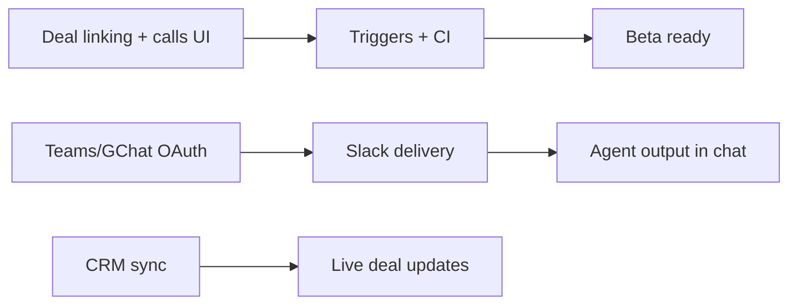

# R7 Roadmap — Next Development Batch

**Version:** 1.0  
**Date:** 2026-09-10  
**Status:** In execution  
**Prerequisite:** R6 agent platform batch + Gong direct-Gemini (Phase A)  
**Parent:** [`wbs.md`](wbs.md) · [`r6-roadmap.md`](r6-roadmap.md)

---

## 1. Executive summary

R6 delivered Opine template parity, NL agent builder, `deliveryConfig`, scheduled agents, and Gong transcript fetch with **direct Gemini** (no RAG). R7 closes integration and delivery gaps for a credible beta: **deal-linked calls**, **real Slack delivery**, **CRM incremental sync**, **Teams/GChat OAuth**, and **event triggers + production hardening**.

Execute as **5 parallel subagent forks**, then integrate: `pnpm typecheck`, `pnpm build`, `pnpm test:e2e`.

---

## 2. R7 workstreams

### WS-1 — Gong deal linking + call detail UI

**Priority:** P0  
**Problem:** `artifact.dealId` is often null after Gong ingest; `/calls` has no detail view.

**Scope**

1. Resolve `dealId` on ingest — match participant emails from Gong `metaData` to deal contacts / company domain / deal owner email.
2. `GET /api/v1/calls/:id` — title, date, deal link, transcript excerpt (`rawText` truncated).
3. `apps/web/app/(dashboard)/calls/[id]/page.tsx` — transcript preview + link to deal.
4. Calls list — row click navigates to `/calls/[id]`.

**Acceptance**

- [ ] Seeded Gong artifacts keep `dealId`; new ingests attempt email match.
- [ ] Call detail page renders transcript for seeded workspace.
- [ ] `pnpm typecheck` passes.

**Key files:** `ingest-call.ts`, `calls/handlers.ts`, `calls/[id]/page.tsx`, `calls/page.tsx`

---

### WS-2 — Slack real delivery (`ChatDeliveryService`)

**Priority:** P0  
**Problem:** `chat-delivery.ts` is a log-only stub.

**Scope**

1. `deliverAgentOutput` — call Slack `chat.postMessage` via workspace OAuth token (`resolveWorkspaceAccessToken`).
2. `GET /api/v1/integrations/chat/channels?provider=slack` — list channels for wizard picker.
3. Format agent run output as Slack blocks (title, status, key fields, link to deal if present).
4. Dev fallback: log-only when Slack not connected (keep current behavior).

**Acceptance**

- [ ] With Slack connected + `deliveryConfig.channelId`, agent run posts to channel.
- [ ] Channel list API returns channels when connected; empty when not.
- [ ] No breaking changes to agent executor flow.

**Key files:** `chat-delivery.ts`, `integrations/slack-api.ts` (new), `integrations-chat/handlers.ts`

---

### WS-3 — CRM incremental sync queue

**Priority:** P1  
**Problem:** CRM webhook handler logs events but does not sync deals.

**Scope**

1. `crm-incremental` queue + `processCrmIncremental` worker.
2. Wire `handleCrmWebhook` → enqueue idempotent jobs (`portalId:objectId:eventId`).
3. HubSpot `deal.propertyChange` → upsert `external_records` → patch local `Deal` (stage, amount, title).
4. `GET /api/v1/integrations/crm/sync-status` — last sync, error count.
5. Register poller in `processor.ts`.

**Acceptance**

- [ ] Webhook returns 202 and enqueues job.
- [ ] Worker updates deal stage when HubSpot stage maps to local `PipelineStage`.
- [ ] Sync status endpoint returns structured JSON.

**Key files:** `queues/crm-incremental.ts`, `webhooks/crm.ts`, `integrations-crm/handlers.ts`, `processor.ts`

---

### WS-4 — Teams + Google Chat OAuth

**Priority:** P1  
**Problem:** Settings UI shows Teams/GChat as "coming soon"; only Slack OAuth exists.

**Scope**

1. OAuth handlers mirroring Slack: `teams-oauth.ts`, `google-chat-oauth.ts`.
2. Routes: `/oauth/start/chat/teams`, `/oauth/callback/chat/teams`, same for `google_chat`.
3. Settings integrations — enable Teams + Google Chat connect buttons.
4. Env vars in `.env.example`: `TEAMS_CLIENT_ID`, `TEAMS_CLIENT_SECRET`, `GOOGLE_CHAT_CLIENT_ID`, etc.

**Acceptance**

- [ ] OAuth start/callback routes exist and save tokens to `integration_connections`.
- [ ] Settings page shows Teams + Google Chat as `enabled` (not coming_soon).
- [ ] Unconfigured env → graceful "not configured" on connect attempt.

**Key files:** `oauth/handlers.ts`, `lib/integrations/teams-oauth.ts`, `google-chat-oauth.ts`, `settings/integrations/page.tsx`

---

### WS-5 — Event triggers + QA / marketing

**Priority:** P1  
**Problem:** `deal.stage_changed` agents never auto-fire; E2E not in CI; no blog/about.

**Scope**

1. `dispatchDealStageChanged` in `agent-events.ts` — fire agents with `triggerConfig.event = 'deal.stage_changed'`.
2. Wire `moveDealStage` in `deals/handlers.ts` after stage save.
3. GitHub Actions — add E2E job (MongoDB service + Playwright `webServer` or background start).
4. Marketing — `/blog` index + `/about` page with `MarketingShell`; 2 static seed posts.
5. Optional: E2E test for call detail page if WS-1 lands first.

**Acceptance**

- [ ] Stage move enqueues matching event-triggered agents.
- [ ] `/blog` and `/about` render; typecheck passes.
- [ ] CI workflow includes E2E step (or documented nightly with comment).

**Key files:** `agent-events.ts`, `deals/handlers.ts`, `.github/workflows/ci.yml`, `app/(marketing)/blog/`, `about/`

---

## 3. Dependency graph

**Parallel safe:** All 5 can start day 1. Integrate WS-1 before WS-5 call-detail E2E.

---

## 4. Out of scope (R8+)

- Gong RAG / `artifact_chunks` embedding pipeline
- Slack approval buttons in chat
- Salesforce adapter
- Production deploy + DNS

---

## Changelog

| Date | Change |
|------|--------|
| 2026-09-10 | v1.0 — R7 roadmap after R6 + Gong Phase A |
