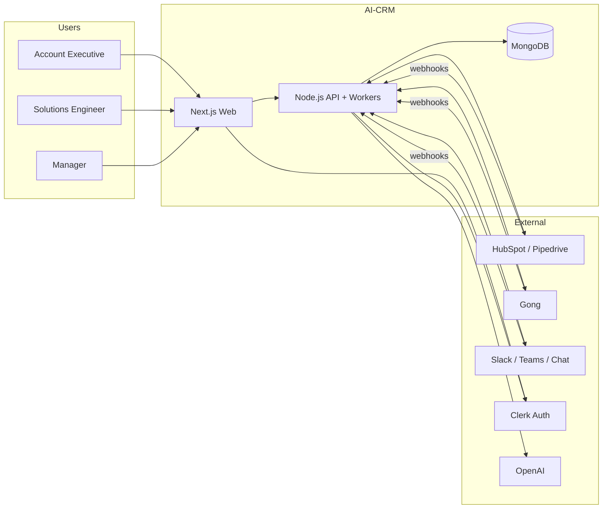
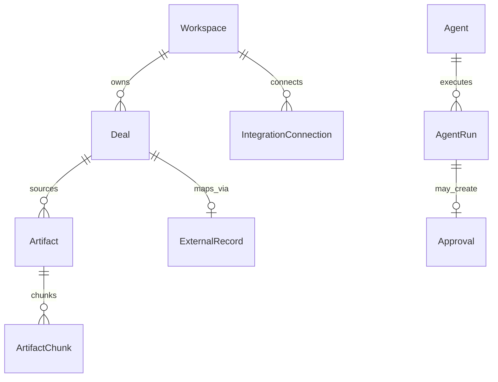
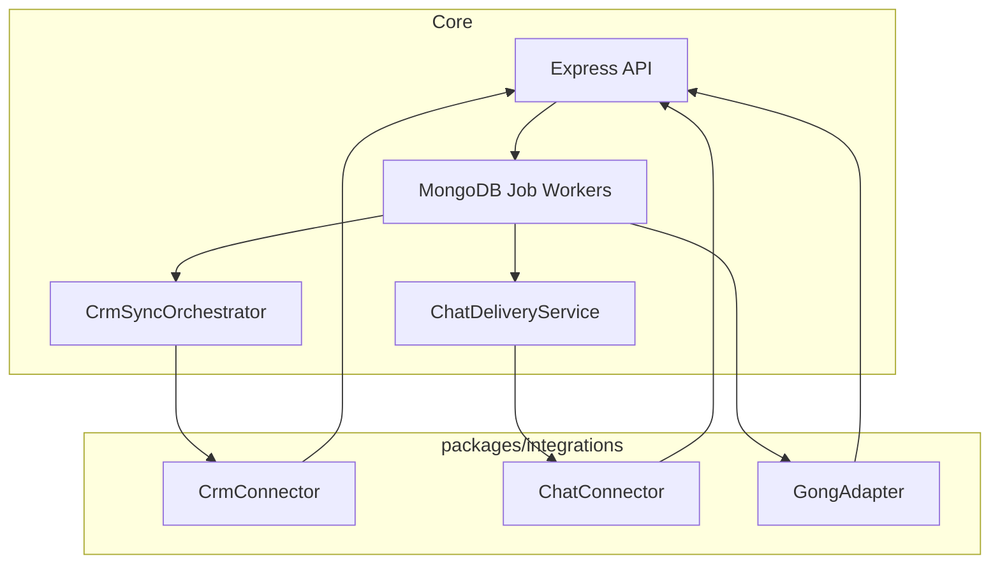

# System Design — AI-Native Presales CRM

---
doc: system-design.md
title: System Design (Master)
version: 2.0
status: approved
taxonomy: Architecture / Foundation
audience: all engineers, architects, PMs
depends_on:
  - stack.md
  - architecture.md
see_also:
  - architecture.md
  - database.md
  - api-routes.md
  - frontend-flow.md
  - crm-connectors.md
  - chat-channels.md
  - agent-platform.md
  - prd.md
  - staff-review.md
last_reviewed: 2026-09-09
stack: Next.js + shadcn · Node.js Express API · MongoDB
---

**Read this first** for a 20-minute technical overview. Deep specs live in linked docs.  
**Master index:** [`README.md`](README.md)

---

## 1. Executive summary

We are building an **AI-native presales CRM** where **deals are the unit of truth**. Reps connect their CRM and Slack once; the system pulls calls, emails, and chat into a unified timeline. AI agents read that timeline—not the open web—and draft summaries, follow-ups, and CRM updates with **citations**. Humans approve anything that leaves the building (CRM writes, emails, external messages).

| Outcome | How |
|---------|-----|
| Monday morning clarity | Deal Focus agent + `/focus` in Slack |
| Trustworthy AI | Every MEDDPICC claim links to `artifact_id` |
| Simple architecture | Thin Next.js UI → fat Node API → MongoDB + queues |

**Product detail:** [`prd.md`](prd.md) · **Known risks:** [`staff-review.md`](staff-review.md)

---

## 2. How it works (plain language)

```
You connect HubSpot + Slack once.
     ↓
Deals, calls, and messages flow into one timeline per deal.
     ↓
AI reads the timeline and drafts summaries, tasks, and CRM updates.
     ↓
You approve in the app or Slack — nothing writes to CRM until you do.
```

The **web app is a display layer** (Next.js + shadcn/ui). The **Node API owns all rules**, integrations, and AI jobs. MongoDB stores everything — including background job queues.

---

## 3. System context



| External system | Direction | Purpose |
|-----------------|-----------|---------|
| Clerk | Outbound (browser + API verify) | Sign-in, JWT |
| CRM | OAuth + webhooks + write-back | Deal source of truth |
| Gong | Webhook in, API fetch transcript | Call artifacts |
| Slack / Teams / Chat | OAuth + webhooks + outbound messages | Notifications, slash commands |
| OpenAI | Outbound from workers | LLM + embeddings |

---

## 4. Stack at a glance

| Layer | Technology |
|-------|------------|
| Frontend | Next.js 15 · **shadcn/ui** · TanStack Query · Clerk UI |
| Backend | **Node.js 20+** · **Express** · Zod |
| Database | **MongoDB Atlas** · Mongoose · Atlas Vector Search |
| Queue | MongoDB `background_jobs` collection |
| AI | LangGraph in `packages/agents` |

**We do not use:** Postgres, Prisma, Inngest, or business logic in Next.js Route Handlers.

Full env vars and repo layout: [`stack.md`](stack.md)

---

## 5. Five layers (mental model)

| # | Layer | Owns | Must NOT |
|---|-------|------|----------|
| 1 | **Client** (`apps/web`) | Pages, shadcn components, TanStack Query | DB, CRM SDKs, agents |
| 2 | **API** (`apps/api`) | REST, auth, webhooks, enqueue jobs, SSE | UI components |
| 3 | **Domain** (`packages/agents`, `packages/context`) | MEDDPICC, RAG, LangGraph graphs | HTTP, channel SDKs |
| 4 | **Data** (MongoDB) | Deals, artifacts, vectors, background jobs | Business rules |
| 5 | **External** (`packages/integrations`) | CRM, chat, Gong adapters | Direct DB access |

```
┌─────────────────────────────────────────────────────────────┐
│  CLIENT     Next.js + shadcn/ui + Clerk + TanStack Query     │
└──────────────────────────┬──────────────────────────────────┘
                           │ HTTPS REST + SSE
┌──────────────────────────▼──────────────────────────────────┐
│  API        Express · /api/v1 · webhooks · auth middleware   │
│             enqueues → MongoDB background_jobs               │
└──────┬─────────────────────────────┬────────────────────────┘
       │                             │
┌──────▼─────────┐           ┌───────▼────────────────────────┐
│  DOMAIN        │           │  WORKERS (MongoDB queue)        │
│  agents/       │◄──────────│  crm-sync · ingest · agent-run  │
│  context/      │           │  chat-deliver                   │
└──────┬─────────┘           └───────┬────────────────────────┘
       │         ┌───────────────────┼──────────────────┐
┌──────▼─────────▼──┐         ┌──────▼──────┐    ┌───────▼───────┐
│  DATA              │         │  CRM        │    │  Chat + Gong  │
│  MongoDB           │         │  adapters   │    │  adapters     │
└────────────────────┘         └─────────────┘    └───────────────┘
```

Deep layers + ADRs: [`architecture.md`](architecture.md)

---

## 6. Three user journeys

### Journey A — Monday pipeline check

1. AE signs in (Clerk) → lands on **Deals kanban**
2. Cards show sentiment, fit, blockers (from MongoDB, synced from CRM)
3. Click deal → Overview tab loads KPIs from API
4. MEDDPICC summary **streams via SSE** with citations to Gong/Slack
5. Drag deal to new stage → UI updates instantly → API saves → async CRM push

### Journey B — Post-call follow-up

1. Gong finishes call → webhook to API
2. Worker ingests transcript → `artifacts` + vector chunks
3. Post-Call agent drafts email, tasks, CRM updates → **approval queue**
4. Rep gets Slack DM → `/approve` or clicks Approve in app
5. Only then: CRM write + email send

### Journey C — Manager from chat

1. 7am cron: Deal Focus agent scores deals → Slack DM per rep
2. Manager types `/deal Acme Corp` in Slack
3. API maps Slack user → workspace user → returns summary + risks
4. Full 12-tab detail view optional in web app

---

## 7. Full product app surface

### Main navigation

| Module | Route | Backend service |
|--------|-------|-----------------|
| Home | `/home` | `modules/home` |
| Deals | `/deals` | `modules/deals` |
| Accounts | `/accounts` | `modules/companies` |
| Projects | `/projects` | `modules/deals` |
| Calls | `/calls` | `modules/deals` + artifacts |
| Requests | `/requests` | `modules/deals` + integrations |
| Agents | `/agents` | `modules/agents` + `modules/approvals` |
| Insights | `/insights` | `modules/insights` |
| Settings | `/settings` | `modules/auth` + integrations |

### Deal detail — 12 tabs

Overview · Plan · Activity · Events · Participants · Product Requests · Team Requests · Insights · Notes · Tasks · Projects · File Center

Onboarding wizard (`/onboarding`) forced until CRM sync completes.

Full routes: [`frontend-flow.md`](frontend-flow.md) · Modules: [`api-routes.md`](api-routes.md) §1

---

## 8. Onboarding flow (10 minutes)

| Step | User | System |
|------|------|--------|
| 1 | Sign up via Clerk | Create workspace |
| 2 | Pick CRM (HubSpot or Pipedrive) | Show providers |
| 3 | OAuth connect | Store tokens in `integration_connections` |
| 4 | Map CRM stages → internal pipeline | Save `crm_stage_mappings` |
| 5 | Import deals | `crm-backfill` queue → kanban live |
| 6 | Land on `/deals` | Optional banner: connect Gong / Slack |

---

## 9. Data model (7 core entities)



| Entity | One-line role |
|--------|---------------|
| **Workspace** | Tenant root; one primary CRM |
| **Deal** | Canonical in-app deal; provider-agnostic |
| **ExternalRecord** | Maps `(provider, externalId)` ↔ internal deal/company |
| **Artifact** | Unified activity (call, email, chat thread) |
| **ArtifactChunk** | RAG chunks + embeddings |
| **AgentRun** | One LangGraph execution |
| **Approval** | Gate before any external write |

**Tenancy rule:** Every tenant document includes `workspaceId`. Every query filters by it.

**Performance rules:** Denormalize kanban fields on `deals`; TanStack Query cache for board (30s); `inputHash` skip for MEDDPICC; shard on `workspaceId` at scale.

Full schema, **5 ER diagrams**, indexes, hot-path queries, retention: [`database.md`](database.md) (v3.0)

---

## 10. Integration hub (plugins)

CRM and chat use the **same adapter pattern**:



| Integration | Interface | Docs |
|-------------|-----------|------|
| CRM | `CrmConnector` | [`crm-connectors.md`](crm-connectors.md) |
| Chat | `ChatConnector` + `ChatDeliveryService` | [`chat-channels.md`](chat-channels.md) |
| Calls | Gong webhook → `ingest-call` queue | [`architecture.md`](architecture.md) §3.5 |

**Rules:**
- Agents **never** call Slack or HubSpot directly — only through adapters
- One primary CRM per workspace at launch; multi-CRM roadmap in `crm-connectors.md`
- Slack, Teams, Google Chat — all in product scope

---

## 11. Sync vs async

| Action | Sync (API response) | Async (queued) |
|--------|---------------------|----------------|
| Edit deal in UI | ✅ | — |
| CRM OAuth + stage mapping | ✅ save mappings | Backfill on complete |
| CRM webhook | ✅ 202 + enqueue | `crm-incremental` upsert |
| Gong call done | ✅ 202 + enqueue | `ingest-call` → agent |
| MEDDPICC refresh (user watching) | ✅ SSE stream | LangGraph in worker |
| CRM write after approval | — | ✅ `write-back` queue |
| Slack notification | — | ✅ `chat-deliver` queue |

**Webhook rule:** Verify signature → dedupe → enqueue → return **200/202 in &lt;3s**. Never run LangGraph inside webhook handler.

---

## 12. Agent pipeline

```
Trigger (event / cron / manual)
    → MongoDB `agent-runs` background job
    → LangGraph graph (packages/agents)
    → Read DealContextBundle + RAG (artifact_chunks)
    → Write drafts to MongoDB
    → Create Approval if external write needed
    → ChatDeliveryService → user's Slack DM
```

**All 10 agents** in `apps/api` — activation in release waves R1–R2. See [`agent-platform.md`](agent-platform.md).

Per-agent specs: [`agent-platform.md`](agent-platform.md)

---

## 13. RAG flow (5 steps)

1. **Ingest** — Gong call or chat → `artifact` document
2. **Chunk** — Split into `artifact_chunks` with speaker + timestamps
3. **Embed** — `text-embedding-3-small` → `embedding[]` field
4. **Retrieve** — Atlas Vector Search + text index, filter `workspaceId` (+ optional `dealId`)
5. **Cite** — Claims stored in `meddpicc_citations` pointing to `artifactId`

---

## 14. Idempotency (3 rules)

1. **Dedupe by natural key** — `artifacts (workspaceId, source, sourceId)`, `external_records (workspaceId, provider, entityType, externalId)`
2. **Webhooks: verify → enqueue → ack** — Resolve tenant from `connectionId`, not guessable URL params
3. **Write-back is approval-gated** — CRM patches only after `POST /approvals/:id/approve`; use `externalEtag` for conflicts

---

## 15. Stage model (three layers)

| Layer | Field | Purpose |
|-------|-------|---------|
| Kanban UI | `deals.stageId` → `pipeline_stages` | What user sees when dragging cards |
| CRM mirror | `external_records` + `crm_stage_mappings` | Sync to HubSpot/Pipedrive |
| Presales process | `deals.opineProcessStageId` | Plan confidence stepper (orthogonal to CRM) |

**Rule:** DnD updates internal stage first; CRM push is async via mapping table. Never use raw external stage ID as primary key.

Detail: [`prd.md`](prd.md) §5.5

---

## 16. API boundary

### Frontend NEVER

- Calls CRM, Gong, or Slack APIs directly
- Stores OAuth tokens or runs LLM inference
- Accepts inbound webhooks
- Writes to external systems without approval

### API ALWAYS

- Validates Clerk JWT → `workspaceId` + role
- Filters every query by `workspaceId`
- Owns OAuth, webhooks, agents, CRM sync
- Creates approval before external writes

Base URL: `{API_URL}/api/v1` — full contract: [`api-routes.md`](api-routes.md)

---

## 17. Real-time patterns

| Pattern | When | How |
|---------|------|-----|
| **SSE** | User watches MEDDPICC refresh | `POST …/meddpicc/refresh` → `EventSource` |
| **Polling** | OAuth connect, CRM import, agent run status | TanStack Query `refetchInterval` |
| **Push** | Agent → user | `ChatDeliveryService` → Slack DM |
| **Webhooks** | External → system | `POST /api/v1/webhooks/:provider/:connectionId` only |

No WebSockets in MVP.

---

## 18. MongoDB background job queues

Jobs stored in `background_jobs` collection; processed by API or optional dedicated worker.

| Queue | Trigger | Purpose |
|-------|---------|---------|
| `crm-backfill` | Onboarding complete | Initial deal import |
| `crm-incremental` | Cron 15min + CRM webhook | Ongoing sync |
| `ingest-call` | Gong webhook | Transcript → artifacts |
| `agent-runs` | Event / cron / manual | LangGraph execution |
| `chat-deliver` | Agent output | Outbound Slack messages |
| `write-back` | Approval granted | CRM field updates |
| `activity-rollup` | Cron hourly | Insights aggregates |

---

## 19. Deployment

| Component | Platform |
|-----------|----------|
| `apps/web` | Vercel |
| `apps/api` + workers | Railway / Render / Fly.io |
| MongoDB | Atlas (M10+ for vector search) |

**MVP default:** API and workers in **same Node process**; split when agent CPU blocks API latency.

---

## 20. Key design decisions

| # | Decision | Why |
|---|----------|-----|
| D1 | Thin frontend, fat API | One place for auth, tenancy, webhooks |
| D2 | `CrmConnector` + `ChatConnector` on day 1 | New providers = new adapter, not schema fork |
| D3 | Internal stage is kanban truth | CRM stage is mapped mirror |
| D4 | MongoDB job queue for all async work | One retry/idempotency story; no second datastore |
| D5 | Approvals gate external writes | Trust + compliance |
| D6 | MongoDB Vector Search | No second vector DB |
| D7 | 10 agents in `apps/api` workers | Full product; activation in release waves |
| D8 | Modular monolith (`apps/api`) | Single deployable API; clear module boundaries |
| D9 | Express (not Fastify) | Team familiarity; SSE + webhook support |

---

## 21. What NOT to do

1. Put Mongoose or LangGraph in Next.js Route Handlers
2. Let agents call Slack/HubSpot directly
3. Run LangGraph synchronously in webhook handlers
4. Skip lazy-loading on deal tabs — all 12 tabs in product (load on demand)
5. Add Kafka/event bus before you need it
6. Regenerate full MEDDPICC on every page view — cache by `inputHash`
7. Connect two CRMs per workspace in MVP

---

## 22. Documentation map

| If you need… | Read |
|--------------|------|
| **Start here (index)** | [`README.md`](README.md) |
| Stack + env vars | [`stack.md`](stack.md) |
| Product requirements | [`prd.md`](prd.md) |
| Deep architecture | [`architecture.md`](architecture.md) |
| MongoDB schema | [`database.md`](database.md) |
| REST API contract | [`api-routes.md`](api-routes.md) |
| Next.js routes | [`frontend-flow.md`](frontend-flow.md) |
| shadcn + tokens | [`design-system.md`](design-system.md) |
| CRM adapters | [`crm-connectors.md`](crm-connectors.md) |
| Chat adapters | [`chat-channels.md`](chat-channels.md) |
| 10 agents | [`agent-platform.md`](agent-platform.md) |
| Delivery schedule | [`wbs.md`](wbs.md) |
| Pre-build critique | [`staff-review.md`](staff-review.md) |
| Marketing site | [`landing-page.md`](landing-page.md) |
| Brand | [`branding-guidelines.md`](branding-guidelines.md) |
| Opine benchmark | [`competitive-opine.md`](competitive-opine.md) |
| Layout reference (legacy) | [`design.md`](design.md) — superseded by design-system |

---

## 23. Open risks (P0)

| ID | Risk | Mitigation |
|----|------|------------|
| CR-001 | CRM connector framework not coded | Block CRM sync on `CrmConnector` interface |
| CR-003 | Dual-stage confusion | Three-layer model above + mapping table |
| CR-004 | Webhook deduplication | Idempotency rules §14 |
| CR-006 | MEDDPICC cost | Cache by `inputHash`; rate limits |
| Scope | 10 agents vs 16-week timeline | MVP = 5 agents; rest Phase 2+ |

Full audit: [`staff-review.md`](staff-review.md)

---

## Related docs

| Doc | Focus |
|-----|-------|
| [`README.md`](README.md) | Master index + reading paths |
| [`stack.md`](stack.md) | Canonical stack |
| [`architecture.md`](architecture.md) | ADRs, deployment, security depth |
